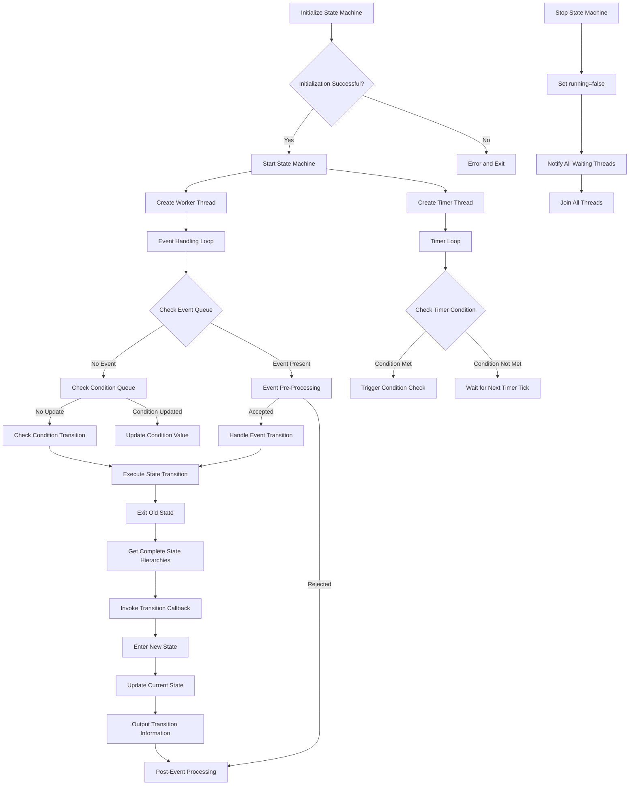

# Finite State Machine (FSM) Library

This is a C++ implementation of a **Finite State Machine (FSM)** that supports event-driven and condition-based state transitions. The library is designed to be flexible, extensible, and easy to use, making it suitable for applications such as IoT device control, game state management, and workflow engines.

---

## Features

- **State Management**: Define and manage multiple states with support for nested (hierarchical) states.
- **Event-Driven Transitions**: Trigger state transitions using events.
- **Condition-Based Transitions**: Trigger state transitions based on conditions (e.g., value ranges, duration).
- **Custom Handlers**: Implement custom logic for state transitions using the `StateEventHandler` interface.
- **Asynchronous Processing**: Handle events and conditions asynchronously using multi-threading.
- **JSON Configuration**: Load state machine configurations from JSON files.
- **Time-Based Conditions**: Support for conditions that require a specific duration to be met.

---

## Code Structure

### Key Components

1. **State and Event Types**
  - `State`: Represented as a `std::string`.
  - `Event`: Represented as a `std::string`.

2. **Condition**
  - A condition consists of:
    - `name`: Unique identifier for the condition.
    - `range`: A pair of integers `[min, max]` defining the valid range.
    - `duration`: Duration (in milliseconds) the condition must be met.
    - `lastUpdateTime`: Timestamp of the last update.

3. **Transition Rule**
  - Defines a state transition:
    - `from`: Starting state.
    - `event`: Triggering event (optional).
    - `to`: Target state.
    - `conditions`: List of conditions to be met.
    - `conditionsOperator`: Logical operator (`AND` or `OR`) for combining conditions.

4. **State Info**
  - Stores information about a state:
    - `name`: State name.
    - `parent`: Parent state (if any).
    - `children`: List of child states.

5. **State Event Handler**
  - Class for managing state event callbacks:
    ```cpp
    class StateEventHandler {
    public:
      // 回调函数类型
      using TransitionCallback = std::function<void(const std::vector<State>&, const Event&, const std::vector<State>&)>;
      using PreEventCallback = std::function<bool(const State&, const Event&)>;
      using EnterStateCallback = std::function<void(const std::vector<State>&)>;
      using ExitStateCallback = std::function<void(const std::vector<State>&)>;
      using PostEventCallback = std::function<void(const Event&, bool)>;
      
      // 设置回调函数
      void setTransitionCallback(TransitionCallback callback);
      void setPreEventCallback(PreEventCallback callback);
      void setEnterStateCallback(EnterStateCallback callback);
      void setExitStateCallback(ExitStateCallback callback);
      void setPostEventCallback(PostEventCallback callback);
      
      // 内部调用方法
      void onTransition(const std::vector<State>& fromStates, const Event& event, 
                        const std::vector<State>& toStates);
      bool onPreEvent(const State& currentState, const Event& event);
      void onEnterState(const std::vector<State>& states);
      void onExitState(const std::vector<State>& states);
      void onPostEvent(const Event& event, bool handled);
    };
    ```
  - Provides flexible callback-based state transition handling:
    - Event pre-processing and validation
    - State entry and exit handling
    - Transition handling
    - Post-transition event processing
  - Receives complete state hierarchies rather than single states
  - Enables handling transitions with knowledge of the entire state context

6. **FiniteStateMachine Class**
  - Core class for managing the state machine:
    - Initialization: Load configuration from a JSON file.
    - Event Handling: Process events asynchronously.
    - Condition Handling: Update and check conditions.
    - State Transitions: Trigger transitions based on events or conditions.

---

## Usage

### 1. Define States and Transitions
States and transitions can be defined programmatically or loaded from a JSON file.

#### Example JSON Configuration
```json
{
  "states": [
   {"name": "OFF", "parent": ""},
   {"name": "ON", "parent": ""},
   {"name": "ACTIVE", "parent": "ON"}
  ],
  "initial_state": "OFF",
  "transitions": [
   {
    "from": "OFF",
    "event": "turn_on",
    "to": "ON",
    "conditions": [
      {"name": "power", "range": [1, 100], "duration": 1000}
    ],
    "conditions_operator": "AND"
   },
   {
    "from": "ON",
    "event": "turn_off",
    "to": "OFF"
   }
  ]
}
```

### 2. Implement State Event Handlers
There are three ways to handle state events:

#### Option 1: Create a StateEventHandler with helper function using lambdas
```cpp
// 创建并配置处理器
auto handler = createLightStateHandler();  // 使用提供的辅助函数
fsm.setStateEventHandler(handler);
```

#### Option 2: Set individual lambda callbacks directly
```cpp
// 状态转换回调
fsm.setTransitionCallback([](const std::vector<State>& fromStates, const Event& event, 
                           const std::vector<State>& toStates) {
  State from = fromStates.empty() ? "" : fromStates[0];
  State to = toStates.empty() ? "" : toStates[0];
  
  if (from == "OFF" && to == "ON") {
    std::cout << "Light turned ON!" << std::endl;
  }
});

// 状态进入回调
fsm.setEnterStateCallback([](const std::vector<State>& states) {
  if (!states.empty() && states[0] == "ON") {
    std::cout << "Entering ON state, activating device..." << std::endl;
  }
});

// 状态退出回调
fsm.setExitStateCallback([](const std::vector<State>& states) {
  if (!states.empty() && states[0] == "ON") {
    std::cout << "Exiting ON state, shutting down device..." << std::endl;
  }
});
```

#### Option 3: Use class member functions as callbacks
```cpp
// 创建控制器对象
auto controller = std::make_shared<LightController>();

// 绑定类成员函数作为回调
fsm.setTransitionCallback(controller.get(), &LightController::handleTransition);
fsm.setPreEventCallback(controller.get(), &LightController::validateEvent);
fsm.setEnterStateCallback(controller.get(), &LightController::onEnter);
fsm.setExitStateCallback(controller.get(), &LightController::onExit);
fsm.setPostEventCallback(controller.get(), &LightController::afterEvent);

// 示例控制器类
class LightController {
public:
  // 状态转换处理
  void handleTransition(const std::vector<State>& fromStates, const Event& event, 
                      const std::vector<State>& toStates) {
    // 实现状态转换逻辑
  }
  
  // 事件验证
  bool validateEvent(const State& state, const Event& event) {
    // 返回true表示允许事件，false表示拒绝
    return true;
  }
  
  // 其他回调方法...
};
```

### 3. Initialize and Run the State Machine
```cpp
int main() {
   FiniteStateMachine fsm;
   
   // 设置状态事件处理器回调
   fsm.setTransitionCallback([](const std::vector<State>& fromStates, 
                              const Event& event,
                              const std::vector<State>& toStates) {
     // 处理状态转换
   });
   
   fsm.Init("config.json"); // 加载配置
   fsm.start(); // 启动状态机

   // 触发事件和条件
   fsm.handleEvent("turn_on");
   fsm.setConditionValue("power", 50);

   // 停止状态机
   fsm.stop();
   return 0;
}
```

---

## API Reference

### FiniteStateMachine Class

#### Methods
- **Initialization**
  - `bool Init(const std::string& configFile)`: Load state machine configuration from a JSON file.
  
- **Start/Stop**
  - `bool start()`: Start the state machine.
  - `void stop()`: Stop the state machine.

- **Event Handling**
  - `void handleEvent(const Event& event)`: Trigger an event asynchronously.

- **Condition Handling**
  - `void setConditionValue(const std::string& name, int value)`: Update a condition value asynchronously.

- **State Management**
  - `State getCurrentState() const`: Get the current state.
  - `void setInitialState(const State& state)`: Set the initial state.
  - `std::vector<State> getStateHierarchy(const State& state) const`: Get state and all its parents.

- **State Event Handlers**
  - `void setStateEventHandler(std::shared_ptr<StateEventHandler> handler)`: Set a complete state event handler.
  - `void setTransitionCallback(callback)`: Set lambda callback for state transitions.
  - `void setTransitionCallback(instance, method)`: Set class member function as callback for state transitions.
  - `void setPreEventCallback(callback)`: Set lambda callback for event pre-processing.
  - `void setPreEventCallback(instance, method)`: Set class member function as callback for event pre-processing.
  - `void setEnterStateCallback(callback)`: Set lambda callback for state entry.
  - `void setEnterStateCallback(instance, method)`: Set class member function as callback for state entry.
  - `void setExitStateCallback(callback)`: Set lambda callback for state exit.
  - `void setExitStateCallback(instance, method)`: Set class member function as callback for state exit.
  - `void setPostEventCallback(callback)`: Set lambda callback for event post-processing.
  - `void setPostEventCallback(instance, method)`: Set class member function as callback for event post-processing.

---

## Example Use Cases

1. **IoT Device Control**:
  - Manage the states of a smart light (e.g., OFF, ON, ACTIVE).
  - Trigger transitions based on events (e.g., "turn_on", "turn_off") or conditions (e.g., power level).

2. **Game State Management**:
  - Control game states (e.g., MENU, PLAY, PAUSE, GAME_OVER).
  - Handle transitions based on player actions or game conditions.

3. **Workflow Engine**:
  - Model workflows with states representing stages (e.g., START, PROCESS, END).
  - Trigger transitions based on external inputs or time-based conditions.

---

## Dependencies

- **nlohmann/json**: A modern C++ JSON library for parsing and generating JSON data.
  - GitHub: [nlohmann/json](https://github.com/nlohmann/json)

---

## License

This project is licensed under the MIT License. See the [LICENSE](LICENSE) file for details.

---

## Contributing

Contributions are welcome! Please open an issue or submit a pull request for any improvements or bug fixes.

---

## State Processing Pipeline

The following diagram illustrates the state processing pipeline of the Finite State Machine:



---

## Author

[JerryHu]  
[1151217347@qq.com]  
[JUSTLIKEHU](https://github.com/JUSTLIKEHU)