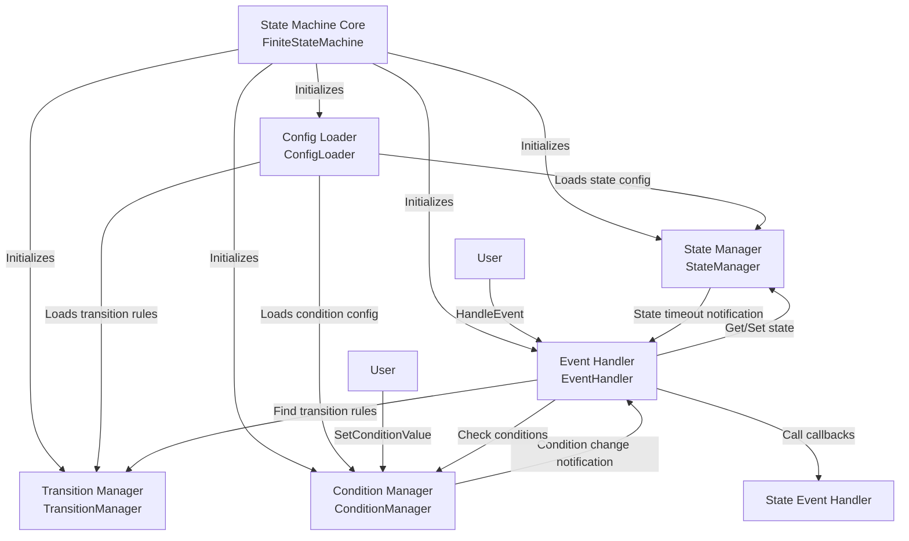
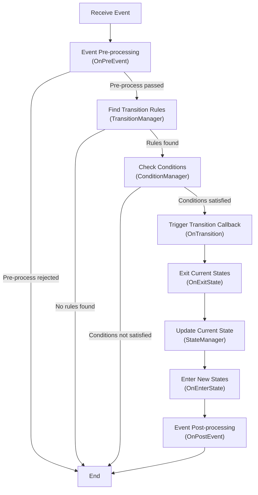
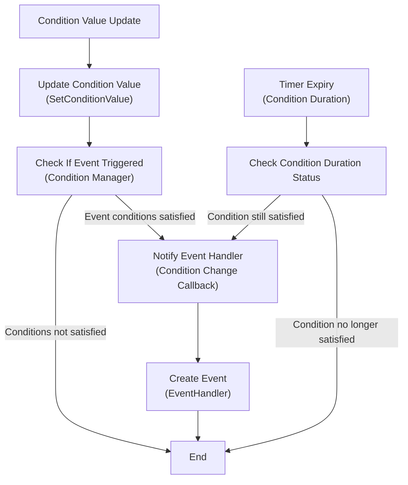
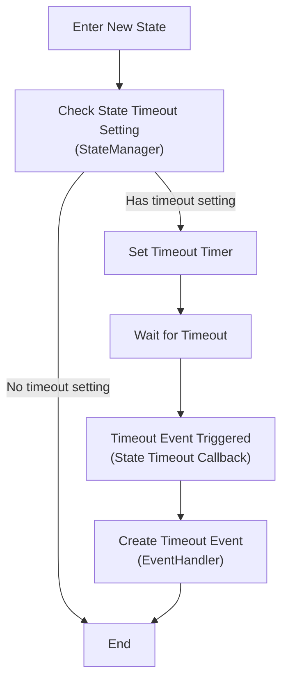
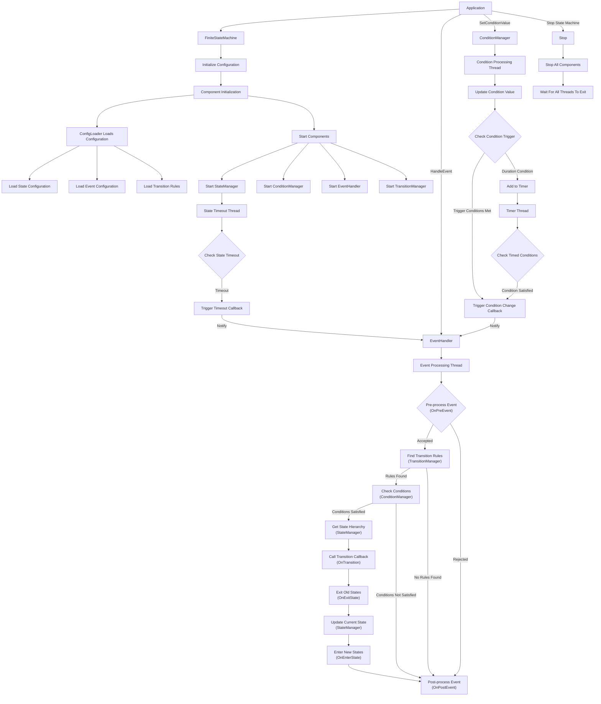

# Finite State Machine (FSM) Library

This is a C++ implementation of a **Finite State Machine (FSM)** that supports event-driven and condition-based state transitions. The library is designed to be flexible, extensible, and easy to use, making it suitable for applications such as IoT device control, game state management, and workflow engines.

---

## Features

- **Modular Architecture**: Adopts modular design with core functionality separated into independent components
  - Condition Manager: Handles condition value updates and checks
  - State Manager: Manages state hierarchy and transitions
  - Event Handler: Handles event triggering and callbacks
  - Transition Manager: Manages state transition rules
  - Config Loader: Handles loading and validating configuration files
- **State Management**: Define and manage multiple states with support for nested (hierarchical) states.
- **Event-Driven Transitions**: Trigger state transitions using events.
- **Condition-Based Transitions**: Trigger state transitions based on conditions (e.g., value ranges, duration).
- **Multi-dimensional Range Conditions**: Support for both simple one-dimensional ranges and multi-dimensional range arrays.
- **Custom Handlers**: Implement custom logic for state transitions using the `StateEventHandler` interface.
- **Asynchronous Processing**: Handle events and conditions asynchronously using multi-threading.
- **JSON Configuration**: Load state machine configurations from JSON files.
- **Time-Based Conditions**: Support for conditions that require a specific duration to be met.
- **State Timeout Mechanism**: Ability to define timeout for states, triggering a timeout event when a state exceeds its specified duration.
- **Flexible Callback Mechanism**: Support for lambda functions and class member functions as callbacks.
- **Complete State Hierarchy**: Provide complete state hierarchy information in callbacks.
- **Integrated Logging System**: A thread-safe logging system with multiple log levels.
- **Event Definition Mechanism**: Support for defining events and their triggering conditions in the configuration file.
- **Multiple Trigger Modes**: Support for both edge-triggered and level-triggered event modes.
- **Automatic Condition Management**: Automatically create same-named conditions for defined events, simplifying state tracking.
- **Priority Queue Timer**: Efficiently manage timed conditions using a priority queue.
- **Fine-grained Thread Synchronization**: Improve concurrent performance with separate mutexes for events, conditions, states, timers, and event triggers.
- **Factory Pattern Support**: Create and manage multiple state machines through a centralized factory.
- **Named State Machines**: Support for creating and managing multiple named state machines.
- **Singleton Factory Management**: Centralized management of all state machine instances.

---

## Project Structure

```
StateMachine_Frame/
├── build.sh                  # Build script
├── CMakeLists.txt            # Main CMake configuration file
├── cmake/                    # CMake configuration files
│   ├── FSMConfig.cmake.in    # Template for FSM config
│   └── statemachine.pc.in    # Template for pkg-config
├── config/                   # Configuration examples
│   ├── state_config.json     # State configuration
│   ├── event_generate_config/  # Event generation configs
│   │   └── power_event.json  # Power event definition
│   └── trans_config/         # Transition configs
│       ├── active_to_paused.json
│       ├── active_to_standby.json
│       ├── idle_to_standby.json
│       ├── off_to_idle.json
│       ├── on_to_off.json
│       ├── paused_to_active.json
│       ├── standby_to_active.json
│       └── standby_to_idle.json
├── LICENSE                   # MIT License
├── README.md                 # English documentation
├── README_CN.md              # Chinese documentation
├── run_test.sh               # Script to run tests
├── state_machine/            # Core library implementation
│   ├── CMakeLists.txt        # State machine build config
│   ├── include/              # Header files
│   │   ├── common_define.h   # Common definitions
│   │   ├── event.h           # Event handling
│   │   ├── handler_example.h # Example handler implementation
│   │   ├── logger.h          # Logger implementation
│   │   ├── state_event_handler.h  # State event handler
│   │   ├── state_machine.h   # Main FSM implementation
│   │   ├── state_machine_factory.h # State machine factory
│   │   └── components/       # Component interfaces and implementations
│   │       ├── i_component.h          # Component base interface
│   │       ├── i_condition_manager.h  # Condition manager interface
│   │       ├── i_state_manager.h      # State manager interface
│   │       ├── i_event_handler.h      # Event handler interface
│   │       ├── i_transition_manager.h # Transition manager interface
│   │       ├── i_config_loader.h      # Config loader interface
│   │       ├── condition_manager.h    # Condition manager implementation
│   │       ├── state_manager.h        # State manager implementation
│   │       ├── event_handler.h        # Event handler implementation
│   │       ├── transition_manager.h   # Transition manager implementation
│   │       └── config_loader.h        # Config loader implementation
│   └── src/                  # Source files
│       ├── state_machine.cpp # Main implementation file
│       ├── state_machine_factory.cpp # State machine factory
│       └── components/       # Component implementations
│           ├── condition_manager.cpp  # Condition manager implementation
│           ├── state_manager.cpp      # State manager implementation
│           ├── event_handler.cpp      # Event handler implementation
│           ├── transition_manager.cpp # Transition manager implementation
│           └── config_loader.cpp      # Config loader implementation
├── test/                     # Test files
│   ├── CMakeLists.txt        # Test build configuration
│   ├── comprehensive_test/   # Comprehensive tests
│   │   ├── comprehensive_test.cpp  # Smart home system test
│   │   └── state_hierarchy_test.cpp # Hierarchy state test
│   ├── conditions_event/     # Condition-based events tests
│   │   ├── CMakeLists.txt    # Test build configuration
│   │   ├── condition_event_test.cpp  # Condition event test
│   │   └── config/           # Test configurations
│   │       ├── event_generate_config/  # Event configs for test
│   │       │   ├── start_work.json     # Work start event
│   │       │   └── system_error.json   # System error event
│   │       ├── state_config.json       # State configuration
│   │       └── trans_config/           # Transition configs
│   │           ├── error2init.json     # Error to init transition
│   │           ├── init2working.json   # Init to working transition
│   │           ├── working2error.json  # Working to error transition
│   │           └── working2init.json   # Working to init transition
│   ├── main_test/            # Basic tests
│   │   └── main_test.cpp     # Basic functionality test
│   ├── multi_range_conditions/ # Multi-dimensional range condition tests
│   │   ├── CMakeLists.txt      # Test build configuration
│   │   └── test_multi_range_conditions.cpp # Multi-range condition test
│   └── state_timeout/        # State timeout tests
│       ├── CMakeLists.txt    # Test build configuration 
│       ├── state_timeout_test.cpp # State timeout test
│       └── config/           # Test configurations
└── third_party/              # External dependencies
    └── nlohmann-json/        # JSON library
        ├── json_fwd.hpp      # Forward declarations
        └── json.hpp          # JSON implementation
```

## Code Structure

### Core Component Interfaces

The state machine library now uses a component-based architecture with core functionality broken down into multiple independent components, each implementing a specific interface:

1. **IComponent**: Base interface for all components
```cpp
class IComponent {
 public:
  virtual ~IComponent() = default;
  virtual void Start() = 0;  // Start the component
  virtual void Stop() = 0;   // Stop the component
  virtual bool IsRunning() const = 0;  // Check if component is running
};
```

2. **IConditionManager**: Condition manager interface, responsible for condition value management and checking
```cpp
class IConditionManager : public IComponent {
 public:
  // Set condition value
  virtual void SetConditionValue(const std::string& name, int value) = 0;
  // Get condition value
  virtual void GetConditionValue(const std::string& name, int& value) const = 0;
  // Check if conditions are satisfied
  virtual bool CheckConditions(const std::vector<Condition>& conditions, 
                             const std::string& op,
                             std::vector<ConditionInfo>& condition_infos) = 0;
  // Add condition
  virtual void AddCondition(const Condition& condition) = 0;
  // Register condition change callback
  using ConditionChangeCallback = std::function<void(const std::string&, int, int, bool)>;
  virtual void RegisterConditionChangeCallback(ConditionChangeCallback callback) = 0;
};
```

3. **IStateManager**: State manager interface, responsible for state information management
```cpp
class IStateManager : public IComponent {
 public:
  // Add state information
  virtual bool AddStateInfo(const StateInfo& state_info) = 0;
  // Set current state
  virtual bool SetState(const State& state) = 0;
  // Get current state
  virtual State GetCurrentState() const = 0;
  // Get state hierarchy
  virtual std::vector<State> GetStateHierarchy(const State& state) const = 0;
  // Get transition path between two states (states to exit and enter)
  virtual void GetStateHierarchy(const State& from, const State& to,
                               std::vector<State>& exit_states,
                               std::vector<State>& enter_states) const = 0;
  // Register state timeout callback
  using StateTimeoutCallback = std::function<void(const State& state, int timeout)>;
  virtual void RegisterStateTimeoutCallback(StateTimeoutCallback callback) = 0;
};
```

4. **IEventHandler**: Event handler interface, responsible for event processing and dispatching
```cpp
class IEventHandler : public IComponent {
 public:
  // Handle event
  virtual void HandleEvent(const EventPtr& event) = 0;
  // Set state event handler
  virtual void SetStateEventHandler(std::shared_ptr<StateEventHandler> handler) = 0;
};
```

5. **ITransitionManager**: Transition manager interface, responsible for managing state transition rules
```cpp
class ITransitionManager : public IComponent {
 public:
  // Add transition rule
  virtual bool AddTransition(const TransitionRule& rule) = 0;
  // Find transition rule
  virtual bool FindTransition(const State& current_state, 
                            const EventPtr& event,
                            std::vector<TransitionRule>& out_rules) = 0;
  // Clear all transition rules
  virtual void Clear() = 0;
};
```

6. **IConfigLoader**: Config loader interface, responsible for loading and parsing configuration files
```cpp
class IConfigLoader : public IComponent {
 public:
  // Load config from JSON file
  virtual bool LoadConfig(const std::string& config_file) = 0;
  // Load config from multiple config files
  virtual bool LoadConfig(const std::string& state_config_file, 
                        const std::string& event_generate_config_dir,
                        const std::string& trans_config_dir) = 0;
};
```

### Data Structures

1. **State and Event Types**
  - `State`: Represented as a `std::string`.
  - `Event`: Class representing an event with name and matched conditions information.
  - `EventPtr`: Defined as `std::shared_ptr<Event>` for safer event handling.

2. **Condition Type**
  ```cpp
  struct Condition {
    std::string name;                                // Condition name
    std::vector<std::pair<int, int>> range_values;   // Condition ranges [[min1, max1], [min2, max2], ...]
    int duration{0};                                 // Duration in milliseconds, default 0 means immediate effect
  };
  ```

3. **Condition Value**
  ```cpp
  struct ConditionValue {
    std::string name;                                       // Condition name
    int value;                                              // Current condition value
    std::chrono::steady_clock::time_point lastUpdateTime;   // Last update timestamp
    std::chrono::steady_clock::time_point lastChangedTime;  // Timestamp when the value last changed
  };
  ```

4. **Condition Info**
  ```cpp
  struct ConditionInfo {
    std::string name;  // Condition name
    int value;         // Condition value
    long duration;     // Duration in milliseconds that the condition has been satisfied
  };
  ```

5. **Event Definition Structure**
  ```cpp
  struct EventDefinition {
    std::string name;                   // Event name
    std::string trigger_mode;           // Trigger mode: edge (edge-triggered) or level (level-triggered)
    std::vector<Condition> conditions;  // Conditions that trigger the event
    std::string conditionsOperator;     // Condition operator ("AND" or "OR")
  };
  ```

6. **Transition Rule**
  ```cpp
  struct TransitionRule {
    State from;                         // Source state
    std::string event;                  // Triggering event (can be empty)
    State to;                           // Target state
    std::vector<Condition> conditions;  // List of conditions
    std::string conditionsOperator;     // Condition operator ("AND" or "OR")
  };
  ```

7. **State Info**
  ```cpp
  struct StateInfo {
    State name;                   // State name
    State parent;                 // Parent state name (can be empty)
    std::vector<State> children;  // Child states list
    int timeout{0};               // Timeout in milliseconds, default 0 means no timeout
  };
  ```

8. **Condition Update Event**
  ```cpp
  struct ConditionUpdateEvent {
    std::string name;
    int value;
    std::chrono::steady_clock::time_point updateTime;
  };
  ```

9. **Duration Condition**
  ```cpp
  struct DurationCondition {
    std::string name;
    int value;        // Value at the time of triggering
    int duration;     // Duration in milliseconds
    std::chrono::steady_clock::time_point expiryTime;
  };
  ```

10. **State Timeout Info**
  ```cpp
  struct StateTimeoutInfo {
    State state;                                      // State name
    int timeout;                                      // Timeout in milliseconds
    std::chrono::steady_clock::time_point enterTime;  // Time when entered the state
    std::chrono::steady_clock::time_point expiryTime; // Time when timeout will occur
  };
  ```

11. **State Event Handler**
  ```cpp
  class StateEventHandler {
  public:
    // Callback function types
    using TransitionCallback = std::function<void(const std::vector<State>&, const EventPtr&, const std::vector<State>&)>;
    using PreEventCallback = std::function<bool(const State&, const EventPtr&)>;
    using EnterStateCallback = std::function<void(const std::vector<State>&)>;
    using ExitStateCallback = std::function<void(const std::vector<State>&)>;
    using PostEventCallback = std::function<void(const EventPtr&, bool)>;
    
    // Set callback functions
    void SetTransitionCallback(TransitionCallback callback);
    void SetPreEventCallback(PreEventCallback callback);
    void SetEnterStateCallback(EnterStateCallback callback);
    void SetExitStateCallback(ExitStateCallback callback);
    void SetPostEventCallback(PostEventCallback callback);
    
    // Support for class member functions as callbacks
    template<typename T>
    void SetTransitionCallback(T* instance, void (T::*method)(const std::vector<State>&, const EventPtr&, const std::vector<State>&));
    
    template<typename T>
    void SetPreEventCallback(T* instance, bool (T::*method)(const State&, const EventPtr&));
    
    template<typename T>
    void SetEnterStateCallback(T* instance, void (T::*method)(const std::vector<State>&));
    
    template<typename T>
    void SetExitStateCallback(T* instance, void (T::*method)(const std::vector<State>&));
    
    template<typename T>
    void SetPostEventCallback(T* instance, void (T::*method)(const EventPtr&, bool));
    
    // Internal call methods
    void OnTransition(const std::vector<State>& fromStates, const EventPtr& event, 
                     const std::vector<State>& toStates);
    bool OnPreEvent(const State& currentState, const EventPtr& event);
    void OnEnterState(const std::vector<State>& states);
    void OnExitState(const std::vector<State>& states);
    void OnPostEvent(const EventPtr& event, bool handled);
  };
  ```
  - Provides flexible callback-based state transition handling:
    - Event pre-processing and validation
    - State entry and exit handling
    - Transition handling
    - Post-transition event processing
  - Receives complete state hierarchies rather than single states
  - Enables handling transitions with knowledge of the entire state context

12. **Finite State Machine Class**
  - Core class for managing the state machine:
    - Initialization: Load configuration from a JSON file or separate configuration files
    - Event Handling: Process events asynchronously with dedicated mutex
    - Condition Handling: Update and check conditions with dedicated mutex
    - State Transitions: Trigger transitions based on events or conditions with state mutex protection
    - Event Generation: Automatically generate events based on condition changes
    - Timer Management: Handle time-based (duration) conditions with timer mutex protection
    - Event Triggering: Dedicated event trigger handling with separate mutex

13. **Logger Class**
  ```cpp
  class Logger {
  public:
    static Logger& GetInstance();
    void SetLogLevel(LogLevel level);
    LogLevel GetLogLevel() const;
    void Log(LogLevel level, const std::string& file, int line, const std::string& message);
    void SetLogFile(const std::string& file);
    void SetLogFileRolling(size_t max_file_size, int max_backup_index);
    void Shutdown();
  private:
    Logger();
    // Thread-safe implementation with mutex
  };
  ```
  - Thread-safe singleton logger with support for multiple log levels
  - Includes file, line number, and timestamp information
  - Provides convenient macros for different log levels
  - Supports file-based logging with rotation capabilities

### StateMachineFactory Class

#### Static Methods
- `static std::shared_ptr<FiniteStateMachine> CreateStateMachine(const std::string& name)`: Create a new state machine with the specified name
- `static std::vector<std::string> GetAllStateMachineNames()`: Get names of all created state machines
- `static std::shared_ptr<FiniteStateMachine> GetStateMachine(const std::string& name)`: Get a state machine by its name
- `static std::unordered_map<std::string, std::shared_ptr<FiniteStateMachine>> GetAllStateMachines()`: Get all created state machines

#### Usage Example
```cpp
// Create a new state machine
auto fsm = StateMachineFactory::CreateStateMachine("main_fsm");

// Get an existing state machine
auto existing_fsm = StateMachineFactory::GetStateMachine("main_fsm");

// Get all state machine names
auto names = StateMachineFactory::GetAllStateMachineNames();

// Get all state machines
auto all_fsms = StateMachineFactory::GetAllStateMachines();
```

---

## Usage

### 1. Define States and Transitions
States and transitions can be defined programmatically or loaded from a JSON file.

#### Example JSON Configuration (Separate Files Mode)

##### State Configuration (state_config.json)
```json
{
  "states": [
    {"name": "OFF"},
    {"name": "ON"},
    {"name": "IDLE", "parent": "ON"},
    {"name": "STAND_BY", "parent": "ON"},
    {"name": "ACTIVE", "parent": "ON"},
    {"name": "PAUSED", "parent": "ON"},
    {"name": "WAITING", "parent": "ON", "timeout": 5000}
  ],
  "initial_state": "OFF"
}
```

##### Event Generation Configuration (event_generate_config/power_event.json)
```json
{
  "name": "POWER_CHANGE",
  "trigger_mode": "edge",
  "conditions": [
    {
      "name": "is_powered",
      "range": [1, 1]
    }
  ],
  "conditions_operator": "AND"
}
```

##### Event with Multi-range Conditions Example
```json
{
  "name": "MULTI_RANGE_EVENT",
  "trigger_mode": "edge",
  "conditions": [
    {
      "name": "temperature",
      "range": [
        [10, 20],
        [30, 40]
      ]
    }
  ],
  "conditions_operator": "AND"
}
```

##### Transition Rule Configuration (trans_config/off_to_idle.json)
```json
{
  "from": "OFF",
  "to": "IDLE",
  "conditions": [
    {
      "name": "is_powered",
      "range": [1, 1],
      "duration": 1000
    }
  ],
  "conditions_operator": "OR"
}
```

### 2. Implement State Event Handlers
There are three ways to handle state events:

#### Option 1: Create a StateEventHandler with helper function using lambdas
```cpp
// Create and configure handler
auto handler = createLightStateHandler();  // Use provided helper function
fsm.SetStateEventHandler(handler);
```

#### Option 2: Set individual lambda callbacks directly
```cpp
// State transition callback
fsm.SetTransitionCallback([](const std::vector<State>& fromStates, const EventPtr& event, 
                           const std::vector<State>& toStates) {
  State from = fromStates.empty() ? "" : fromStates[0];
  State to = toStates.empty() ? "" : toStates[0];
  
  if (from == "OFF" && to == "ON") {
    std::cout << "Light turned ON!" << std::endl;
  }
});

// State entry callback
fsm.SetEnterStateCallback([](const std::vector<State>& states) {
  if (!states.empty() && states[0] == "ON") {
    std::cout << "Entering ON state, activating device..." << std::endl;
  }
});

// State exit callback
fsm.SetExitStateCallback([](const std::vector<State>& states) {
  if (!states.empty() && states[0] == "ON") {
    std::cout << "Exiting ON state, shutting down device..." << std::endl;
  }
});
```

#### Option 3: Use class member functions as callbacks
```cpp
// Create controller object
auto controller = std::make_shared<LightController>();

// Bind class member functions as callbacks
fsm.SetTransitionCallback(controller.get(), &LightController::handleTransition);
fsm.SetPreEventCallback(controller.get(), &LightController::validateEvent);
fsm.SetEnterStateCallback(controller.get(), &LightController::onEnter);
fsm.SetExitStateCallback(controller.get(), &LightController::onExit);
fsm.SetPostEventCallback(controller.get(), &LightController::afterEvent);

// Example controller class
class LightController {
public:
  // State transition handler
  void handleTransition(const std::vector<State>& fromStates, const EventPtr& event, 
                      const std::vector<State>& toStates) {
    // Implement state transition logic
  }
  
  // Event validation
  bool validateEvent(const State& state, const EventPtr& event) {
    // Return true to allow the event, false to reject
    return true;
  }
  
  // Other callback methods...
};
```

### 3. Initialize and Run the State Machine
```cpp
int main() {
   // Create a state machine using factory
   auto fsm = smf::StateMachineFactory::CreateStateMachine("main_fsm");
   
   // Set state event handler callbacks
   fsm->SetTransitionCallback([](const std::vector<State>& fromStates, 
                              const EventPtr& event,
                              const std::vector<State>& toStates) {
     // Handle state transition
   });
   
   // Option 1: Initialize with a single configuration file
   fsm->Init("config.json"); 
   
   // Option 2: Initialize with separate configuration files
   fsm->Init("state_config.json", "event_generate_config_dir", "trans_config_dir");
   
   // Start state machine
   fsm->Start();

   // Get state machine by name
   auto same_fsm = smf::StateMachineFactory::GetStateMachine("main_fsm");

   // Get all state machine names
   auto names = smf::StateMachineFactory::GetAllStateMachineNames();

   // Get all state machines
   auto all_fsms = smf::StateMachineFactory::GetAllStateMachines();

   // Trigger events and conditions
   fsm->HandleEvent(std::make_shared<Event>("turn_on"));
   fsm->SetConditionValue("power", 50);

   // Stop state machine
   fsm->Stop();
   return 0;
}
```

### 4. Configure and Use the Logger
```cpp
// Initialize the logger with desired log level
SMF_LOGGER_INIT(smf::LogLevel::INFO);

// Log messages of different levels
SMF_LOGD("This is a debug message");
SMF_LOGI("This is an info message");
SMF_LOGW("This is a warning message");
SMF_LOGE("This is an error message");
```

---

## Testing

The project includes two test examples that can be run using the provided script:

### Running Tests with Script
```bash
# Run basic test
./run_test.sh main

# Run comprehensive test
./run_test.sh comp

# Run condition event test
./run_test.sh condition

# Run multi-range conditions test
./run_test.sh multi

# Run state timeout test
./run_test.sh timeout

# Run all tests
./run_test.sh all
```

### Basic Test
A simple test that demonstrates basic state machine functionality, including:
- Basic state transitions
- Event handling
- Simple callback execution

### Comprehensive Test
A more complex example that simulates a smart home system with multiple states, events and transitions:
- Hierarchical state management
- Event-driven transitions
- Condition-based transitions with timing constraints
- Complete callback handling
- Smart home controller implementation
- Error handling and logging

### Multi-range Conditions Test
A specialized test for the multi-dimensional range condition feature:
- Support for simple one-dimensional range conditions (`[min, max]`)
- Support for multi-dimensional range arrays (`[[min1, max1], [min2, max2], ...]`)
- Testing transitions with different range configurations
- Demonstrating condition matching in non-contiguous value ranges

### State Timeout Test
A specialized test for the state timeout feature:
- Testing state timeout logic and its integration with the state machine
- Demonstrating state timeout handling in different scenarios

---

## API Reference

### FiniteStateMachine Class

#### Construction/Destruction
- Cannot be directly created through constructor, must use `StateMachineFactory::CreateStateMachine` factory method
- Provides declarations for disabled copy constructors/assignments and move constructors/assignments
- Destructor automatically calls `Stop()` method to stop all components

#### Initialization and Control Methods
```cpp
// Initialize from a single configuration directory
bool Init(const std::string& configDir);

// Initialize from separate configuration files
bool Init(const std::string& stateConfigFile, 
          const std::string& eventGenerateConfigDir,
          const std::string& transConfigDir);

// Start the state machine and all its components
bool Start();

// Stop the state machine and all its components
void Stop();
```

#### Event Handling
```cpp
// Handle event asynchronously
void HandleEvent(const EventPtr& event);
```

#### Condition Management
```cpp
// Set condition value
void SetConditionValue(const std::string& name, int value);

// Get condition value
void GetConditionValue(const std::string& name, int& value) const;
```

#### State Retrieval
```cpp
// Get current state
State GetCurrentState() const;
```

#### Callback Setting Methods
Each type of callback provides both a function object version and a class member function version:

1. **Transition Callback** - Triggered on state transition
```cpp
// Function object version
void SetTransitionCallback(StateEventHandler::TransitionCallback callback);

// Class member function version
template <typename T>
void SetTransitionCallback(T* instance, 
                         void (T::*method)(const std::vector<State>&, 
                                        const EventPtr&, 
                                        const std::vector<State>&));
```

2. **Pre-Event Callback** - Triggered before event processing, can be used to validate events
```cpp
// Function object version
void SetPreEventCallback(StateEventHandler::PreEventCallback callback);

// Class member function version
template <typename T>
void SetPreEventCallback(T* instance, 
                       bool (T::*method)(const State&, const EventPtr&));
```

3. **Enter State Callback** - Triggered when entering a new state
```cpp
// Function object version
void SetEnterStateCallback(StateEventHandler::EnterStateCallback callback);

// Class member function version
template <typename T>
void SetEnterStateCallback(T* instance, 
                         void (T::*method)(const std::vector<State>&));
```

4. **Exit State Callback** - Triggered when exiting the current state
```cpp
// Function object version
void SetExitStateCallback(StateEventHandler::ExitStateCallback callback);

// Class member function version
template <typename T>
void SetExitStateCallback(T* instance, 
                        void (T::*method)(const std::vector<State>&));
```

5. **Post-Event Callback** - Triggered after event processing is complete
```cpp
// Function object version
void SetPostEventCallback(StateEventHandler::PostEventCallback callback);

// Class member function version
template <typename T>
void SetPostEventCallback(T* instance, 
                        void (T::*method)(const EventPtr&, bool));
```

#### Internal Components
The state machine internally includes the following core components, each responsible for specific functionality:

1. **Transition Manager (TransitionManager)**
   - Manages all state transition rules
   - Provides rule lookup functionality

2. **State Manager (StateManager)**
   - Manages state hierarchy
   - Handles state entry/exit
   - Manages state timeouts

3. **Condition Manager (ConditionManager)**
   - Manages condition values
   - Checks if conditions are satisfied
   - Handles condition change notifications

4. **Event Handler (EventHandler)**
   - Handles event queue
   - Coordinates state transition process
   - Calls relevant callbacks

5. **Config Loader (ConfigLoader)**
   - Loads and parses configuration files
   - Initializes other components

#### Usage Example
```cpp
// Create state machine instance using factory
auto fsm = StateMachineFactory::CreateStateMachine("my_fsm");

// Set event handling callbacks
fsm->SetTransitionCallback([](const std::vector<State>& fromStates, 
                           const EventPtr& event, 
                           const std::vector<State>& toStates) {
    std::cout << "Transitioning from state " << fromStates[0] << " to state " << toStates[0] 
              << " triggered by event " << event->GetName() << std::endl;
});

// Initialize state machine
fsm->Init("config/");

// Start state machine
fsm->Start();

// Handle event
fsm->HandleEvent(std::make_shared<Event>("button_pressed"));

// Update condition value
fsm->SetConditionValue("temperature", 25);

// Get current state
std::cout << "Current state: " << fsm->GetCurrentState() << std::endl;

// Stop state machine
fsm->Stop();
```

### StateEventHandler Class

The state event handler is used to handle various events and state transitions within the state machine.

#### Callback Function Types
```cpp
// State transition callback: Called when state transitions from fromStates to toStates, triggered by event
using TransitionCallback = std::function<void(const std::vector<State>&, const EventPtr&, const std::vector<State>&)>;

// Pre-event callback: Called before processing an event, returns true to allow the event, false to reject
using PreEventCallback = std::function<bool(const State&, const EventPtr&)>;

// Enter state callback: Called when entering a new set of states
using EnterStateCallback = std::function<void(const std::vector<State>&)>;

// Exit state callback: Called when exiting the current set of states
using ExitStateCallback = std::function<void(const std::vector<State>&)>;

// Post-event callback: Called after event processing is complete, handled indicates if the event was processed
using PostEventCallback = std::function<void(const EventPtr&, bool)>;
```

#### Callback Setting Methods
Each type of callback provides both a function object version and a class member function version:

1. **Set State Transition Callback**
```cpp
// Function object version
void SetTransitionCallback(TransitionCallback callback);

// Class member function version
template <typename T>
void SetTransitionCallback(T* instance, 
                         void (T::*method)(const std::vector<State>&, 
                                        const EventPtr&, 
                                        const std::vector<State>&));
```

2. **Set Pre-Event Callback**
```cpp
// Function object version
void SetPreEventCallback(PreEventCallback callback);

// Class member function version
template <typename T>
void SetPreEventCallback(T* instance, 
                       bool (T::*method)(const State&, const EventPtr&));
```

3. **Set Enter State Callback**
```cpp
// Function object version
void SetEnterStateCallback(EnterStateCallback callback);

// Class member function version
template <typename T>
void SetEnterStateCallback(T* instance, 
                         void (T::*method)(const std::vector<State>&));
```

4. **Set Exit State Callback**
```cpp
// Function object version
void SetExitStateCallback(ExitStateCallback callback);

// Class member function version
template <typename T>
void SetExitStateCallback(T* instance, 
                        void (T::*method)(const std::vector<State>&));
```

5. **Set Post-Event Callback**
```cpp
// Function object version
void SetPostEventCallback(PostEventCallback callback);

// Class member function version
template <typename T>
void SetPostEventCallback(T* instance, 
                        void (T::*method)(const EventPtr&, bool));
```

#### Internal Handler Methods
```cpp
// Handle state transition
void OnTransition(const std::vector<State>& fromStates, 
                const EventPtr& event,
                const std::vector<State>& toStates);

// Handle event pre-processing
bool OnPreEvent(const State& currentState, const EventPtr& event);

// Handle state entry
void OnEnterState(const std::vector<State>& states);

// Handle state exit
void OnExitState(const std::vector<State>& states);

// Handle event post-processing
void OnPostEvent(const EventPtr& event, bool handled);
```

### StateMachineFactory Class

The state machine factory is responsible for creating and managing state machine instances, implemented as a singleton.

#### Static Methods

```cpp
// Create a new state machine instance
static std::shared_ptr<FiniteStateMachine> CreateStateMachine(const std::string& name);

// Get names of all created state machines
static std::vector<std::string> GetAllStateMachineNames();

// Get a state machine by its name
static std::shared_ptr<FiniteStateMachine> GetStateMachine(const std::string& name);

// Get all created state machines
static std::unordered_map<std::string, std::shared_ptr<FiniteStateMachine>> GetAllStateMachines();
```

#### Usage Example
```cpp
// Create state machines
auto fsm1 = StateMachineFactory::CreateStateMachine("fsm1");
auto fsm2 = StateMachineFactory::CreateStateMachine("fsm2");

// Get state machine names list
auto names = StateMachineFactory::GetAllStateMachineNames();
for (const auto& name : names) {
    std::cout << "State machine name: " << name << std::endl;
}

// Get specific state machine by name
auto fsm = StateMachineFactory::GetStateMachine("fsm1");
if (fsm) {
    std::cout << "Retrieved state machine, current state: " << fsm->GetCurrentState() << std::endl;
}

// Get all state machines
auto allFsms = StateMachineFactory::GetAllStateMachines();
std::cout << "Total of " << allFsms.size() << " state machines created" << std::endl;
```

### Logger Class

The logging system provides thread-safe logging functionality with support for multiple log levels and log file rotation.

#### Log Level Enum
```cpp
enum class LogLevel { 
    DEBUG,  // Debug information, most detailed log level
    INFO,   // General information, default log level
    WARN,   // Warning information, indicates potential problems
    ERROR   // Error information, indicates errors that have occurred
};
```

#### Public Methods
```cpp
// Get the singleton logger instance
static Logger& GetInstance();

// Set log level
void SetLogLevel(LogLevel level);

// Get current log level
LogLevel GetLogLevel() const;

// Log a message
void Log(LogLevel level, const std::string& file, int line, const std::string& message);

// Set log file
void SetLogFile(const std::string& file);

// Set log file rotation policy
// max_file_size: Maximum size of a single log file (bytes)
// max_backup_index: Maximum number of backup files to keep
void SetLogFileRolling(size_t max_file_size, int max_backup_index);

// Shut down the logger and release resources
void Shutdown();
```

#### Logging Macros
```cpp
// Initialize logging system
#define SMF_LOGGER_INIT(level) /* ... */

// Set log file
#define SMF_LOGGER_SET_FILE(file) /* ... */

// Set log file rotation
#define SMF_LOGGER_SET_ROLLING(max_size, max_backup) /* ... */

// Log debug level message
#define SMF_LOGD(message) /* ... */

// Log info level message
#define SMF_LOGI(message) /* ... */

// Log warning level message
#define SMF_LOGW(message) /* ... */

// Log error level message
#define SMF_LOGE(message) /* ... */
```

#### Log File Rotation Mechanism
- Automatically rotates when the log file size exceeds the threshold
- Original log file is renamed to `<filename>.1`
- Old backup files are renamed sequentially: `<filename>.1` -> `<filename>.2`, etc.
- Files exceeding the maximum backup count are deleted
- The rotation process is thread-safe, ensuring no log messages are lost

#### Usage Example
```cpp
// Initialize logging system, setting log level to INFO
SMF_LOGGER_INIT(smf::LogLevel::INFO);

// Set log file
SMF_LOGGER_SET_FILE("app.log");

// Configure log rotation (max 10MB, keep 5 backups)
SMF_LOGGER_SET_ROLLING(10 * 1024 * 1024, 5);

// Log different levels of messages
SMF_LOGD("This is debug info");  // Won't be output because log level is INFO
SMF_LOGI("State machine initialization successful");
SMF_LOGW("Condition check failed, using default value");
SMF_LOGE("State transition error: Target state not found");

// Shut down logging system (typically called when program exits)
smf::Logger::GetInstance().Shutdown();
```

---

## Example Use Cases

1. **IoT Device Control**:
  - Manage the states of a smart light (e.g., OFF, ON, ACTIVE).
  - Trigger transitions based on events (e.g., "turn_on", "turn_off") or conditions (e.g., power level).

2. **Game State Management**:
  - Control game states (e.g., MENU, PLAY, PAUSE, GAME_OVER).
  - Handle transitions based on player actions or game conditions.

3. **Workflow Engine**:
  - Model workflows with states representing stages (e.g., START, PROCESS, END).
  - Trigger transitions based on external inputs or time-based conditions.

---

## State Machine Processing Flow

### Component Interactions

The different components of the state machine interact through well-defined interfaces to form a collaborative system:



### Component Processing Flows

1. **Configuration Loading Process**
   - Load state configuration: Parse state definitions and their parent-child relationships, initial state, etc.
   - Load event generation configuration: Parse event definitions and their triggering conditions
   - Load transition rule configuration: Parse state transition rules
   - Validate configuration validity and consistency

2. **Event Handling Process**


3. **Condition Processing Flow**


4. **State Timeout Processing**


The following diagram illustrates the detailed processing flow of the Finite State Machine:



## Finite State Machine Thread Model

The state machine uses a component-based multi-threading model for asynchronous processing:

1. **Event Handler Thread (EventHandler Thread)**
   - Dedicated to processing events from the event queue and event callbacks
   - Responds to external event triggers and internal condition change notifications
   - Coordinates the complete state transition process

2. **Condition Manager Thread (ConditionManager Thread)**
   - Dedicated to processing condition value updates
   - Checks if conditions meet event definition criteria
   - Manages timed conditions and duration checks
   - Notifies the event handler via callbacks when conditions are met

3. **State Manager Timeout Thread (StateManager Timeout Thread)**
   - Dedicated to handling state timeout detection
   - Notifies the event handler via callbacks when states timeout

4. **Logger Thread (Logger Thread)**
   - Dedicated to handling asynchronous logging of messages
   - Manages log file rotation
   - Ensures logging operations don't block the main business logic

Each component creates its own worker thread when started (via the `Start()` method) and safely exits the thread when stopped (via the `Stop()` method). Components communicate through well-defined interfaces and callback mechanisms rather than direct inter-thread communication, simplifying concurrency control and improving system reliability and maintainability.

---

## Thread Synchronization

To ensure data consistency and avoid race conditions in a multi-threaded environment, the state machine uses fine-grained thread synchronization mechanisms:

1. **Event Handler (EventHandler)**
   - `std::mutex event_queue_mutex_`: Protects thread-safe access to the event queue
   - `std::condition_variable event_cv_`: Condition variable for the event queue, avoiding busy waiting

2. **Condition Manager (ConditionManager)**
   - `std::mutex condition_values_mutex_`: Protects access to condition value storage
   - `std::mutex condition_update_mutex_`: Protects the condition update queue
   - `std::condition_variable condition_update_cv_`: Condition variable for condition updates
   - `std::mutex timer_mutex_`: Protects the timer queue
   - `std::condition_variable timer_cv_`: Condition variable for timers
   - `std::mutex callbacks_mutex_`: Protects the callback function list

3. **State Manager (StateManager)**
   - `std::mutex state_mutex_`: Protects access to state information
   - `std::mutex timeout_mutex_`: Protects state timeout information
   - `std::condition_variable timeout_cv_`: Condition variable for state timeouts

4. **Transition Manager (TransitionManager)**
   - `std::mutex rules_mutex_`: Protects access to the transition rule collection

5. **Logger System (Logger)**
   - `std::mutex log_mutex_`: Protects logging operations
   - `std::mutex queue_mutex_`: Protects the log message queue
   - `std::condition_variable queue_cv_`: Condition variable for the log queue

This multi-mutex and condition variable approach allows different operations to proceed in parallel when possible, improving overall performance while ensuring data consistency and thread safety.

---

## Performance Optimizations

With the component-based architecture, the state machine implements several performance optimizations:

1. **Componentization and Asynchronous Processing**
   - Core functionality separated into independent components, each running in dedicated threads, reducing main thread blocking
   - Events, condition updates, and log operations processed through asynchronous queues, improving system responsiveness
   - Components communicate through interfaces and callbacks, reducing coupling and improving concurrent performance

2. **Fine-grained Locks and Condition Variables**
   - Each component uses independent mutexes to protect its data, reducing lock contention
   - Preferential use of `std::shared_mutex` and other read-write locks, allowing concurrent reads
   - Condition variables used instead of polling, reducing CPU usage and improving thread wake-up precision

3. **Efficient Data Structures**
   - Priority queue (`std::priority_queue`) used to manage timed conditions, ensuring efficient retrieval of the next due timer
   - State hierarchy implemented using tree-like data structures, optimizing state relationship queries
   - Transition rules indexed using hash tables, improving rule lookup efficiency

4. **Event and Condition Management Optimizations**
   - Condition change notification mechanism avoids unnecessary polling
   - Smart condition triggering: Only re-evaluates relevant event definitions when condition values change
   - Support for different event triggering modes (edge-triggered vs. level-triggered), optimizing event generation frequency

5. **Logging System Optimizations**
   - Asynchronous logging: Log operations executed in a dedicated thread, not blocking business logic
   - Log message queue: Uses lock-free queues or fine-grained locks to reduce performance impact of logging
   - Log file rotation: Automatically manages log file size, avoiding I/O performance degradation from overly large files
   - Configurable log levels: Run-time adjustable log verbosity, balancing information richness and performance overhead

6. **Memory Management Optimizations**
   - Object pools: Reuse event objects, reducing memory allocation overhead
   - Smart pointers: Use `std::shared_ptr` etc. to automatically manage object lifecycles, avoiding memory leaks
   - Move semantics: Leverage C++17 move semantics to optimize data transfer, reducing unnecessary copying

These optimization measures collectively ensure efficient operation of the state machine in complex application scenarios, including high-concurrency processing, low-latency response, and efficient resource utilization.

---

## Dependencies

- **nlohmann/json**: A modern C++ JSON library for parsing and generating JSON data.
  - GitHub: [nlohmann/json](https://github.com/nlohmann/json)
- **logger**: Integrated thread-safe logging system included in the library.

---

## Build Instructions

### Prerequisites
- C++17 compatible compiler
- CMake 3.10 or higher
- pthread library

### Library Output Options
The state machine framework can be built as both static and dynamic libraries:
- **Static Library**: Built as `libstatemachine.a`
- **Dynamic Library**: Built as `libstatemachine.so` with proper soname versioning (`libstatemachine.so.1` -> `libstatemachine.so.1.0.0`)

### Build Steps
```bash
# Clone the repository
git clone https://github.com/JUSTLIKEHU/StateMachine_Frame.git
cd StateMachine_Frame

# Build using script (recommended)
./build.sh

# Or build manually
mkdir -p build && cd build
cmake ..
make

# Run tests
cd bin
./main_test
./comprehensive_test
```

### Installation
```bash
# Install the library and headers (from the build directory)
sudo make install
```

By default, the library will be installed to:
- Libraries: `/usr/local/lib/`
- Headers: `/usr/local/include/statemachine/`
- CMake config files: `/usr/local/lib/cmake/FSM/`
- pkg-config file: `/usr/local/lib/pkgconfig/`

### Using the Installed Library in Other Projects

#### With CMake
```cmake
# Find the library in your CMakeLists.txt
find_package(FSM REQUIRED)

# Link against the library
target_link_libraries(your_target_name FSM::statemachine)
```

#### With pkg-config
```bash
# Compile with pkg-config information
g++ -o your_program your_program.cpp $(pkg-config --cflags --libs statemachine)
```

---

## License

This project is licensed under the MIT License. See the [LICENSE](LICENSE) file for details.

---

## Contributing

Contributions are welcome! Please open an issue or submit a pull request for any improvements or bug fixes.

---

## Author

[Xiaokui.Hu]
[1151217347@qq.com]
[JUSTLIKEHU](https://github.com/JUSTLIKEHU)