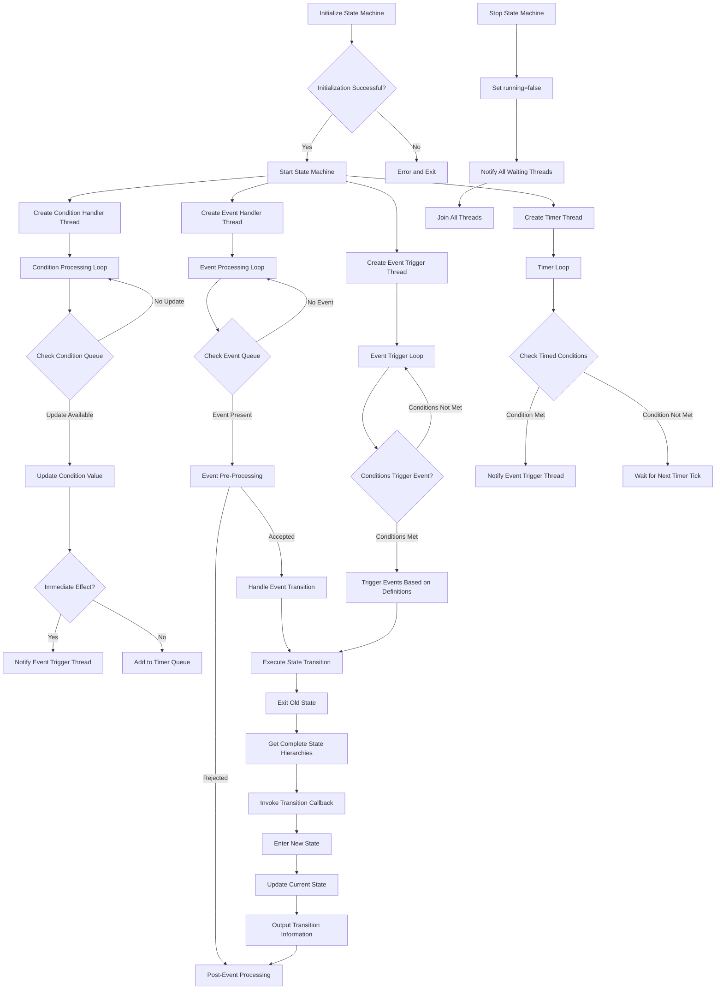

# Finite State Machine (FSM) Library

This is a C++ implementation of a **Finite State Machine (FSM)** that supports event-driven and condition-based state transitions. The library is designed to be flexible, extensible, and easy to use, making it suitable for applications such as IoT device control, game state management, and workflow engines.

---

## Features

- **State Management**: Define and manage multiple states with support for nested (hierarchical) states.
- **Event-Driven Transitions**: Trigger state transitions using events.
- **Condition-Based Transitions**: Trigger state transitions based on conditions (e.g., value ranges, duration).
- **Multi-dimensional Range Conditions**: Support for both simple one-dimensional ranges and multi-dimensional range arrays.
- **Custom Handlers**: Implement custom logic for state transitions using the `StateEventHandler` interface.
- **Asynchronous Processing**: Handle events and conditions asynchronously using multi-threading.
- **JSON Configuration**: Load state machine configurations from JSON files.
- **Time-Based Conditions**: Support for conditions that require a specific duration to be met.
- **Flexible Callback Mechanism**: Support for lambda functions and class member functions as callbacks.
- **Complete State Hierarchy**: Provide complete state hierarchy information in callbacks.
- **Integrated Logging System**: A thread-safe logging system with multiple log levels.
- **Event Definition Mechanism**: Support for defining events and their triggering conditions in the configuration file.
- **Multiple Trigger Modes**: Support for both edge-triggered and level-triggered event modes.
- **Automatic Condition Management**: Automatically create same-named conditions for defined events, simplifying state tracking.
- **Priority Queue Timer**: Efficiently manage timed conditions using a priority queue.
- **Fine-grained Thread Synchronization**: Improve concurrent performance with separate mutexes for events, conditions, states, timers, and event triggers.

---

## Project Structure

```
StateMachine_Frame/
├── build.sh                  # Build script
├── CMakeLists.txt            # Main CMake configuration file
├── cmake/                    # CMake configuration files
│   ├── FSMConfig.cmake.in    # Template for FSM config
│   └── statemachine.pc.in    # Template for pkg-config
├── config/                   # Configuration examples
│   ├── state_config.json     # State configuration
│   ├── event_generate_config/  # Event generation configs
│   │   └── power_event.json  # Power event definition
│   └── trans_config/         # Transition configs
│       ├── active_to_paused.json
│       ├── active_to_standby.json
│       ├── idle_to_standby.json
│       ├── off_to_idle.json
│       ├── on_to_off.json
│       ├── paused_to_active.json
│       ├── standby_to_active.json
│       └── standby_to_idle.json
├── LICENSE                   # MIT License
├── README.md                 # English documentation
├── README_CN.md              # Chinese documentation
├── run_test.sh               # Script to run tests
├── state_machine/            # Core library implementation
│   ├── CMakeLists.txt        # State machine build config
│   ├── include/              # Header files
│   │   ├── common_define.h   # Common definitions
│   │   ├── event.h           # Event handling
│   │   ├── handler_example.h # Example handler implementation
│   │   ├── logger.h          # Logger implementation
│   │   ├── state_event_handler.h  # State event handler
│   │   └── state_machine.h   # Main FSM implementation
│   └── src/                  # Source files
│       └── state_machine.cpp # Implementation file
├── test/                     # Test files
│   ├── CMakeLists.txt        # Test build configuration
│   ├── comprehensive_test/   # Comprehensive tests
│   │   ├── comprehensive_test.cpp  # Smart home system test
│   │   └── state_hierarchy_test.cpp # Hierarchy state test
│   ├── conditions_event/     # Condition-based events tests
│   │   ├── CMakeLists.txt    # Test build configuration
│   │   ├── condition_event_test.cpp  # Condition event test
│   │   └── config/           # Test configurations
│   │       ├── event_generate_config/  # Event configs for test
│   │       │   ├── start_work.json     # Work start event
│   │       │   └── system_error.json   # System error event
│   │       ├── state_config.json       # State configuration
│   │       └── trans_config/           # Transition configs
│   │           ├── error2init.json     # Error to init transition
│   │           ├── init2working.json   # Init to working transition
│   │           ├── working2error.json  # Working to error transition
│   │           └── working2init.json   # Working to init transition
│   ├── main_test/            # Basic tests
│   │   └── main_test.cpp     # Basic functionality test
│   └── multi_range_conditions/ # Multi-dimensional range condition tests
│       ├── CMakeLists.txt      # Test build configuration
│       └── test_multi_range_conditions.cpp # Multi-range condition test
└── third_party/              # External dependencies
    └── nlohmann-json/        # JSON library
        ├── json_fwd.hpp      # Forward declarations
        └── json.hpp          # JSON implementation
```

## Code Structure

### Key Components

1. **State and Event Types**
  - `State`: Represented as a `std::string`.
  - `Event`: Class representing an event with name and matched conditions information.
  - `EventPtr`: Defined as `std::shared_ptr<Event>` for safer event handling.

2. **Condition Type**
  ```cpp
  struct Condition {
    std::string name;                                // Condition name
    std::vector<std::pair<int, int>> range_values;   // Condition ranges [[min1, max1], [min2, max2], ...]
    int duration{0};                                 // Duration in milliseconds, default 0 means immediate effect
  };
  ```

3. **Condition Value**
  ```cpp
  struct ConditionValue {
    std::string name;                                       // Condition name
    int value;                                              // Current condition value
    std::chrono::steady_clock::time_point lastUpdateTime;   // Last update timestamp
    std::chrono::steady_clock::time_point lastChangedTime;  // Timestamp when the value last changed
  };
  ```

4. **Condition Info**
  ```cpp
  struct ConditionInfo {
    std::string name;  // Condition name
    int value;         // Condition value
    long duration;     // Duration in milliseconds that the condition has been satisfied
  };
  ```

5. **Event Definition Structure**
  ```cpp
  struct EventDefinition {
    std::string name;                   // Event name
    std::string trigger_mode;           // Trigger mode: edge (edge-triggered) or level (level-triggered)
    std::vector<Condition> conditions;  // Conditions that trigger the event
    std::string conditionsOperator;     // Condition operator ("AND" or "OR")
  };
  ```

6. **Transition Rule**
  ```cpp
  struct TransitionRule {
    State from;                         // Source state
    std::string event;                  // Triggering event (can be empty)
    State to;                           // Target state
    std::vector<Condition> conditions;  // List of conditions
    std::string conditionsOperator;     // Condition operator ("AND" or "OR")
  };
  ```

7. **State Info**
  ```cpp
  struct StateInfo {
    State name;                   // State name
    State parent;                 // Parent state name (can be empty)
    std::vector<State> children;  // Child states list
  };
  ```

8. **Condition Update Event**
  ```cpp
  struct ConditionUpdateEvent {
    std::string name;
    int value;
    std::chrono::steady_clock::time_point updateTime;
  };
  ```

9. **Duration Condition**
  ```cpp
  struct DurationCondition {
    std::string name;
    int value;        // Value at the time of triggering
    int duration;     // Duration in milliseconds
    std::chrono::steady_clock::time_point expiryTime;
  };
  ```

10. **State Event Handler**
  ```cpp
  class StateEventHandler {
  public:
    // Callback function types
    using TransitionCallback = std::function<void(const std::vector<State>&, const EventPtr&, const std::vector<State>&)>;
    using PreEventCallback = std::function<bool(const State&, const EventPtr&)>;
    using EnterStateCallback = std::function<void(const std::vector<State>&)>;
    using ExitStateCallback = std::function<void(const std::vector<State>&)>;
    using PostEventCallback = std::function<void(const EventPtr&, bool)>;
    
    // Set callback functions
    void SetTransitionCallback(TransitionCallback callback);
    void SetPreEventCallback(PreEventCallback callback);
    void SetEnterStateCallback(EnterStateCallback callback);
    void SetExitStateCallback(ExitStateCallback callback);
    void SetPostEventCallback(PostEventCallback callback);
    
    // Support for class member functions as callbacks
    template<typename T>
    void SetTransitionCallback(T* instance, void (T::*method)(const std::vector<State>&, const EventPtr&, const std::vector<State>&));
    
    template<typename T>
    void SetPreEventCallback(T* instance, bool (T::*method)(const State&, const EventPtr&));
    
    template<typename T>
    void SetEnterStateCallback(T* instance, void (T::*method)(const std::vector<State>&));
    
    template<typename T>
    void SetExitStateCallback(T* instance, void (T::*method)(const std::vector<State>&));
    
    template<typename T>
    void SetPostEventCallback(T* instance, void (T::*method)(const EventPtr&, bool));
    
    // Internal call methods
    void OnTransition(const std::vector<State>& fromStates, const EventPtr& event, 
                     const std::vector<State>& toStates);
    bool OnPreEvent(const State& currentState, const EventPtr& event);
    void OnEnterState(const std::vector<State>& states);
    void OnExitState(const std::vector<State>& states);
    void OnPostEvent(const EventPtr& event, bool handled);
  };
  ```
  - Provides flexible callback-based state transition handling:
    - Event pre-processing and validation
    - State entry and exit handling
    - Transition handling
    - Post-transition event processing
  - Receives complete state hierarchies rather than single states
  - Enables handling transitions with knowledge of the entire state context

11. **Finite State Machine Class**
  - Core class for managing the state machine:
    - Initialization: Load configuration from a JSON file or separate configuration files
    - Event Handling: Process events asynchronously with dedicated mutex
    - Condition Handling: Update and check conditions with dedicated mutex
    - State Transitions: Trigger transitions based on events or conditions with state mutex protection
    - Event Generation: Automatically generate events based on condition changes
    - Timer Management: Handle time-based (duration) conditions with timer mutex protection
    - Event Triggering: Dedicated event trigger handling with separate mutex

12. **Logger Class**
  ```cpp
  class Logger {
  public:
    static Logger& GetInstance();
    void SetLogLevel(LogLevel level);
    LogLevel GetLogLevel() const;
    void Log(LogLevel level, const std::string& file, int line, const std::string& message);
    void SetLogFile(const std::string& file);
    void SetLogFileRolling(size_t max_file_size, int max_backup_index);
    void Shutdown();
  private:
    Logger();
    // Thread-safe implementation with mutex
  };
  ```
  - Thread-safe singleton logger with support for multiple log levels
  - Includes file, line number, and timestamp information
  - Provides convenient macros for different log levels
  - Supports file-based logging with rotation capabilities

---

## Usage

### 1. Define States and Transitions
States and transitions can be defined programmatically or loaded from a JSON file.

#### Example JSON Configuration (Separate Files Mode)

##### State Configuration (state_config.json)
```json
{
  "states": [
    {"name": "OFF"},
    {"name": "ON"},
    {"name": "IDLE", "parent": "ON"},
    {"name": "STAND_BY", "parent": "ON"},
    {"name": "ACTIVE", "parent": "ON"},
    {"name": "PAUSED", "parent": "ON"}
  ],
  "initial_state": "OFF"
}
```

##### Event Generation Configuration (event_generate_config/power_event.json)
```json
{
  "name": "POWER_CHANGE",
  "trigger_mode": "edge",
  "conditions": [
    {
      "name": "is_powered",
      "range": [1, 1]
    }
  ],
  "conditions_operator": "AND"
}
```

##### Event with Multi-range Conditions Example
```json
{
  "name": "MULTI_RANGE_EVENT",
  "trigger_mode": "edge",
  "conditions": [
    {
      "name": "temperature",
      "range": [
        [10, 20],
        [30, 40]
      ]
    }
  ],
  "conditions_operator": "AND"
}
```

##### Transition Rule Configuration (trans_config/off_to_idle.json)
```json
{
  "from": "OFF",
  "to": "IDLE",
  "conditions": [
    {
      "name": "is_powered",
      "range": [1, 1],
      "duration": 1000
    }
  ],
  "conditions_operator": "OR"
}
```

### 2. Implement State Event Handlers
There are three ways to handle state events:

#### Option 1: Create a StateEventHandler with helper function using lambdas
```cpp
// Create and configure handler
auto handler = createLightStateHandler();  // Use provided helper function
fsm.SetStateEventHandler(handler);
```

#### Option 2: Set individual lambda callbacks directly
```cpp
// State transition callback
fsm.SetTransitionCallback([](const std::vector<State>& fromStates, const EventPtr& event, 
                           const std::vector<State>& toStates) {
  State from = fromStates.empty() ? "" : fromStates[0];
  State to = toStates.empty() ? "" : toStates[0];
  
  if (from == "OFF" && to == "ON") {
    std::cout << "Light turned ON!" << std::endl;
  }
});

// State entry callback
fsm.SetEnterStateCallback([](const std::vector<State>& states) {
  if (!states.empty() && states[0] == "ON") {
    std::cout << "Entering ON state, activating device..." << std::endl;
  }
});

// State exit callback
fsm.SetExitStateCallback([](const std::vector<State>& states) {
  if (!states.empty() && states[0] == "ON") {
    std::cout << "Exiting ON state, shutting down device..." << std::endl;
  }
});
```

#### Option 3: Use class member functions as callbacks
```cpp
// Create controller object
auto controller = std::make_shared<LightController>();

// Bind class member functions as callbacks
fsm.SetTransitionCallback(controller.get(), &LightController::handleTransition);
fsm.SetPreEventCallback(controller.get(), &LightController::validateEvent);
fsm.SetEnterStateCallback(controller.get(), &LightController::onEnter);
fsm.SetExitStateCallback(controller.get(), &LightController::onExit);
fsm.SetPostEventCallback(controller.get(), &LightController::afterEvent);

// Example controller class
class LightController {
public:
  // State transition handler
  void handleTransition(const std::vector<State>& fromStates, const EventPtr& event, 
                      const std::vector<State>& toStates) {
    // Implement state transition logic
  }
  
  // Event validation
  bool validateEvent(const State& state, const EventPtr& event) {
    // Return true to allow the event, false to reject
    return true;
  }
  
  // Other callback methods...
};
```

### 3. Initialize and Run the State Machine
```cpp
int main() {
   FiniteStateMachine fsm;
   
   // Set state event handler callbacks
   fsm.SetTransitionCallback([](const std::vector<State>& fromStates, 
                              const EventPtr& event,
                              const std::vector<State>& toStates) {
     // Handle state transition
   });
   
   // Option 1: Initialize with a single configuration file
   fsm.Init("config.json"); 
   
   // Option 2: Initialize with separate configuration files
   fsm.Init("state_config.json", "event_generate_config_dir", "trans_config_dir");
   
   // Start state machine
   fsm.Start();

   // Trigger events and conditions
   fsm.HandleEvent(std::make_shared<Event>("turn_on"));
   fsm.SetConditionValue("power", 50);

   // Stop state machine
   fsm.Stop();
   return 0;
}
```

### 4. Configure and Use the Logger
```cpp
// Initialize the logger with desired log level
SMF_LOGGER_INIT(smf::LogLevel::INFO);

// Log messages of different levels
SMF_LOGD("This is a debug message");
SMF_LOGI("This is an info message");
SMF_LOGW("This is a warning message");
SMF_LOGE("This is an error message");
```

---

## Testing

The project includes two test examples that can be run using the provided script:

### Running Tests with Script
```bash
# Run basic test
./run_test.sh main

# Run comprehensive test
./run_test.sh comp

# Run state hierarchy test
./run_test.sh hierarchy

# Run condition event test
./run_test.sh condition

# Run multi-range conditions test
./run_test.sh multi

# Run all tests
./run_test.sh all
```

### Basic Test
A simple test that demonstrates basic state machine functionality, including:
- Basic state transitions
- Event handling
- Simple callback execution

### Comprehensive Test
A more complex example that simulates a smart home system with multiple states, events and transitions:
- Hierarchical state management
- Event-driven transitions
- Condition-based transitions with timing constraints
- Complete callback handling
- Smart home controller implementation
- Error handling and logging

### Multi-range Conditions Test
A specialized test for the multi-dimensional range condition feature:
- Support for simple one-dimensional range conditions (`[min, max]`)
- Support for multi-dimensional range arrays (`[[min1, max1], [min2, max2], ...]`)
- Testing transitions with different range configurations
- Demonstrating condition matching in non-contiguous value ranges

---

## API Reference

### FiniteStateMachine Class

#### Static Constants
- `static constexpr const char* INTERNAL_EVENT`: Internal event constant for condition-triggered transitions

#### Construction/Destruction
- `FiniteStateMachine()`: Constructor, initializes the state machine
- `~FiniteStateMachine()`: Destructor, stops the state machine and cleans up resources

#### Initialization and Control Methods
- `bool Init(const std::string& configFile)`: Load state machine configuration from a single JSON file
- `bool Init(const std::string& stateConfigFile, const std::string& eventGenerateConfigDir, const std::string& transConfigDir)`: Load state machine configuration from separate JSON files
- `bool Start()`: Start the state machine and its worker threads
- `void Stop()`: Stop the state machine and its worker threads

#### Event Handling
- `void HandleEvent(const EventPtr& event)`: Trigger an event asynchronously

#### Condition Handling
- `void SetConditionValue(const std::string& name, int value)`: Update a condition value asynchronously

#### State Management
- `State GetCurrentState() const`: Get the current state
- `void SetInitialState(const State& state)`: Set the initial state
- `void AddState(const State& name, const State& parent = "")`: Add a new state
- `void AddTransition(const TransitionRule& rule)`: Add a state transition rule
- `std::vector<State> GetStateHierarchy(const State& state) const`: Get a state and all its parent states (from child to parent)
- `void GetStateHierarchy(const State& from, const State& to, std::vector<State>& exit_states, std::vector<State>& enter_states) const`: Get states to exit and enter when transitioning between two states

#### State Event Handler Methods
- `void SetStateEventHandler(std::shared_ptr<StateEventHandler> handler)`: Set a complete state event handler

##### Function Object Callbacks
- `void SetTransitionCallback(StateEventHandler::TransitionCallback callback)`: Set state transition callback
- `void SetPreEventCallback(StateEventHandler::PreEventCallback callback)`: Set event pre-processing callback
- `void SetEnterStateCallback(StateEventHandler::EnterStateCallback callback)`: Set state entry callback
- `void SetExitStateCallback(StateEventHandler::ExitStateCallback callback)`: Set state exit callback
- `void SetPostEventCallback(StateEventHandler::PostEventCallback callback)`: Set event post-processing callback

##### Class Member Function Callbacks
- `template<typename T> void SetTransitionCallback(T* instance, void (T::*method)(...))`: Set class member function as state transition callback
- `template<typename T> void SetPreEventCallback(T* instance, bool (T::*method)(...))`: Set class member function as event pre-processing callback
- `template<typename T> void SetEnterStateCallback(T* instance, void (T::*method)(...))`: Set class member function as state entry callback
- `template<typename T> void SetExitStateCallback(T* instance, void (T::*method)(...))`: Set class member function as state exit callback
- `template<typename T> void SetPostEventCallback(T* instance, void (T::*method)(...))`: Set class member function as event post-processing callback

#### Internal Handler Methods
The library includes several private methods for internal processing:
- Event processing loop for handling event queue items
- Condition processing loop for handling condition updates
- Timer loop for managing duration-based conditions
- Event trigger loop for generating events based on conditions

### StateEventHandler Class

#### Callback Function Types
- `using TransitionCallback`: State transition callback function type
- `using PreEventCallback`: Event pre-processing callback function type
- `using EnterStateCallback`: State entry callback function type
- `using ExitStateCallback`: State exit callback function type
- `using PostEventCallback`: Event post-processing callback function type

#### Callback Setting Methods
- `void SetTransitionCallback(TransitionCallback callback)`: Set state transition callback
- `void SetPreEventCallback(PreEventCallback callback)`: Set event pre-processing callback
- `void SetEnterStateCallback(EnterStateCallback callback)`: Set state entry callback
- `void SetExitStateCallback(ExitStateCallback callback)`: Set state exit callback
- `void SetPostEventCallback(PostEventCallback callback)`: Set event post-processing callback

#### Class Member Function Callbacks
- `template<typename T> void SetTransitionCallback(T* instance, void (T::*method)(...))`: Set class member function as state transition callback
- `template<typename T> void SetPreEventCallback(T* instance, bool (T::*method)(...))`: Set class member function as event pre-processing callback
- `template<typename T> void SetEnterStateCallback(T* instance, void (T::*method)(...))`: Set class member function as state entry callback
- `template<typename T> void SetExitStateCallback(T* instance, void (T::*method)(...))`: Set class member function as state exit callback
- `template<typename T> void SetPostEventCallback(T* instance, void (T::*method)(...))`: Set class member function as event post-processing callback

#### Internal Handler Methods
- `void OnTransition(const std::vector<State>& fromStates, const EventPtr& event, const std::vector<State>& toStates)`: Handle state transition
- `bool OnPreEvent(const State& currentState, const EventPtr& event)`: Handle event pre-processing
- `void OnEnterState(const std::vector<State>& states)`: Handle state entry
- `void OnExitState(const std::vector<State>& states)`: Handle state exit
- `void OnPostEvent(const EventPtr& event, bool handled)`: Handle event post-processing

### Logger Class

#### Enums
- `enum class LogLevel { DEBUG, INFO, WARN, ERROR }`: Log levels from least to most severe

#### Public Methods
- `static Logger& GetInstance()`: Get the singleton logger instance
- `void SetLogLevel(LogLevel level)`: Set the minimum log level to display
- `LogLevel GetLogLevel() const`: Get the current minimum log level
- `void Log(LogLevel level, const std::string& file, int line, const std::string& message)`: Log a message
- `void SetLogFile(const std::string& file)`: Set the log file
- `void SetLogFileRolling(size_t max_file_size, int max_backup_index)`: Set up log file rolling based on size and backup index
- `void Shutdown()`: Shutdown the logger and release resources

#### Logging Macros
- `SMF_LOGGER_INIT(level)`: Initialize the logger with a specific log level
- `SMF_LOGD(message)`: Log a debug message
- `SMF_LOGI(message)`: Log an info message
- `SMF_LOGW(message)`: Log a warning message
- `SMF_LOGE(message)`: Log an error message

---

## Example Use Cases

1. **IoT Device Control**:
  - Manage the states of a smart light (e.g., OFF, ON, ACTIVE).
  - Trigger transitions based on events (e.g., "turn_on", "turn_off") or conditions (e.g., power level).

2. **Game State Management**:
  - Control game states (e.g., MENU, PLAY, PAUSE, GAME_OVER).
  - Handle transitions based on player actions or game conditions.

3. **Workflow Engine**:
  - Model workflows with states representing stages (e.g., START, PROCESS, END).
  - Trigger transitions based on external inputs or time-based conditions.

---

## State Machine Processing Flow

The following diagram illustrates the processing flow of the Finite State Machine:



---

## Finite State Machine Thread Model

The state machine uses a four-thread model for asynchronous processing:
1. **Event Handler Thread**: Dedicated to processing events from the event queue
2. **Event Trigger Thread**: Dedicated to generating events based on condition changes
3. **Condition Handler Thread**: Dedicated to processing condition updates
4. **Timer Thread**: Dedicated to handling time-based conditions

This design ensures efficient concurrent processing while avoiding complex race conditions.

---

## Thread Synchronization

The state machine uses fine-grained synchronization to maximize concurrent performance:

1. **event_mutex_**: Protects access to the event queue and ensures thread-safe event handling
2. **condition_update_mutex_**: Protects condition updates and the condition update queue
3. **state_mutex_**: Ensures thread-safe state access and updates
4. **timer_mutex_**: Protects the timer queue for duration-based conditions
5. **event_trigger_mutex_**: Handles synchronization of event triggering based on conditions
6. **condition_values_mutex_**: Protects access to condition values storage

This multi-mutex approach allows different operations to proceed in parallel when possible, improving overall performance.

---

## Performance Optimizations

1. **Asynchronous Event and Condition Handling**: Reduce blocking by using queues and dedicated threads
2. **Smart Condition Triggering**: Check transition rules only when conditions change
3. **Duration Condition Optimization**: Use priority queue to efficiently manage timed conditions
4. **Fine-grained Locking**: Separate mutexes for events, conditions, states, timers, and triggers
5. **Condition Variable Notification**: Use condition variables instead of polling to reduce CPU usage
6. **Automatic Event Generation**: Generate events automatically based on condition changes, reducing manual triggering

---

## Dependencies

- **nlohmann/json**: A modern C++ JSON library for parsing and generating JSON data.
  - GitHub: [nlohmann/json](https://github.com/nlohmann/json)
- **logger**: Integrated thread-safe logging system included in the library.

---

## Build Instructions

### Prerequisites
- C++17 compatible compiler
- CMake 3.10 or higher
- pthread library

### Library Output Options
The state machine framework can be built as both static and dynamic libraries:
- **Static Library**: Built as `libstatemachine.a`
- **Dynamic Library**: Built as `libstatemachine.so` with proper soname versioning (`libstatemachine.so.1` -> `libstatemachine.so.1.0.0`)

### Build Steps
```bash
# Clone the repository
git clone https://github.com/JUSTLIKEHU/StateMachine_Frame.git
cd StateMachine_Frame

# Build using script (recommended)
./build.sh

# Or build manually
mkdir -p build && cd build
cmake ..
make

# Run tests
cd bin
./main_test
./comprehensive_test
```

### Installation
```bash
# Install the library and headers (from the build directory)
sudo make install
```

By default, the library will be installed to:
- Libraries: `/usr/local/lib/`
- Headers: `/usr/local/include/statemachine/`
- CMake config files: `/usr/local/lib/cmake/FSM/`
- pkg-config file: `/usr/local/lib/pkgconfig/`

### Using the Installed Library in Other Projects

#### With CMake
```cmake
# Find the library in your CMakeLists.txt
find_package(FSM REQUIRED)

# Link against the library
target_link_libraries(your_target_name FSM::statemachine)
```

#### With pkg-config
```bash
# Compile with pkg-config information
g++ -o your_program your_program.cpp $(pkg-config --cflags --libs statemachine)
```

---

## License

This project is licensed under the MIT License. See the [LICENSE](LICENSE) file for details.

---

## Contributing

Contributions are welcome! Please open an issue or submit a pull request for any improvements or bug fixes.

---

## Author

[Xiaokui.Hu]
[1151217347@qq.com]
[JUSTLIKEHU](https://github.com/JUSTLIKEHU)