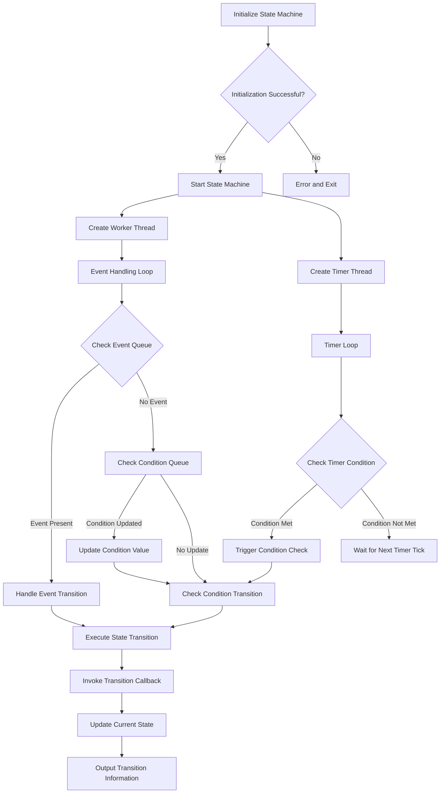

# Finite State Machine (FSM) Library

This is a C++ implementation of a **Finite State Machine (FSM)** that supports event-driven and condition-based state transitions. The library is designed to be flexible, extensible, and easy to use, making it suitable for applications such as IoT device control, game state management, and workflow engines.

---

## Features

- **State Management**: Define and manage multiple states with support for nested (hierarchical) states.
- **Event-Driven Transitions**: Trigger state transitions using events.
- **Condition-Based Transitions**: Trigger state transitions based on conditions (e.g., value ranges, duration).
- **Custom Handlers**: Implement custom logic for state transitions using the `TransitionHandler` interface.
- **Asynchronous Processing**: Handle events and conditions asynchronously using multi-threading.
- **JSON Configuration**: Load state machine configurations from JSON files.
- **Time-Based Conditions**: Support for conditions that require a specific duration to be met.

---

## Code Structure

### Key Components

1. **State and Event Types**
  - `State`: Represented as a `std::string`.
  - `Event`: Represented as a `std::string`.

2. **Condition**
  - A condition consists of:
    - `name`: Unique identifier for the condition.
    - `range`: A pair of integers `[min, max]` defining the valid range.
    - `duration`: Duration (in milliseconds) the condition must be met.
    - `lastUpdateTime`: Timestamp of the last update.

3. **Transition Rule**
  - Defines a state transition:
    - `from`: Starting state.
    - `event`: Triggering event (optional).
    - `to`: Target state.
    - `conditions`: List of conditions to be met.
    - `conditionsOperator`: Logical operator (`AND` or `OR`) for combining conditions.

4. **State Info**
  - Stores information about a state:
    - `name`: State name.
    - `parent`: Parent state (if any).
    - `children`: List of child states.

5. **Transition Handler**
  - Abstract class for implementing custom transition logic:
    ```cpp
    class TransitionHandler {
    public:
      virtual void onTransition(const State& from, const Event& event, const State& to) = 0;
    };
    ```

6. **FiniteStateMachine Class**
  - Core class for managing the state machine:
    - Initialization: Load configuration from a JSON file.
    - Event Handling: Process events asynchronously.
    - Condition Handling: Update and check conditions.
    - State Transitions: Trigger transitions based on events or conditions.

---

## Usage

### 1. Define States and Transitions
States and transitions can be defined programmatically or loaded from a JSON file.

#### Example JSON Configuration
```json
{
  "states": [
   {"name": "OFF", "parent": ""},
   {"name": "ON", "parent": ""},
   {"name": "ACTIVE", "parent": "ON"}
  ],
  "initial_state": "OFF",
  "transitions": [
   {
    "from": "OFF",
    "event": "turn_on",
    "to": "ON",
    "conditions": [
      {"name": "power", "range": [1, 100], "duration": 1000}
    ],
    "conditions_operator": "AND"
   },
   {
    "from": "ON",
    "event": "turn_off",
    "to": "OFF"
   }
  ]
}
```
### 2. Implement a Custom Transition Handler
Create a class that inherits from `TransitionHandler` to define custom logic for state transitions.

#### Example: LightTransitionHandler
```cpp
class LightTransitionHandler : public TransitionHandler {
public:
   void onTransition(const State& from, const Event& event, const State& to) override {
      if (from == "OFF" && to == "ACTIVE") {
        std::cout << "Light turned ON and is ACTIVE!" << std::endl;
      } else if (from == "ON" && to == "OFF") {
        std::cout << "Light turned OFF!" << std::endl;
      }
   }
};
```

### 3. Initialize and Run the State Machine
```cpp
int main() {
   FiniteStateMachine fsm;
   fsm.Init("config.json"); // Load configuration from JSON file

   auto handler = std::make_shared<LightTransitionHandler>();
   fsm.setTransitionHandler(handler);

   fsm.start(); // Start the state machine

   // Trigger events
   fsm.handleEvent("turn_on");
   fsm.setConditionValue("power", 50); // Update condition value

   // Stop the state machine
   fsm.stop();
   return 0;
}
```

---

## API Reference

### FiniteStateMachine Class

#### Methods
- **Initialization**
  - `bool Init(const std::string& configFile)`: Load state machine configuration from a JSON file.
  
- **Start/Stop**
  - `bool start()`: Start the state machine.
  - `void stop()`: Stop the state machine.

- **Event Handling**
  - `void handleEvent(const Event& event)`: Trigger an event asynchronously.

- **Condition Handling**
  - `void setConditionValue(const std::string& name, int value)`: Update a condition value asynchronously.

- **State Management**
  - `State getCurrentState() const`: Get the current state.
  - `void setInitialState(const State& state)`: Set the initial state.

- **Transition Handler**
  - `void setTransitionHandler(std::shared_ptr<TransitionHandler> handler)`: Set a custom transition handler.

---

## Example Use Cases

1. **IoT Device Control**:
  - Manage the states of a smart light (e.g., OFF, ON, ACTIVE).
  - Trigger transitions based on events (e.g., "turn_on", "turn_off") or conditions (e.g., power level).

2. **Game State Management**:
  - Control game states (e.g., MENU, PLAY, PAUSE, GAME_OVER).
  - Handle transitions based on player actions or game conditions.

3. **Workflow Engine**:
  - Model workflows with states representing stages (e.g., START, PROCESS, END).
  - Trigger transitions based on external inputs or time-based conditions.

---

## Dependencies

- **nlohmann/json**: A modern C++ JSON library for parsing and generating JSON data.
  - GitHub: [nlohmann/json](https://github.com/nlohmann/json)

---

## License

This project is licensed under the MIT License. See the [LICENSE](LICENSE) file for details.

---

## Contributing

Contributions are welcome! Please open an issue or submit a pull request for any improvements or bug fixes.

---

## State Processing Pipeline

The following diagram illustrates the state processing pipeline of the Finite State Machine:


---

## Author

[JerryHu]  
[1151217347@qq.com]  
[JUSTLIKEHU](https://github.com/JUSTLIKEHU)