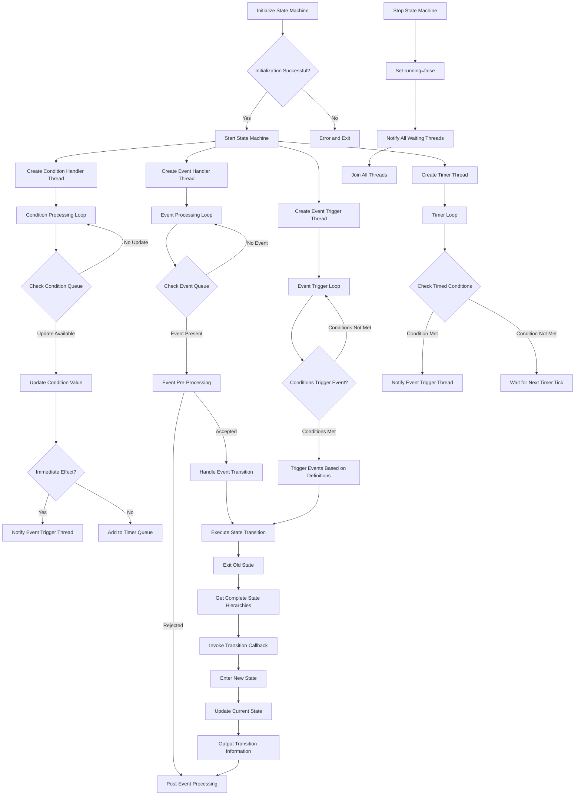

# Finite State Machine (FSM) Library

This is a C++ implementation of a **Finite State Machine (FSM)** that supports event-driven and condition-based state transitions. The library is designed to be flexible, extensible, and easy to use, making it suitable for applications such as IoT device control, game state management, and workflow engines.

---

## Features

- **State Management**: Define and manage multiple states with support for nested (hierarchical) states.
- **Event-Driven Transitions**: Trigger state transitions using events.
- **Condition-Based Transitions**: Trigger state transitions based on conditions (e.g., value ranges, duration).
- **Custom Handlers**: Implement custom logic for state transitions using the `StateEventHandler` interface.
- **Asynchronous Processing**: Handle events and conditions asynchronously using multi-threading.
- **JSON Configuration**: Load state machine configurations from JSON files.
- **Time-Based Conditions**: Support for conditions that require a specific duration to be met.
- **Flexible Callback Mechanism**: Support for lambda functions and class member functions as callbacks.
- **Complete State Hierarchy**: Provide complete state hierarchy information in callbacks.
- **Integrated Logging System**: A thread-safe logging system with multiple log levels.
- **Event Definition Mechanism**: Support for defining events and their triggering conditions in the configuration file.
- **Multiple Trigger Modes**: Support for both edge-triggered and level-triggered event modes.
- **Automatic Condition Management**: Automatically create same-named conditions for defined events, simplifying state tracking.

---

## Project Structure

```
StateMachine_Frame/
├── build.sh                  # Build script
├── CMakeLists.txt            # Main CMake configuration file
├── config/                   # Configuration examples
│   └── fsm_config.json       # Example FSM configuration
├── LICENSE                   # MIT License
├── README.md                 # English documentation
├── README_CN.md              # Chinese documentation
├── run_test.sh               # Script to run tests
├── state_machine/            # Core library implementation
│   ├── logger.h              # Logger implementation
│   └── state_machine.h       # Main FSM implementation
├── test/                     # Test files
│   ├── CMakeLists.txt        # Test build configuration
│   ├── comprehensive_test/   # Comprehensive tests
│   │   └── comprehensive_test.cpp  # Smart home system test example
│   └── main_test/            # Basic tests
│       └── main_test.cpp     # Basic functionality test
└── third_party/              # External dependencies
    └── nlohmann-json/        # JSON library
        ├── json_fwd.hpp
        └── json.hpp
```

## Code Structure

### Key Components

1. **State and Event Types**
  - `State`: Represented as a `std::string`.
  - `Event`: Represented as a `std::string`.

2. **Condition Type**
  ```cpp
  struct Condition {
    std::string name;           // Condition name
    std::pair<int, int> range;  // Valid range [min, max]
    int duration{0};            // Duration in milliseconds, default 0 means immediate effect
    std::chrono::steady_clock::time_point lastUpdateTime;  // Last update timestamp
  };
  ```

3. **Event Definition Structure**
  ```cpp
  struct EventDefinition {
    std::string name;               // Event name
    std::string trigger_mode;       // Trigger mode: edge (edge-triggered) or level (level-triggered)
    std::vector<Condition> conditions;  // Conditions that trigger the event
    std::string conditionsOperator; // Condition operator ("AND" or "OR")
  };
  ```

4. **Transition Rule**
  ```cpp
  struct TransitionRule {
    State from;                         // Source state
    Event event;                        // Triggering event (can be empty)
    State to;                           // Target state
    std::vector<Condition> conditions;  // List of conditions
    std::string conditionsOperator;     // Condition operator ("AND" or "OR")
  };
  ```

5. **State Info**
  ```cpp
  struct StateInfo {
    State name;                   // State name
    State parent;                 // Parent state name (can be empty)
    std::vector<State> children;  // Child states list
  };
  ```

6. **Condition Update Event**
  ```cpp
  struct ConditionUpdateEvent {
    std::string name;
    int value;
    std::chrono::steady_clock::time_point updateTime;
  };
  ```

7. **Duration Condition**
  ```cpp
  struct DurationCondition {
    std::string name;
    int value;  // Value at the time of triggering
    std::chrono::steady_clock::time_point expiryTime;
  };
  ```

8. **State Event Handler**
  ```cpp
  class StateEventHandler {
  public:
    // Callback function types
    using TransitionCallback = std::function<void(const std::vector<State>&, const Event&, const std::vector<State>&)>;
    using PreEventCallback = std::function<bool(const State&, const Event&)>;
    using EnterStateCallback = std::function<void(const std::vector<State>&)>;
    using ExitStateCallback = std::function<void(const std::vector<State>&)>;
    using PostEventCallback = std::function<void(const Event&, bool)>;
    
    // Set callback functions
    void setTransitionCallback(TransitionCallback callback);
    void setPreEventCallback(PreEventCallback callback);
    void setEnterStateCallback(EnterStateCallback callback);
    void setExitStateCallback(ExitStateCallback callback);
    void setPostEventCallback(PostEventCallback callback);
    
    // Support for class member functions as callbacks
    template<typename T>
    void setTransitionCallback(T* instance, void (T::*method)(const std::vector<State>&, const Event&, const std::vector<State>&));
    
    template<typename T>
    void setPreEventCallback(T* instance, bool (T::*method)(const State&, const Event&));
    
    template<typename T>
    void setEnterStateCallback(T* instance, void (T::*method)(const std::vector<State>&));
    
    template<typename T>
    void setExitStateCallback(T* instance, void (T::*method)(const std::vector<State>&));
    
    template<typename T>
    void setPostEventCallback(T* instance, void (T::*method)(const Event&, bool));
    
    // Internal call methods
    void onTransition(const std::vector<State>& fromStates, const Event& event, 
                     const std::vector<State>& toStates);
    bool onPreEvent(const State& currentState, const Event& event);
    void onEnterState(const std::vector<State>& states);
    void onExitState(const std::vector<State>& states);
    void onPostEvent(const Event& event, bool handled);
  };
  ```
  - Provides flexible callback-based state transition handling:
    - Event pre-processing and validation
    - State entry and exit handling
    - Transition handling
    - Post-transition event processing
  - Receives complete state hierarchies rather than single states
  - Enables handling transitions with knowledge of the entire state context

9. **Finite State Machine Class**
  - Core class for managing the state machine:
    - Initialization: Load configuration from a JSON file.
    - Event Handling: Process events asynchronously.
    - Condition Handling: Update and check conditions.
    - State Transitions: Trigger transitions based on events or conditions.
    - Event Generation: Automatically generate events based on condition changes.

10. **Logger Class**
  ```cpp
  class Logger {
  public:
    static Logger& getInstance();
    void setLogLevel(LogLevel level);
    LogLevel getLogLevel() const;
    void log(LogLevel level, const std::string& file, int line, const std::string& message);
  private:
    Logger();
    // Thread-safe implementation with mutex
  };
  ```
  - Thread-safe singleton logger with support for multiple log levels
  - Includes file, line number, and timestamp information
  - Provides convenient macros for different log levels

---

## Usage

### 1. Define States and Transitions
States and transitions can be defined programmatically or loaded from a JSON file.

#### Example JSON Configuration
```json
{
  "states": [
   {"name": "OFF", "parent": ""},
   {"name": "ON", "parent": ""},
   {"name": "ACTIVE", "parent": "ON"}
  ],
  "initial_state": "OFF",
  "events": [
   {
    "name": "power_changed",
    "trigger_mode": "edge",
    "conditions": [
      {"name": "power", "range": [1, 100]}
    ],
    "conditions_operator": "AND"
   }
  ],
  "transitions": [
   {
    "from": "OFF",
    "event": "turn_on",
    "to": "ON",
    "conditions": [
      {"name": "power", "range": [1, 100], "duration": 1000}
    ],
    "conditions_operator": "AND"
   },
   {
    "from": "ON",
    "event": "turn_off",
    "to": "OFF"
   }
  ]
}
```

### 2. Implement State Event Handlers
There are three ways to handle state events:

#### Option 1: Create a StateEventHandler with helper function using lambdas
```cpp
// Create and configure handler
auto handler = createLightStateHandler();  // Use provided helper function
fsm.setStateEventHandler(handler);
```

#### Option 2: Set individual lambda callbacks directly
```cpp
// State transition callback
fsm.setTransitionCallback([](const std::vector<State>& fromStates, const Event& event, 
                           const std::vector<State>& toStates) {
  State from = fromStates.empty() ? "" : fromStates[0];
  State to = toStates.empty() ? "" : toStates[0];
  
  if (from == "OFF" && to == "ON") {
    std::cout << "Light turned ON!" << std::endl;
  }
});

// State entry callback
fsm.setEnterStateCallback([](const std::vector<State>& states) {
  if (!states.empty() && states[0] == "ON") {
    std::cout << "Entering ON state, activating device..." << std::endl;
  }
});

// State exit callback
fsm.setExitStateCallback([](const std::vector<State>& states) {
  if (!states.empty() && states[0] == "ON") {
    std::cout << "Exiting ON state, shutting down device..." << std::endl;
  }
});
```

#### Option 3: Use class member functions as callbacks
```cpp
// Create controller object
auto controller = std::make_shared<LightController>();

// Bind class member functions as callbacks
fsm.setTransitionCallback(controller.get(), &LightController::handleTransition);
fsm.setPreEventCallback(controller.get(), &LightController::validateEvent);
fsm.setEnterStateCallback(controller.get(), &LightController::onEnter);
fsm.setExitStateCallback(controller.get(), &LightController::onExit);
fsm.setPostEventCallback(controller.get(), &LightController::afterEvent);

// Example controller class
class LightController {
public:
  // State transition handler
  void handleTransition(const std::vector<State>& fromStates, const Event& event, 
                      const std::vector<State>& toStates) {
    // Implement state transition logic
  }
  
  // Event validation
  bool validateEvent(const State& state, const Event& event) {
    // Return true to allow the event, false to reject
    return true;
  }
  
  // Other callback methods...
};
```

### 3. Initialize and Run the State Machine
```cpp
int main() {
   FiniteStateMachine fsm;
   
   // Set state event handler callbacks
   fsm.setTransitionCallback([](const std::vector<State>& fromStates, 
                              const Event& event,
                              const std::vector<State>& toStates) {
     // Handle state transition
   });
   
   fsm.Init("config.json"); // Load configuration
   fsm.start(); // Start state machine

   // Trigger events and conditions
   fsm.handleEvent("turn_on");
   fsm.setConditionValue("power", 50);

   // Stop state machine
   fsm.stop();
   return 0;
}
```

### 4. Configure and Use the Logger
```cpp
// Initialize the logger with desired log level
SMF_LOGGER_INIT(smf::LogLevel::INFO);

// Log messages of different levels
SMF_LOGD("This is a debug message");
SMF_LOGI("This is an info message");
SMF_LOGW("This is a warning message");
SMF_LOGE("This is an error message");
```

---

## Testing

The project includes two test examples that can be run using the provided script:

### Running Tests with Script
```bash
# Run basic test
./run_test.sh main

# Run comprehensive test
./run_test.sh comp

# Run all tests
./run_test.sh all
```

### Basic Test
A simple test that demonstrates basic state machine functionality, including:
- Basic state transitions
- Event handling
- Simple callback execution

### Comprehensive Test
A more complex example that simulates a smart home system with multiple states, events and transitions:
- Hierarchical state management
- Event-driven transitions
- Condition-based transitions with timing constraints
- Complete callback handling
- Smart home controller implementation
- Error handling and logging

---

## API Reference

### FiniteStateMachine Class

#### Static Constants
- `static constexpr const char* INTERNAL_EVENT`: Internal event constant for condition-triggered transitions

#### Construction/Destruction
- `FiniteStateMachine()`: Constructor, initializes the state machine
- `~FiniteStateMachine()`: Destructor, stops the state machine and cleans up resources

#### Initialization and Control Methods
- `bool Init(const std::string& configFile)`: Load state machine configuration from a JSON file
- `bool start()`: Start the state machine and its worker threads
- `void stop()`: Stop the state machine and its worker threads

#### Event Handling
- `void handleEvent(const Event& event)`: Trigger an event asynchronously

#### Condition Handling
- `void setConditionValue(const std::string& name, int value)`: Update a condition value asynchronously

#### State Management
- `State getCurrentState() const`: Get the current state
- `void setInitialState(const State& state)`: Set the initial state
- `void addState(const State& name, const State& parent = "")`: Add a new state
- `void addTransition(const TransitionRule& rule)`: Add a state transition rule
- `void loadFromJSON(const std::string& filepath)`: Load state machine configuration from a JSON file

#### State Event Handler Methods
- `void setStateEventHandler(std::shared_ptr<StateEventHandler> handler)`: Set a complete state event handler

##### Function Object Callbacks
- `void setTransitionCallback(StateEventHandler::TransitionCallback callback)`: Set state transition callback
- `void setPreEventCallback(StateEventHandler::PreEventCallback callback)`: Set event pre-processing callback
- `void setEnterStateCallback(StateEventHandler::EnterStateCallback callback)`: Set state entry callback
- `void setExitStateCallback(StateEventHandler::ExitStateCallback callback)`: Set state exit callback
- `void setPostEventCallback(StateEventHandler::PostEventCallback callback)`: Set event post-processing callback

##### Class Member Function Callbacks
- `template<typename T> void setTransitionCallback(T* instance, void (T::*method)(...))`: Set class member function as state transition callback
- `template<typename T> void setPreEventCallback(T* instance, bool (T::*method)(...))`: Set class member function as event pre-processing callback
- `template<typename T> void setEnterStateCallback(T* instance, void (T::*method)(...))`: Set class member function as state entry callback
- `template<typename T> void setExitStateCallback(T* instance, void (T::*method)(...))`: Set class member function as state exit callback
- `template<typename T> void setPostEventCallback(T* instance, void (T::*method)(...))`: Set class member function as event post-processing callback

### StateEventHandler Class

#### Callback Function Types
- `using TransitionCallback`: State transition callback function type
- `using PreEventCallback`: Event pre-processing callback function type
- `using EnterStateCallback`: State entry callback function type
- `using ExitStateCallback`: State exit callback function type
- `using PostEventCallback`: Event post-processing callback function type

#### Callback Setting Methods
- `void setTransitionCallback(TransitionCallback callback)`: Set state transition callback
- `void setPreEventCallback(PreEventCallback callback)`: Set event pre-processing callback
- `void setEnterStateCallback(EnterStateCallback callback)`: Set state entry callback
- `void setExitStateCallback(ExitStateCallback callback)`: Set state exit callback
- `void setPostEventCallback(PostEventCallback callback)`: Set event post-processing callback

#### Class Member Function Callbacks
- `template<typename T> void setTransitionCallback(T* instance, void (T::*method)(...))`: Set class member function as state transition callback
- `template<typename T> void setPreEventCallback(T* instance, bool (T::*method)(...))`: Set class member function as event pre-processing callback
- `template<typename T> void setEnterStateCallback(T* instance, void (T::*method)(...))`: Set class member function as state entry callback
- `template<typename T> void setExitStateCallback(T* instance, void (T::*method)(...))`: Set class member function as state exit callback
- `template<typename T> void setPostEventCallback(T* instance, void (T::*method)(...))`: Set class member function as event post-processing callback

#### Internal Handler Methods
- `void onTransition(const std::vector<State>& fromStates, const Event& event, const std::vector<State>& toStates)`: Handle state transition
- `bool onPreEvent(const State& currentState, const Event& event)`: Handle event pre-processing
- `void onEnterState(const std::vector<State>& states)`: Handle state entry
- `void onExitState(const std::vector<State>& states)`: Handle state exit
- `void onPostEvent(const Event& event, bool handled)`: Handle event post-processing

### Logger Class

#### Enums
- `enum class LogLevel { DEBUG, INFO, WARN, ERROR }`: Log levels from least to most severe

#### Public Methods
- `static Logger& getInstance()`: Get the singleton logger instance
- `void setLogLevel(LogLevel level)`: Set the minimum log level to display
- `LogLevel getLogLevel() const`: Get the current minimum log level
- `void log(LogLevel level, const std::string& file, int line, const std::string& message)`: Log a message

#### Logging Macros
- `SMF_LOGGER_INIT(level)`: Initialize the logger with a specific log level
- `SMF_LOGD(message)`: Log a debug message
- `SMF_LOGI(message)`: Log an info message
- `SMF_LOGW(message)`: Log a warning message
- `SMF_LOGE(message)`: Log an error message

---

## Example Use Cases

1. **IoT Device Control**:
  - Manage the states of a smart light (e.g., OFF, ON, ACTIVE).
  - Trigger transitions based on events (e.g., "turn_on", "turn_off") or conditions (e.g., power level).

2. **Game State Management**:
  - Control game states (e.g., MENU, PLAY, PAUSE, GAME_OVER).
  - Handle transitions based on player actions or game conditions.

3. **Workflow Engine**:
  - Model workflows with states representing stages (e.g., START, PROCESS, END).
  - Trigger transitions based on external inputs or time-based conditions.

---

## State Machine Processing Flow

The following diagram illustrates the processing flow of the Finite State Machine:



---

## Finite State Machine Thread Model

The state machine uses a four-thread model for asynchronous processing:
1. **Event Handler Thread**: Dedicated to processing events from the event queue
2. **Event Trigger Thread**: Dedicated to generating events based on condition changes
3. **Condition Handler Thread**: Dedicated to processing condition updates
4. **Timer Thread**: Dedicated to handling time-based conditions

This design ensures efficient concurrent processing while avoiding complex race conditions.

---

## Performance Optimizations

1. **Asynchronous Event and Condition Handling**: Reduce blocking by using queues and dedicated threads
2. **Smart Condition Triggering**: Check transition rules only when conditions change
3. **Duration Condition Optimization**: Use priority queue to efficiently manage timed conditions
4. **Fine-grained Locking**: Separate mutexes for events, conditions, and states
5. **Condition Variable Notification**: Use condition variables instead of polling to reduce CPU usage
6. **Automatic Event Generation**: Generate events automatically based on condition changes, reducing manual triggering

---

## Dependencies

- **nlohmann/json**: A modern C++ JSON library for parsing and generating JSON data.
  - GitHub: [nlohmann/json](https://github.com/nlohmann/json)
- **logger**: Integrated thread-safe logging system included in the library.

---

## Build Instructions

### Prerequisites
- C++17 compatible compiler
- CMake 3.10 or higher
- pthread library

### Build Steps
```bash
# Clone the repository
git clone https://github.com/JUSTLIKEHU/StateMachine_Frame.git
cd StateMachine_Frame

# Build using script (recommended)
./build.sh

# Or build manually
mkdir -p build && cd build
cmake ..
make

# Run tests
cd bin
./main_test
./comprehensive_test
```

---

## License

This project is licensed under the MIT License. See the [LICENSE](LICENSE) file for details.

---

## Contributing

Contributions are welcome! Please open an issue or submit a pull request for any improvements or bug fixes.

---

## Author

[Xiaokui.Hu]
[1151217347@qq.com]
[JUSTLIKEHU](https://github.com/JUSTLIKEHU)