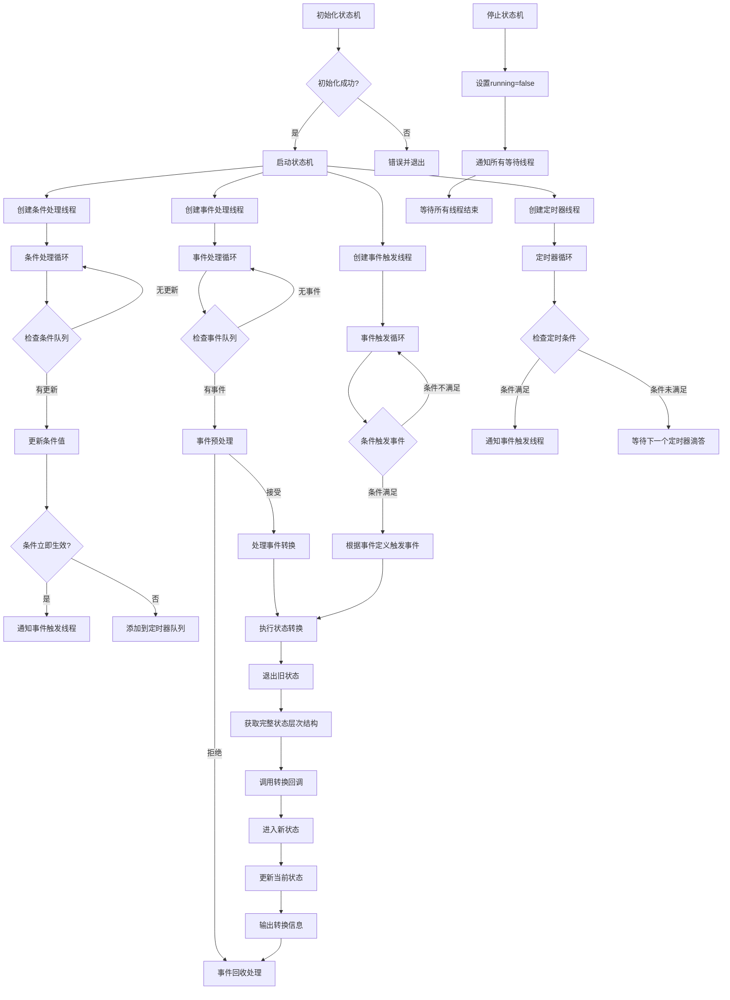

# 有限状态机(FSM)库

这是一个**有限状态机(FSM)**的C++实现，支持事件驱动和基于条件的状态转换。该库被设计为灵活、可扩展且易用，适用于物联网设备控制、游戏状态管理和工作流引擎等应用场景。

---

## 功能特点

- **状态管理**：定义和管理多个状态，支持嵌套(层次化)状态。
- **事件驱动转换**：使用事件触发状态转换。
- **基于条件的转换**：基于条件(例如，值范围、持续时间)触发状态转换。
- **多维范围条件**：支持简单的一维范围和多维范围数组。
- **自定义处理器**：使用`StateEventHandler`接口实现自定义状态转换逻辑。
- **异步处理**：使用多线程异步处理事件和条件。
- **JSON配置**：从JSON文件加载状态机配置。
- **基于时间的条件**：支持需要满足特定持续时间的条件。
- **状态超时机制**：可以为状态定义超时时间，当状态持续时间超过指定值时触发超时事件。
- **灵活的回调机制**：支持lambda函数和类成员函数作为回调。
- **完整的状态层次结构**：在回调中提供完整的状态层次信息。
- **集成日志系统**：具有多种日志级别的线程安全日志系统。
- **事件定义机制**：支持在配置文件中定义事件及其触发条件。
- **多种触发模式**：支持边缘触发和水平触发两种事件触发模式。
- **条件自动管理**：为定义的事件自动创建同名条件，简化状态跟踪。
- **优先级队列定时器**：使用优先级队列高效管理定时条件。
- **细粒度线程同步**：为事件、条件、状态、定时器和事件触发使用独立的互斥锁，提高并发性能。
- **工厂模式支持**：通过集中式工厂创建和管理多个状态机。
- **命名状态机**：支持创建和管理多个具名状态机。
- **单例工厂管理**：集中管理所有状态机实例。

---

## 项目结构

```
StateMachine_Frame/
├── build.sh                  # 构建脚本
├── CMakeLists.txt            # 主CMake配置文件
├── cmake/                    # CMake配置文件
│   ├── FSMConfig.cmake.in    # FSM配置模板
│   └── statemachine.pc.in    # pkg-config模板
├── config/                   # 配置示例
│   ├── state_config.json     # 状态配置
│   ├── event_generate_config/  # 事件生成配置
│   │   └── power_event.json  # 电源事件定义
│   └── trans_config/         # 转换配置
│       ├── active_to_paused.json
│       ├── active_to_standby.json
│       ├── idle_to_standby.json
│       ├── off_to_idle.json
│       ├── on_to_off.json
│       ├── paused_to_active.json
│       ├── standby_to_active.json
│       └── standby_to_idle.json
├── LICENSE                   # MIT许可证
├── README.md                 # 英文文档
├── README_CN.md              # 中文文档
├── run_test.sh               # 运行测试脚本
├── state_machine/            # 核心库实现
│   ├── CMakeLists.txt        # 状态机构建配置
│   ├── include/              # 头文件
│   │   ├── common_define.h   # 通用定义
│   │   ├── event.h           # 事件处理
│   │   ├── handler_example.h # 处理器示例实现
│   │   ├── logger.h          # 日志实现
│   │   ├── state_event_handler.h  # 状态事件处理器
│   │   └── state_machine.h   # 主FSM实现
│   └── src/                  # 源文件
│       └── state_machine.cpp # 实现文件
├── test/                     # 测试文件
│   ├── CMakeLists.txt        # 测试构建配置
│   ├── comprehensive_test/   # 全面测试
│   │   ├── comprehensive_test.cpp  # 智能家居系统测试
│   │   └── state_hierarchy_test.cpp # 层次状态测试
│   ├── conditions_event/     # 基于条件的事件测试
│   │   ├── CMakeLists.txt    # 测试构建配置
│   │   ├── condition_event_test.cpp  # 条件事件测试
│   │   └── config/           # 测试配置
│   │       ├── event_generate_config/  # 测试用事件配置
│   │       │   ├── start_work.json     # 开始工作事件
│   │       │   └── system_error.json   # 系统错误事件
│   │       ├── state_config.json       # 状态配置
│   │       └── trans_config/           # 转换配置
│   │           ├── error2init.json     # 错误到初始化转换
│   │           ├── init2working.json   # 初始化到工作转换
│   │           ├── working2error.json  # 工作到错误转换
│   │           └── working2init.json   # 工作到初始化转换
│   ├── main_test/            # 基本测试
│   │   └── main_test.cpp     # 基本功能测试
│   ├── multi_range_conditions/ # 多维范围条件测试
│   │   ├── CMakeLists.txt      # 测试构建配置
│   │   └── test_multi_range_conditions.cpp # 多范围条件测试
│   └── state_timeout/        # 状态超时测试
│       ├── CMakeLists.txt    # 测试构建配置 
│       ├── state_timeout_test.cpp # 状态超时测试
│       └── config/           # 测试配置
└── third_party/              # 外部依赖
    └── nlohmann-json/        # JSON库
        ├── json_fwd.hpp      # 前向声明
        └── json.hpp          # JSON实现
```

## 代码结构

### 核心组件

1. **状态和事件类型**
  - `State`：表示为`std::string`。
  - `Event`：表示事件的类，包含事件名称和匹配条件信息。
  - `EventPtr`：定义为`std::shared_ptr<Event>`，用于更安全的事件处理。

2. **条件类型**
  ```cpp
  struct Condition {
    std::string name;                                // 条件名称
    std::vector<std::pair<int, int>> range_values;   // 条件范围数组 [[min1, max1], [min2, max2], ...]
    int duration{0};                                 // 条件持续时间(毫秒),默认0表示立即生效
  };
  ```

3. **条件值**
  ```cpp
  struct ConditionValue {
    std::string name;                                       // 条件名称
    int value;                                              // 条件当前值
    std::chrono::steady_clock::time_point lastUpdateTime;   // 最后一次更新时间
    std::chrono::steady_clock::time_point lastChangedTime;  // 上次值变化的时间
  };
  ```

4. **条件信息**
  ```cpp
  struct ConditionInfo {
    std::string name;  // 条件名称
    int value;         // 条件值
    long duration;     // 条件已满足的持续时间（毫秒）
  };
  ```

5. **事件定义结构体**
  ```cpp
  struct EventDefinition {
    std::string name;                   // 事件名称
    std::string trigger_mode;           // 触发模式：edge (边缘触发) 或 level (水平触发)
    std::vector<Condition> conditions;  // 触发事件的条件列表
    std::string conditionsOperator;     // 条件运算符 ("AND" 或 "OR")
  };
  ```

6. **状态转换规则**
  ```cpp
  struct TransitionRule {
    State from;                         // 起始状态
    std::string event;                  // 事件（可为空）
    State to;                           // 目标状态
    std::vector<Condition> conditions;  // 条件列表
    std::string conditionsOperator;     // 条件运算符 ("AND" 或 "OR")
  };
  ```

7. **状态信息**
  ```cpp
  struct StateInfo {
    State name;                   // 状态名称
    State parent;                 // 父状态名称（可为空）
    std::vector<State> children;  // 子状态列表
    int timeout{0};               // 状态超时时间(毫秒)，默认0表示不超时
  };
  ```

8. **条件更新事件**
  ```cpp
  struct ConditionUpdateEvent {
    std::string name;
    int value;
    std::chrono::steady_clock::time_point updateTime;
  };
  ```

9. **持续条件**
  ```cpp
  struct DurationCondition {
    std::string name;
    int value;        // 触发条件时的值
    int duration;     // 持续时间（毫秒）
    std::chrono::steady_clock::time_point expiryTime;
  };
  ```

10. **状态超时信息**
  ```cpp
  struct StateTimeoutInfo {
    State state;                                      // 状态名称
    int timeout;                                      // 超时时间（毫秒）
    std::chrono::steady_clock::time_point enterTime;  // 进入状态的时间
    std::chrono::steady_clock::time_point expiryTime; // 超时将发生的时间
  };
  ```

11. **状态事件处理器**
  ```cpp
  class StateEventHandler {
  public:
    // 回调函数类型
    using TransitionCallback = std::function<void(const std::vector<State>&, const EventPtr&, const std::vector<State>&)>;
    using PreEventCallback = std::function<bool(const State&, const EventPtr&)>;
    using EnterStateCallback = std::function<void(const std::vector<State>&)>;
    using ExitStateCallback = std::function<void(const std::vector<State>&)>;
    using PostEventCallback = std::function<void(const EventPtr&, bool)>;
    
    // 设置回调函数
    void SetTransitionCallback(TransitionCallback callback);
    void SetPreEventCallback(PreEventCallback callback);
    void SetEnterStateCallback(EnterStateCallback callback);
    void SetExitStateCallback(ExitStateCallback callback);
    void SetPostEventCallback(PostEventCallback callback);
    
    // 支持类成员函数的回调设置方法
    template<typename T>
    void SetTransitionCallback(T* instance, void (T::*method)(const std::vector<State>&, const EventPtr&, const std::vector<State>&));
    
    template<typename T>
    void SetPreEventCallback(T* instance, bool (T::*method)(const State&, const EventPtr&));
    
    template<typename T>
    void SetEnterStateCallback(T* instance, void (T::*method)(const std::vector<State>&));
    
    template<typename T>
    void SetExitStateCallback(T* instance, void (T::*method)(const std::vector<State>&));
    
    template<typename T>
    void SetPostEventCallback(T* instance, void (T::*method)(const EventPtr&, bool));
    
    // 内部调用方法
    void OnTransition(const std::vector<State>& fromStates, const EventPtr& event, 
                     const std::vector<State>& toStates);
    bool OnPreEvent(const State& currentState, const EventPtr& event);
    void OnEnterState(const std::vector<State>& states);
    void OnExitState(const std::vector<State>& states);
    void OnPostEvent(const EventPtr& event, bool handled);
  };
  ```
  - 提供基于回调的灵活状态转换处理：
    - 事件预处理和验证
    - 状态进入和退出处理
    - 转换处理
    - 转换后事件处理
  - 接收完整的状态层次结构而非单个状态
  - 能够在知道整个状态上下文的情况下处理转换

12. **有限状态机类**
  - 管理状态机的核心类：
    - 初始化：从JSON文件或分离的配置文件加载配置
    - 事件处理：使用专用互斥锁异步处理事件
    - 条件处理：使用专用互斥锁更新和检查条件
    - 状态转换：基于事件或条件触发转换，使用状态互斥锁保护
    - 事件生成：基于条件自动生成事件
    - 定时器管理：使用定时器互斥锁处理基于时间的（持续）条件
    - 事件触发：使用专用互斥锁处理事件触发

13. **日志记录器类**
  ```cpp
  class Logger {
  public:
    static Logger& GetInstance();
    void SetLogLevel(LogLevel level);
    LogLevel GetLogLevel() const;
    void Log(LogLevel level, const std::string& file, int line, const std::string& message);
    void SetLogFile(const std::string& file);
    void SetLogFileRolling(size_t max_file_size, int max_backup_index);
    void Shutdown();
  private:
    Logger();
    // 线程安全实现，使用互斥锁
  };
  ```
  - 线程安全的单例日志记录器，支持多种日志级别
  - 包含文件名、行号和时间戳信息
  - 提供便捷的日志级别宏定义
  - 支持文件日志和日志轮转功能

### StateMachineFactory 类

#### 静态方法
- `static std::shared_ptr<FiniteStateMachine> CreateStateMachine(const std::string& name)`: 创建一个具有指定名称的新状态机
- `static std::vector<std::string> GetAllStateMachineNames()`: 获取所有已创建状态机的名称
- `static std::shared_ptr<FiniteStateMachine> GetStateMachine(const std::string& name)`: 通过名称获取状态机
- `static std::unordered_map<std::string, std::shared_ptr<FiniteStateMachine>> GetAllStateMachines()`: 获取所有已创建的状态机

#### 使用示例
```cpp
// 创建新的状态机
auto fsm = StateMachineFactory::CreateStateMachine("main_fsm");

// 获取已存在的状态机
auto existing_fsm = StateMachineFactory::GetStateMachine("main_fsm");

// 获取所有状态机名称
auto names = StateMachineFactory::GetAllStateMachineNames();

// 获取所有状态机
auto all_fsms = StateMachineFactory::GetAllStateMachines();
```

---

## 使用方法

### 1. 定义状态和转换
可以通过编程方式定义状态和转换，或者从JSON文件加载。

#### JSON配置示例（分离文件模式）

##### 状态配置 (state_config.json)
```json
{
  "states": [
    {"name": "OFF"},
    {"name": "ON"},
    {"name": "IDLE", "parent": "ON"},
    {"name": "STAND_BY", "parent": "ON"},
    {"name": "ACTIVE", "parent": "ON"},
    {"name": "PAUSED", "parent": "ON"},
    {"name": "WAITING", "parent": "ON", "timeout": 5000}
  ],
  "initial_state": "OFF"
}
```

##### 事件生成配置 (event_generate_config/power_event.json)
```json
{
  "name": "POWER_CHANGE",
  "trigger_mode": "edge",
  "conditions": [
    {
      "name": "is_powered",
      "range": [1, 1]
    }
  ],
  "conditions_operator": "AND"
}
```

##### 多范围条件事件示例
```json
{
  "name": "MULTI_RANGE_EVENT",
  "trigger_mode": "edge",
  "conditions": [
    {
      "name": "temperature",
      "range": [
        [10, 20],
        [30, 40]
      ]
    }
  ],
  "conditions_operator": "AND"
}
```

##### 转换规则配置 (trans_config/off_to_idle.json)
```json
{
  "from": "OFF",
  "to": "IDLE",
  "conditions": [
    {
      "name": "is_powered",
      "range": [1, 1],
      "duration": 1000
    }
  ],
  "conditions_operator": "OR"
}
```

### 2. 实现状态事件处理器
有三种方式处理状态事件：

#### 方式1：使用辅助函数创建带有lambda函数的处理器
```cpp
// 创建并配置处理器
auto handler = createLightStateHandler();  // 使用提供的辅助函数
fsm.SetStateEventHandler(handler);
```

#### 方式2：直接设置单独的lambda回调
```cpp
// 状态转换回调
fsm.SetTransitionCallback([](const std::vector<State>& fromStates, const EventPtr& event, 
                           const std::vector<State>& toStates) {
  State from = fromStates.empty() ? "" : fromStates[0];
  State to = toStates.empty() ? "" : toStates[0];
  
  if (from == "OFF" && to == "ON") {
    std::cout << "灯光已打开！" << std::endl;
  }
});

// 状态进入回调
fsm.SetEnterStateCallback([](const std::vector<State>& states) {
  if (!states.empty() && states[0] == "ON") {
    std::cout << "正在进入ON状态，激活设备..." << std::endl;
  }
});

// 状态退出回调
fsm.SetExitStateCallback([](const std::vector<State>& states) {
  if (!states.empty() && states[0] == "ON") {
    std::cout << "正在退出ON状态，关闭设备..." << std::endl;
  }
});
```

#### 方式3：使用类成员函数作为回调
```cpp
// 创建控制器对象
auto controller = std::make_shared<LightController>();

// 绑定类成员函数作为回调
fsm.SetTransitionCallback(controller.get(), &LightController::handleTransition);
fsm.SetPreEventCallback(controller.get(), &LightController::validateEvent);
fsm.SetEnterStateCallback(controller.get(), &LightController::onEnter);
fsm.SetExitStateCallback(controller.get(), &LightController::onExit);
fsm.SetPostEventCallback(controller.get(), &LightController::afterEvent);

// 示例控制器类
class LightController {
public:
  // 状态转换处理
  void handleTransition(const std::vector<State>& fromStates, const EventPtr& event, 
                      const std::vector<State>& toStates) {
    // 实现状态转换逻辑
  }
  
  // 事件验证
  bool validateEvent(const State& state, const EventPtr& event) {
    // 返回true表示允许事件，false表示拒绝
    return true;
  }
  
  // 其他回调方法...
};
```

### 3. 初始化并运行状态机
```cpp
int main() {
   // 使用工厂创建状态机
   auto fsm = smf::StateMachineFactory::CreateStateMachine("main_fsm");
   
   // 设置状态事件处理器回调
   fsm->SetTransitionCallback([](const std::vector<State>& fromStates, 
                              const EventPtr& event,
                              const std::vector<State>& toStates) {
     // 处理状态转换
   });
   
   // 方式1：使用单一配置文件初始化
   fsm->Init("config.json");
   
   // 方式2：使用分离的配置文件初始化
   fsm->Init("state_config.json", "event_generate_config_dir", "trans_config_dir");
   
   // 启动状态机
   fsm->Start();

   // 通过名称获取状态机
   auto same_fsm = smf::StateMachineFactory::GetStateMachine("main_fsm");

   // 获取所有状态机名称
   auto names = smf::StateMachineFactory::GetAllStateMachineNames();

   // 获取所有状态机
   auto all_fsms = smf::StateMachineFactory::GetAllStateMachines();

   // 触发事件和条件
   fsm->HandleEvent(std::make_shared<Event>("turn_on"));
   fsm->SetConditionValue("power", 50);

   // 停止状态机
   fsm->Stop();
   return 0;
}
```

### 4. 配置和使用日志系统
```cpp
// 使用所需的日志级别初始化日志记录器
SMF_LOGGER_INIT(smf::LogLevel::INFO);

// 记录不同级别的日志消息
SMF_LOGD("这是一条调试信息");
SMF_LOGI("这是一条信息");
SMF_LOGW("这是一条警告信息");
SMF_LOGE("这是一条错误信息");
```

---

## 测试

项目包含两个测试示例，可以使用提供的脚本运行：

### 使用脚本运行测试
```bash
# 运行基本测试
./run_test.sh main

# 运行全面测试
./run_test.sh comp

# 运行状态层次测试
./run_test.sh hierarchy

# 运行条件事件测试
./run_test.sh condition

# 运行多范围条件测试
./run_test.sh multi

# 运行状态超时测试
./run_test.sh timeout

# 运行所有测试
./run_test.sh all
```

### 基本测试
一个演示基本状态机功能的简单测试，包括：
- 基本状态转换
- 事件处理
- 简单回调执行

### 全面测试
一个模拟智能家居系统，包含多种状态、事件和转换的复杂示例：
- 层次状态管理
- 事件驱动转换
- 带有时间约束的基于条件的转换
- 完整的回调处理
- 智能家居控制器实现
- 错误处理和日志记录

### 多范围条件测试
专门用于测试多维范围条件功能的测试：
- 支持简单的一维范围条件 (`[min, max]`)
- 支持多维范围数组 (`[[min1, max1], [min2, max2], ...]`)
- 测试不同范围配置的状态转换
- 演示在非连续值范围内的条件匹配

### 状态超时测试
专门用于测试状态超时功能的测试：
- 测试状态超时机制
- 验证状态超时后的处理逻辑

---

## API参考

### FiniteStateMachine 类

#### 静态常量
- `static constexpr const char* INTERNAL_EVENT`：内部事件常量，用于条件触发的自动转换
- `static constexpr const char* STATE_TIMEOUT_EVENT`：内部事件常量，用于状态超时事件

#### 构造/析构
- `FiniteStateMachine()`：构造函数，初始化状态机
- `~FiniteStateMachine()`：析构函数，停止状态机并清理资源

#### 初始化和控制方法
- `bool Init(const std::string& configFile)`：从单一JSON文件加载状态机配置
- `bool Init(const std::string& stateConfigFile, const std::string& eventGenerateConfigDir, const std::string& transConfigDir)`：从分离的JSON文件加载状态机配置
- `bool Start()`：启动状态机及其工作线程
- `void Stop()`：停止状态机及其工作线程

#### 事件处理
- `void HandleEvent(const EventPtr& event)`：异步触发事件

#### 条件处理
- `void SetConditionValue(const std::string& name, int value)`：异步更新条件值

#### 状态管理
- `State GetCurrentState() const`：获取当前状态
- `void SetInitialState(const State& state)`：设置初始状态
- `void AddState(const State& name, const State& parent = "")`：添加新状态
- `void AddTransition(const TransitionRule& rule)`：添加状态转换规则
- `std::vector<State> GetStateHierarchy(const State& state) const`：获取一个状态及其所有父状态（从子到父的顺序）
- `void GetStateHierarchy(const State& from, const State& to, std::vector<State>& exit_states, std::vector<State>& enter_states) const`：获取从一个状态转换到另一个状态时需要退出和进入的状态

#### 状态事件处理器方法
- `void SetStateEventHandler(std::shared_ptr<StateEventHandler> handler)`：设置完整的状态事件处理器

##### 函数对象回调设置
- `void SetTransitionCallback(StateEventHandler::TransitionCallback callback)`：设置状态转换回调
- `void SetPreEventCallback(StateEventHandler::PreEventCallback callback)`：设置事件预处理回调
- `void SetEnterStateCallback(StateEventHandler::EnterStateCallback callback)`：设置状态进入回调
- `void SetExitStateCallback(StateEventHandler::ExitStateCallback callback)`：设置状态退出回调
- `void SetPostEventCallback(StateEventHandler::PostEventCallback callback)`：设置事件回收回调

##### 类成员函数回调设置
- `template<typename T> void SetTransitionCallback(T* instance, void (T::*method)(...))`：设置类成员函数作为状态转换回调
- `template<typename T> void SetPreEventCallback(T* instance, bool (T::*method)(...))`：设置类成员函数作为事件预处理回调
- `template<typename T> void SetEnterStateCallback(T* instance, void (T::*method)(...))`：设置类成员函数作为状态进入回调
- `template<typename T> void SetExitStateCallback(T* instance, void (T::*method)(...))`：设置类成员函数作为状态退出回调
- `template<typename T> void SetPostEventCallback(T* instance, void (T::*method)(...))`：设置类成员函数作为事件回收回调

#### 内部处理方法
库包含几个用于内部处理的私有方法：
- 事件处理循环，用于处理事件队列
- 条件处理循环，用于处理条件更新
- 定时器循环，用于管理基于持续时间的条件
- 事件触发循环，用于根据条件生成事件

### StateEventHandler 类

#### 回调函数类型
- `using TransitionCallback`: 状态转换回调函数类型
- `using PreEventCallback`: 事件预处理回调函数类型
- `using EnterStateCallback`: 状态进入回调函数类型
- `using ExitStateCallback`: 状态退出回调函数类型
- `using PostEventCallback`: 事件回收回调函数类型

#### 设置回调方法
- `void SetTransitionCallback(TransitionCallback callback)`：设置状态转换回调
- `void SetPreEventCallback(PreEventCallback callback)`：设置事件预处理回调
- `void SetEnterStateCallback(EnterStateCallback callback)`：设置状态进入回调
- `void SetExitStateCallback(ExitStateCallback callback)`：设置状态退出回调
- `void SetPostEventCallback(PostEventCallback callback)`：设置事件回收回调

#### 类成员函数回调设置
- `template<typename T> void SetTransitionCallback(T* instance, void (T::*method)(...))`：设置类成员函数作为状态转换回调
- `template<typename T> void SetPreEventCallback(T* instance, bool (T::*method)(...))`：设置类成员函数作为事件预处理回调
- `template<typename T> void SetEnterStateCallback(T* instance, void (T::*method)(...))`：设置类成员函数作为状态进入回调
- `template<typename T> void SetExitStateCallback(T* instance, void (T::*method)(...))`：设置类成员函数作为状态退出回调
- `template<typename T> void SetPostEventCallback(T* instance, void (T::*method)(...))`：设置类成员函数作为事件回收回调

#### 内部处理方法
- `void OnTransition(const std::vector<State>& fromStates, const EventPtr& event, const std::vector<State>& toStates)`：处理状态转换
- `bool OnPreEvent(const State& currentState, const EventPtr& event)`：处理事件预处理
- `void OnEnterState(const std::vector<State>& states)`：处理状态进入
- `void OnExitState(const std::vector<State>& states)`：处理状态退出
- `void OnPostEvent(const EventPtr& event, bool handled)`：处理事件回收

### Logger 类

#### 枚举
- `enum class LogLevel { DEBUG, INFO, WARN, ERROR }`：日志级别，从最低到最高严重程度

#### 公共方法
- `static Logger& GetInstance()`：获取日志记录器单例实例
- `void SetLogLevel(LogLevel level)`：设置要显示的最低日志级别
- `LogLevel GetLogLevel() const`：获取当前最低日志级别
- `void Log(LogLevel level, const std::string& file, int line, const std::string& message)`：记录日志消息
- `void SetLogFile(const std::string& file)`：设置日志文件
- `void SetLogFileRolling(size_t max_file_size, int max_backup_index)`：设置日志文件滚动策略
- `void Shutdown()`：关闭日志记录器

---

## 示例用例

1. **物联网设备控制**：
  - 管理智能灯的状态（例如，OFF、ON、ACTIVE）。
  - 基于事件（例如，"turn_on"、"turn_off"）或条件（例如，电源水平）触发转换。

2. **游戏状态管理**：
  - 控制游戏状态（例如，MENU、PLAY、PAUSE、GAME_OVER）。
  - 基于玩家操作或游戏条件处理转换。

3. **工作流引擎**：
  - 使用表示阶段的状态建模工作流（例如，START、PROCESS、END）。
  - 基于外部输入或基于时间的条件触发转换。

---

## 状态机处理流程

以下图表说明了有限状态机的处理流程：



---

## 有限状态机线程模型

状态机采用五线程模型进行异步处理：
1. **事件处理线程**：专门处理事件队列中的事件
2. **事件触发线程**：专门处理条件变化导致的事件生成
3. **条件处理线程**：专门处理条件更新队列
4. **定时器线程**：专门处理需要定时触发的条件
5. **状态超时线程**：专门处理状态超时事件

这种设计确保了高效的并发处理，同时避免了复杂的竞态条件。

---

## 线程同步机制

状态机使用细粒度的同步机制以最大化并发性能：

1. **event_mutex_**：保护事件队列的访问并确保线程安全的事件处理
2. **condition_update_mutex_**：保护条件更新和条件更新队列
3. **state_mutex_**：确保线程安全的状态访问和更新
4. **timer_mutex_**：保护用于基于持续时间的条件的定时器队列
5. **event_trigger_mutex_**：处理基于条件的事件触发同步
6. **condition_values_mutex_**：保护条件值存储的访问
7. **state_timeout_mutex_**：保护状态超时信息并确保线程安全的超时处理

这种多互斥锁方法允许不同操作在可能的情况下并行进行，提高整体性能。

---

## 性能优化

1. **异步事件和条件处理**：通过队列和专用线程减少阻塞
2. **智能条件触发**：仅在条件发生变化时检查转换规则
3. **持续条件优化**：使用优先队列高效管理定时条件
4. **细粒度锁定**：为事件、条件、状态、定时器和触发器使用单独的互斥锁
5. **条件变量通知**：使用条件变量而非轮询，减少CPU使用率
6. **事件自动生成**：根据条件变化自动生成相应事件，减少手动触发

---

## 依赖项

- **nlohmann/json**：用于解析和生成JSON数据的现代C++JSON库。
  - GitHub: [nlohmann/json](https://github.com/nlohmann/json)
- **logger**：提供日志功能支持，集成在库中。

---

## 构建说明

### 前提条件
- C++17兼容编译器
- CMake 3.10或更高版本
- pthread库

### 库输出选项
状态机框架可以构建为静态库和动态库两种形式：
- **静态库**：构建为`libstatemachine.a`
- **动态库**：构建为`libstatemachine.so`，并具有正确的soname版本信息（`libstatemachine.so.1` -> `libstatemachine.so.1.0.0`）

### 构建步骤
```bash
# 克隆仓库
git clone https://github.com/JUSTLIKEHU/StateMachine_Frame.git
cd StateMachine_Frame

# 使用脚本构建（推荐）
./build.sh

# 或手动构建
mkdir -p build && cd build
cmake ..
make

# 运行测试
cd bin
./main_test
./comprehensive_test
```

### 安装
```bash
# 安装库文件和头文件（在build目录中执行）
sudo make install
```

默认情况下，库将被安装到以下位置：
- 库文件：`/usr/local/lib/`
- 头文件：`/usr/local/include/statemachine/`
- CMake配置文件：`/usr/local/lib/cmake/FSM/`
- pkg-config文件：`/usr/local/lib/pkgconfig/`

### 在其他项目中使用已安装的库

#### 使用CMake
```cmake
# 在CMakeLists.txt中查找库
find_package(FSM REQUIRED)

# 链接到库
target_link_libraries(你的目标名称 FSM::statemachine)
```

#### 使用pkg-config
```bash
# 使用pkg-config信息编译
g++ -o your_program your_program.cpp $(pkg-config --cflags --libs statemachine)
```

---

## 许可

本项目使用MIT许可证。详情请参阅[LICENSE](LICENSE)文件。

---

## 贡献

欢迎贡献！请为任何改进或错误修复打开issue或提交pull request。

---

## 作者

[Xiaokui.Hu]
[1151217347@qq.com]  
[JUSTLIKEHU](https://github.com/JUSTLIKEHU)
