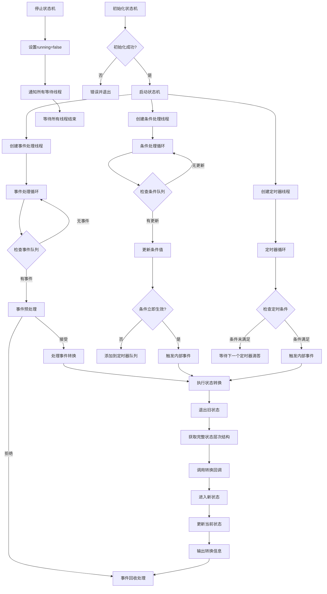

# 有限状态机(FSM)库

这是一个**有限状态机(FSM)**的C++实现，支持事件驱动和基于条件的状态转换。该库被设计为灵活、可扩展且易用，适用于物联网设备控制、游戏状态管理和工作流引擎等应用场景。

---

## 功能特点

- **状态管理**：定义和管理多个状态，支持嵌套(层次化)状态。
- **事件驱动转换**：使用事件触发状态转换。
- **基于条件的转换**：基于条件(例如，值范围、持续时间)触发状态转换。
- **自定义处理器**：使用`StateEventHandler`接口实现自定义状态转换逻辑。
- **异步处理**：使用多线程异步处理事件和条件。
- **JSON配置**：从JSON文件加载状态机配置。
- **基于时间的条件**：支持需要满足特定持续时间的条件。
- **灵活的回调机制**：支持lambda函数和类成员函数作为回调。
- **完整的状态层次结构**：在回调中提供完整的状态层次信息。

---

## 代码结构

### 核心组件

1. **状态和事件类型**
  - `State`：表示为`std::string`。
  - `Event`：表示为`std::string`。

2. **条件类型**
  ```cpp
  struct Condition {
    std::string name;           // 条件名称
    std::pair<int, int> range;  // 条件范围 [min, max]
    int duration{0};            // 条件持续时间(毫秒),默认0表示立即生效
    std::chrono::steady_clock::time_point lastUpdateTime;  // 最后一次更新时间
  };
  ```

3. **状态转换规则**
  ```cpp
  struct TransitionRule {
    State from;                         // 起始状态
    Event event;                        // 事件（可为空）
    State to;                           // 目标状态
    std::vector<Condition> conditions;  // 条件列表
    std::string conditionsOperator;     // 条件运算符 ("AND" 或 "OR")
  };
  ```

4. **状态信息**
  ```cpp
  struct StateInfo {
    State name;                   // 状态名称
    State parent;                 // 父状态名称（可为空）
    std::vector<State> children;  // 子状态列表
  };
  ```

5. **条件更新事件**
  ```cpp
  struct ConditionUpdateEvent {
    std::string name;
    int value;
    std::chrono::steady_clock::time_point updateTime;
  };
  ```

6. **持续条件**
  ```cpp
  struct DurationCondition {
    std::string name;
    int value;  // 触发条件时的值
    std::chrono::steady_clock::time_point expiryTime;
  };
  ```

7. **状态事件处理器**
  ```cpp
  class StateEventHandler {
  public:
    // 回调函数类型
    using TransitionCallback = std::function<void(const std::vector<State>&, const Event&, const std::vector<State>&)>;
    using PreEventCallback = std::function<bool(const State&, const Event&)>;
    using EnterStateCallback = std::function<void(const std::vector<State>&)>;
    using ExitStateCallback = std::function<void(const std::vector<State>&)>;
    using PostEventCallback = std::function<void(const Event&, bool)>;
    
    // 设置回调函数
    void setTransitionCallback(TransitionCallback callback);
    void setPreEventCallback(PreEventCallback callback);
    void setEnterStateCallback(EnterStateCallback callback);
    void setExitStateCallback(ExitStateCallback callback);
    void setPostEventCallback(PostEventCallback callback);
    
    // 支持类成员函数的回调设置方法
    template<typename T>
    void setTransitionCallback(T* instance, void (T::*method)(const std::vector<State>&, const Event&, const std::vector<State>&));
    
    template<typename T>
    void setPreEventCallback(T* instance, bool (T::*method)(const State&, const Event&));
    
    template<typename T>
    void setEnterStateCallback(T* instance, void (T::*method)(const std::vector<State>&));
    
    template<typename T>
    void setExitStateCallback(T* instance, void (T::*method)(const std::vector<State>&));
    
    template<typename T>
    void setPostEventCallback(T* instance, void (T::*method)(const Event&, bool));
    
    // 内部调用方法
    void onTransition(const std::vector<State>& fromStates, const Event& event, 
                     const std::vector<State>& toStates);
    bool onPreEvent(const State& currentState, const Event& event);
    void onEnterState(const std::vector<State>& states);
    void onExitState(const std::vector<State>& states);
    void onPostEvent(const Event& event, bool handled);
  };
  ```
  - 提供基于回调的灵活状态转换处理：
    - 事件预处理和验证
    - 状态进入和退出处理
    - 转换处理
    - 转换后事件处理
  - 接收完整的状态层次结构而非单个状态
  - 能够在知道整个状态上下文的情况下处理转换

8. **有限状态机类**
  - 管理状态机的核心类：
    - 初始化：从JSON文件加载配置。
    - 事件处理：异步处理事件。
    - 条件处理：更新和检查条件。
    - 状态转换：基于事件或条件触发转换。

---

## 使用方法

### 1. 定义状态和转换
可以通过编程方式定义状态和转换，或者从JSON文件加载。

#### JSON配置示例
```json
{
  "states": [
   {"name": "OFF", "parent": ""},
   {"name": "ON", "parent": ""},
   {"name": "ACTIVE", "parent": "ON"}
  ],
  "initial_state": "OFF",
  "transitions": [
   {
    "from": "OFF",
    "event": "turn_on",
    "to": "ON",
    "conditions": [
      {"name": "power", "range": [1, 100], "duration": 1000}
    ],
    "conditions_operator": "AND"
   },
   {
    "from": "ON",
    "event": "turn_off",
    "to": "OFF"
   }
  ]
}
```

### 2. 实现状态事件处理器
有三种方式处理状态事件：

#### 方式1：使用辅助函数创建带有lambda函数的处理器
```cpp
// 创建并配置处理器
auto handler = createLightStateHandler();  // 使用提供的辅助函数
fsm.setStateEventHandler(handler);
```

#### 方式2：直接设置单独的lambda回调
```cpp
// 状态转换回调
fsm.setTransitionCallback([](const std::vector<State>& fromStates, const Event& event, 
                           const std::vector<State>& toStates) {
  State from = fromStates.empty() ? "" : fromStates[0];
  State to = toStates.empty() ? "" : toStates[0];
  
  if (from == "OFF" && to == "ON") {
    std::cout << "灯光已打开！" << std::endl;
  }
});

// 状态进入回调
fsm.setEnterStateCallback([](const std::vector<State>& states) {
  if (!states.empty() && states[0] == "ON") {
    std::cout << "正在进入ON状态，激活设备..." << std::endl;
  }
});

// 状态退出回调
fsm.setExitStateCallback([](const std::vector<State>& states) {
  if (!states.empty() && states[0] == "ON") {
    std::cout << "正在退出ON状态，关闭设备..." << std::endl;
  }
});
```

#### 方式3：使用类成员函数作为回调
```cpp
// 创建控制器对象
auto controller = std::make_shared<LightController>();

// 绑定类成员函数作为回调
fsm.setTransitionCallback(controller.get(), &LightController::handleTransition);
fsm.setPreEventCallback(controller.get(), &LightController::validateEvent);
fsm.setEnterStateCallback(controller.get(), &LightController::onEnter);
fsm.setExitStateCallback(controller.get(), &LightController::onExit);
fsm.setPostEventCallback(controller.get(), &LightController::afterEvent);

// 示例控制器类
class LightController {
public:
  // 状态转换处理
  void handleTransition(const std::vector<State>& fromStates, const Event& event, 
                      const std::vector<State>& toStates) {
    // 实现状态转换逻辑
  }
  
  // 事件验证
  bool validateEvent(const State& state, const Event& event) {
    // 返回true表示允许事件，false表示拒绝
    return true;
  }
  
  // 其他回调方法...
};
```

### 3. 初始化并运行状态机
```cpp
int main() {
   FiniteStateMachine fsm;
   
   // 设置状态事件处理器回调
   fsm.setTransitionCallback([](const std::vector<State>& fromStates, 
                              const Event& event,
                              const std::vector<State>& toStates) {
     // 处理状态转换
   });
   
   fsm.Init("config.json"); // 加载配置
   fsm.start(); // 启动状态机

   // 触发事件和条件
   fsm.handleEvent("turn_on");
   fsm.setConditionValue("power", 50);

   // 停止状态机
   fsm.stop();
   return 0;
}
```

---

## API参考

### FiniteStateMachine 类

#### 静态常量
- `static constexpr const char* INTERNAL_EVENT`：内部事件常量，用于条件触发的自动转换

#### 构造/析构
- `FiniteStateMachine()`：构造函数，初始化状态机
- `~FiniteStateMachine()`：析构函数，停止状态机并清理资源

#### 初始化和控制方法
- `bool Init(const std::string& configFile)`：从JSON文件加载状态机配置
- `bool start()`：启动状态机及其工作线程
- `void stop()`：停止状态机及其工作线程

#### 事件处理
- `void handleEvent(const Event& event)`：异步触发事件

#### 条件处理
- `void setConditionValue(const std::string& name, int value)`：异步更新条件值

#### 状态管理
- `State getCurrentState() const`：获取当前状态
- `void setInitialState(const State& state)`：设置初始状态
- `void addState(const State& name, const State& parent = "")`：添加新状态
- `void addTransition(const TransitionRule& rule)`：添加状态转换规则
- `void loadFromJSON(const std::string& filepath)`：从JSON文件加载状态机配置

#### 状态事件处理器方法
- `void setStateEventHandler(std::shared_ptr<StateEventHandler> handler)`：设置完整的状态事件处理器

##### 函数对象回调设置
- `void setTransitionCallback(StateEventHandler::TransitionCallback callback)`：设置状态转换回调
- `void setPreEventCallback(StateEventHandler::PreEventCallback callback)`：设置事件预处理回调
- `void setEnterStateCallback(StateEventHandler::EnterStateCallback callback)`：设置状态进入回调
- `void setExitStateCallback(StateEventHandler::ExitStateCallback callback)`：设置状态退出回调
- `void setPostEventCallback(StateEventHandler::PostEventCallback callback)`：设置事件回收回调

##### 类成员函数回调设置
- `template<typename T> void setTransitionCallback(T* instance, void (T::*method)(...))`：设置类成员函数作为状态转换回调
- `template<typename T> void setPreEventCallback(T* instance, bool (T::*method)(...))`：设置类成员函数作为事件预处理回调
- `template<typename T> void setEnterStateCallback(T* instance, void (T::*method)(...))`：设置类成员函数作为状态进入回调
- `template<typename T> void setExitStateCallback(T* instance, void (T::*method)(...))`：设置类成员函数作为状态退出回调
- `template<typename T> void setPostEventCallback(T* instance, void (T::*method)(...))`：设置类成员函数作为事件回收回调

### StateEventHandler 类

#### 回调函数类型
- `using TransitionCallback`: 状态转换回调函数类型
- `using PreEventCallback`: 事件预处理回调函数类型
- `using EnterStateCallback`: 状态进入回调函数类型
- `using ExitStateCallback`: 状态退出回调函数类型
- `using PostEventCallback`: 事件回收回调函数类型

#### 设置回调方法
- `void setTransitionCallback(TransitionCallback callback)`：设置状态转换回调
- `void setPreEventCallback(PreEventCallback callback)`：设置事件预处理回调
- `void setEnterStateCallback(EnterStateCallback callback)`：设置状态进入回调
- `void setExitStateCallback(ExitStateCallback callback)`：设置状态退出回调
- `void setPostEventCallback(PostEventCallback callback)`：设置事件回收回调

#### 类成员函数回调设置
- `template<typename T> void setTransitionCallback(T* instance, void (T::*method)(...))`：设置类成员函数作为状态转换回调
- `template<typename T> void setPreEventCallback(T* instance, bool (T::*method)(...))`：设置类成员函数作为事件预处理回调
- `template<typename T> void setEnterStateCallback(T* instance, void (T::*method)(...))`：设置类成员函数作为状态进入回调
- `template<typename T> void setExitStateCallback(T* instance, void (T::*method)(...))`：设置类成员函数作为状态退出回调
- `template<typename T> void setPostEventCallback(T* instance, void (T::*method)(...))`：设置类成员函数作为事件回收回调

#### 内部处理方法
- `void onTransition(const std::vector<State>& fromStates, const Event& event, const std::vector<State>& toStates)`：处理状态转换
- `bool onPreEvent(const State& currentState, const Event& event)`：处理事件预处理
- `void onEnterState(const std::vector<State>& states)`：处理状态进入
- `void onExitState(const std::vector<State>& states)`：处理状态退出
- `void onPostEvent(const Event& event, bool handled)`：处理事件回收

---

## 示例用例

1. **物联网设备控制**：
  - 管理智能灯的状态（例如，OFF、ON、ACTIVE）。
  - 基于事件（例如，"turn_on"、"turn_off"）或条件（例如，电源水平）触发转换。

2. **游戏状态管理**：
  - 控制游戏状态（例如，MENU、PLAY、PAUSE、GAME_OVER）。
  - 基于玩家操作或游戏条件处理转换。

3. **工作流引擎**：
  - 使用表示阶段的状态建模工作流（例如，START、PROCESS、END）。
  - 基于外部输入或基于时间的条件触发转换。

---

## 状态机处理流程

以下图表说明了有限状态机的处理流程：



---

## 有限状态机线程模型

状态机采用三线程模型进行异步处理：
1. **事件处理线程**：专门处理事件队列中的事件
2. **条件处理线程**：专门处理条件更新队列
3. **定时器线程**：专门处理需要定时触发的条件

这种设计确保了高效的并发处理，同时避免了复杂的竞态条件。

---

## 性能优化

1. **异步事件和条件处理**：通过队列和专用线程减少阻塞
2. **智能条件触发**：仅在条件发生变化时检查转换规则
3. **持续条件优化**：使用优先队列高效管理定时条件
4. **细粒度锁定**：为事件、条件和状态使用单独的互斥锁
5. **条件变量通知**：使用条件变量而非轮询，减少CPU使用率

---

## 依赖项

- **nlohmann/json**：用于解析和生成JSON数据的现代C++JSON库。
  - GitHub: [nlohmann/json](https://github.com/nlohmann/json)
- **logger**：提供日志功能支持。

---

## 许可

本项目使用MIT许可证。详情请参阅[LICENSE](LICENSE)文件。

---

## 贡献

欢迎贡献！请为任何改进或错误修复打开issue或提交pull request。

---

## 作者

[JerryHu]  
[1151217347@qq.com]  
[JUSTLIKEHU](https://github.com/JUSTLIKEHU)
