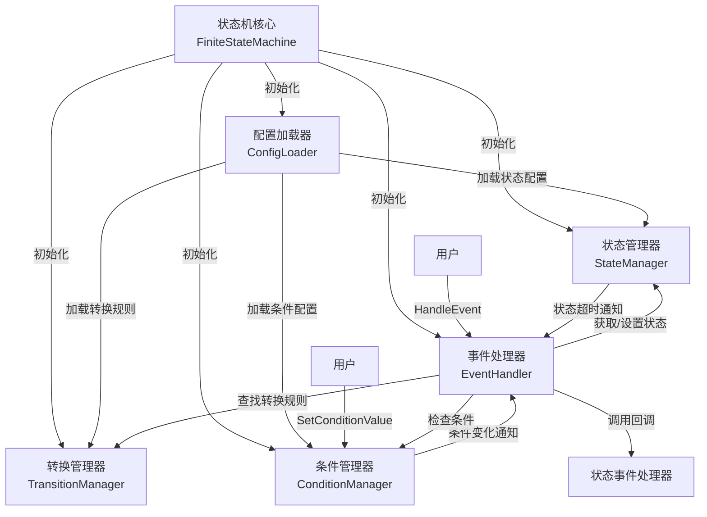
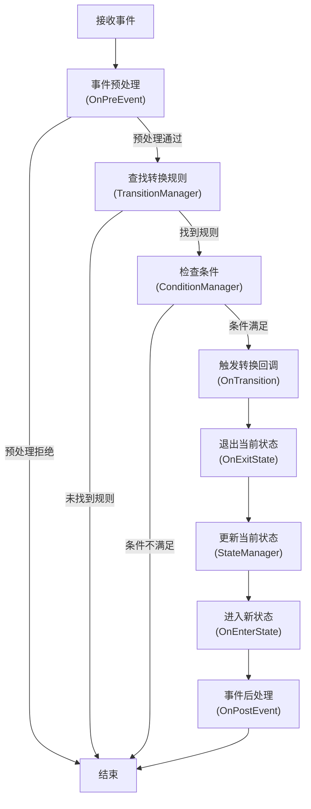
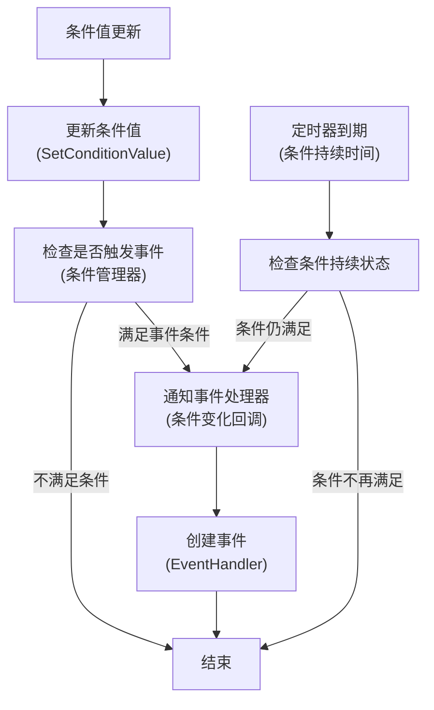
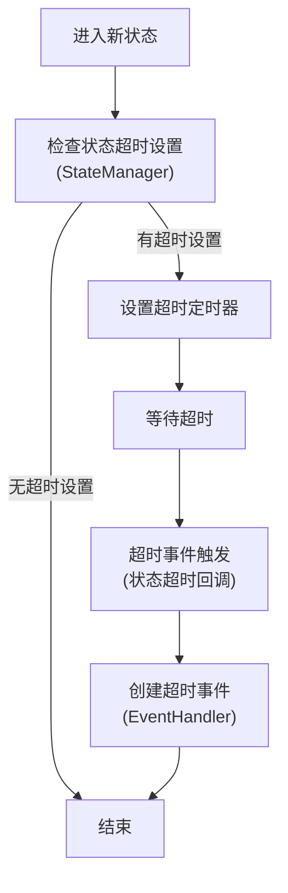
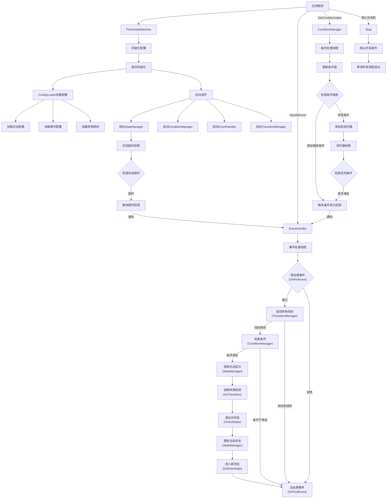

# 有限状态机(FSM)库

这是一个 **有限状态机(FSM)** 的C++实现，支持事件驱动和基于条件的状态转换。该库被设计为灵活、可扩展且易用，适用于物联网设备控制、游戏状态管理和工作流引擎等应用场景。

---

## 功能特点

- **组件化架构**：采用模块化设计，核心功能分离为独立组件
  - 条件管理器：处理条件值的更新和检查
  - 状态管理器：管理状态层次结构和转换
  - 事件处理器：处理事件触发和回调
  - 转换管理器：管理状态转换规则
  - 配置加载器：处理配置文件的加载和验证
- **状态管理**：定义和管理多个状态，支持嵌套(层次化)状态。
- **事件驱动转换**：使用事件触发状态转换。
- **基于条件的转换**：基于条件(例如，值范围、持续时间)触发状态转换。
- **多维范围条件**：支持简单的一维范围和多维范围数组。
- **自定义处理器**：使用`StateEventHandler`接口实现自定义状态转换逻辑。
- **异步处理**：使用多线程异步处理事件和条件。
- **JSON配置**：从JSON文件加载状态机配置。
- **基于时间的条件**：支持需要满足特定持续时间的条件。
- **状态超时机制**：可以为状态定义超时时间，当状态持续时间超过指定值时触发超时事件。
- **灵活的回调机制**：支持lambda函数和类成员函数作为回调。
- **完整的状态层次结构**：在回调中提供完整的状态层次信息。
- **集成日志系统**：具有多种日志级别的线程安全日志系统。
- **事件定义机制**：支持在配置文件中定义事件及其触发条件。
- **多种触发模式**：支持边缘触发和水平触发两种事件触发模式。
- **条件自动管理**：为定义的事件自动创建同名条件，简化状态跟踪。
- **优先级队列定时器**：使用优先级队列高效管理定时条件。
- **细粒度线程同步**：为事件、条件、状态、定时器和事件触发使用独立的互斥锁，提高并发性能。
- **工厂模式支持**：通过集中式工厂创建和管理多个状态机。
- **命名状态机**：支持创建和管理多个具名状态机。
- **单例工厂管理**：集中管理所有状态机实例。

---

## 项目结构

```
StateMachine_Frame/
├── build.sh                  # 构建脚本
├── CMakeLists.txt            # 主CMake配置文件
├── cmake/                    # CMake配置文件
│   ├── FSMConfig.cmake.in    # FSM配置模板
│   └── statemachine.pc.in    # pkg-config模板
├── config/                   # 配置示例
│   ├── state_config.json     # 状态配置
│   ├── event_generate_config/  # 事件生成配置
│   │   └── power_event.json  # 电源事件定义
│   └── trans_config/         # 转换配置
│       ├── active_to_paused.json
│       ├── active_to_standby.json
│       ├── idle_to_standby.json
│       ├── off_to_idle.json
│       ├── on_to_off.json
│       ├── paused_to_active.json
│       ├── standby_to_active.json
│       └── standby_to_idle.json
├── LICENSE                   # MIT许可证
├── README.md                 # 英文文档
├── README_CN.md              # 中文文档
├── run_test.sh               # 运行测试脚本
├── state_machine/            # 核心库实现
│   ├── CMakeLists.txt        # 状态机构建配置
│   ├── include/              # 头文件
│   │   ├── common_define.h   # 通用定义
│   │   ├── event.h           # 事件处理
│   │   ├── handler_example.h # 处理器示例实现
│   │   ├── logger.h          # 日志实现
│   │   ├── state_event_handler.h  # 状态事件处理器
│   │   ├── state_machine.h   # 主FSM实现
│   │   ├── state_machine_factory.h # 状态机工厂
│   │   └── components/       # 组件接口和实现
│   │       ├── i_component.h          # 组件基类接口
│   │       ├── i_condition_manager.h  # 条件管理器接口
│   │       ├── i_state_manager.h      # 状态管理器接口
│   │       ├── i_event_handler.h      # 事件处理器接口
│   │       ├── i_transition_manager.h # 转换管理器接口
│   │       ├── i_config_loader.h      # 配置加载器接口
│   │       ├── condition_manager.h    # 条件管理器实现
│   │       ├── state_manager.h        # 状态管理器实现
│   │       ├── event_handler.h        # 事件处理器实现
│   │       ├── transition_manager.h   # 转换管理器实现
│   │       └── config_loader.h        # 配置加载器实现
│   └── src/                  # 源文件
│       ├── state_machine.cpp # 主实现文件
|       ├── state_machine_factory.cpp # 状态机工厂
│       └── components/       # 组件实现
│           ├── condition_manager.cpp  # 条件管理器实现
│           ├── state_manager.cpp      # 状态管理器实现
│           ├── event_handler.cpp      # 事件处理器实现
│           ├── transition_manager.cpp # 转换管理器实现
│           └── config_loader.cpp      # 配置加载器实现
├── test/                     # 测试文件
│   ├── CMakeLists.txt        # 测试构建配置
│   ├── comprehensive_test/   # 全面测试
│   │   ├── comprehensive_test.cpp  # 智能家居系统测试
│   │   └── state_hierarchy_test.cpp # 层次状态测试
│   ├── conditions_event/     # 基于条件的事件测试
│   │   ├── CMakeLists.txt    # 测试构建配置
│   │   ├── condition_event_test.cpp  # 条件事件测试
│   │   └── config/           # 测试配置
│   │       ├── event_generate_config/  # 测试用事件配置
│   │       │   ├── start_work.json     # 开始工作事件
│   │       │   └── system_error.json   # 系统错误事件
│   │       ├── state_config.json       # 状态配置
│   │       └── trans_config/           # 转换配置
│   │           ├── error2init.json     # 错误到初始化转换
│   │           ├── init2working.json   # 初始化到工作转换
│   │           ├── working2error.json  # 工作到错误转换
│   │           └── working2init.json   # 工作到初始化转换
│   ├── main_test/            # 基本测试
│   │   └── main_test.cpp     # 基本功能测试
│   ├── multi_event_test/     # 多事件测试
│   │   ├── CMakeLists.txt    # 测试构建配置
│   │   └── multi_event_test.cpp  # 多事件触发测试
│   ├── multi_range_conditions/ # 多维范围条件测试
│   │   ├── CMakeLists.txt      # 测试构建配置
│   │   └── test_multi_range_conditions.cpp # 多范围条件测试
│   └── state_timeout/        # 状态超时测试
│       ├── CMakeLists.txt    # 测试构建配置 
│       ├── state_timeout_test.cpp # 状态超时测试
│       └── config/           # 测试配置
└── third_party/              # 外部依赖
    └── nlohmann-json/        # JSON库
        ├── json_fwd.hpp      # 前向声明
        └── json.hpp          # JSON实现
```

## 代码结构

### 核心组件接口

状态机库现在采用组件化架构，核心功能分解为多个独立组件，每个组件都实现了特定的接口：

1. **IComponent**：所有组件的基础接口
```cpp
class IComponent {
 public:
  virtual ~IComponent() = default;
  virtual void Start() = 0;  // 启动组件
  virtual void Stop() = 0;   // 停止组件
  virtual bool IsRunning() const = 0;  // 检查组件是否运行中
};
```

2. **IConditionManager**：条件管理器接口，负责条件值的管理和检查
```cpp
class IConditionManager : public IComponent {
 public:
  // 设置条件值
  virtual void SetConditionValue(const std::string& name, int value) = 0;
  // 获取条件值
  virtual void GetConditionValue(const std::string& name, int& value) const = 0;
  // 检查条件是否满足
  virtual bool CheckConditions(const std::vector<Condition>& conditions, 
                             const std::string& op,
                             std::vector<ConditionInfo>& condition_infos) = 0;
  // 添加条件
  virtual void AddCondition(const Condition& condition) = 0;
  // 注册条件变化回调
  using ConditionChangeCallback = std::function<void(const std::string&, int, int, bool)>;
  virtual void RegisterConditionChangeCallback(ConditionChangeCallback callback) = 0;
};
```

3. **IStateManager**：状态管理器接口，负责状态信息的管理和维护
```cpp
class IStateManager : public IComponent {
 public:
  // 添加状态信息
  virtual bool AddStateInfo(const StateInfo& state_info) = 0;
  // 设置当前状态
  virtual bool SetState(const State& state) = 0;
  // 获取当前状态
  virtual State GetCurrentState() const = 0;
  // 获取状态层次结构
  virtual std::vector<State> GetStateHierarchy(const State& state) const = 0;
  // 获取两个状态间的转换路径（需要退出和进入的状态）
  virtual void GetStateHierarchy(const State& from, const State& to,
                               std::vector<State>& exit_states,
                               std::vector<State>& enter_states) const = 0;
  // 注册状态超时回调
  using StateTimeoutCallback = std::function<void(const State& state, int timeout)>;
  virtual void RegisterStateTimeoutCallback(StateTimeoutCallback callback) = 0;
};
```

4. **IEventHandler**：事件处理器接口，负责事件的处理和分发
```cpp
class IEventHandler : public IComponent {
 public:
  // 处理事件
  virtual void HandleEvent(const EventPtr& event) = 0;
  // 设置状态事件处理器
  virtual void SetStateEventHandler(std::shared_ptr<StateEventHandler> handler) = 0;
};
```

5. **ITransitionManager**：转换管理器接口，负责管理状态转换规则
```cpp
class ITransitionManager : public IComponent {
 public:
  // 添加转换规则
  virtual bool AddTransition(const TransitionRule& rule) = 0;
  // 查找转换规则
  virtual bool FindTransition(const State& current_state, 
                            const EventPtr& event,
                            std::vector<TransitionRule>& out_rules) = 0;
  // 清除所有转换规则
  virtual void Clear() = 0;
};
```

6. **IConfigLoader**：配置加载器接口，负责加载和解析配置文件
```cpp
class IConfigLoader : public IComponent {
 public:
  // 从JSON文件加载配置
  virtual bool LoadConfig(const std::string& config_file) = 0;
  // 从多个配置文件加载配置
  virtual bool LoadConfig(const std::string& state_config_file, 
                        const std::string& event_generate_config_dir,
                        const std::string& trans_config_dir) = 0;
};
```

### 数据结构

1. **状态和事件类型**
  - `State`：表示为`std::string`。
  - `Event`：表示事件的类，包含事件名称和匹配条件信息。
  - `EventPtr`：定义为`std::shared_ptr<Event>`，用于更安全的事件处理。

2. **条件类型**
  ```cpp
  struct Condition {
    std::string name;                                // 条件名称
    std::vector<std::pair<int, int>> range_values;   // 条件范围数组 [[min1, max1], [min2, max2], ...]
    int duration{0};                                 // 条件持续时间(毫秒),默认0表示立即生效
  };
  ```

3. **条件值**
  ```cpp
  struct ConditionValue {
    std::string name;                                       // 条件名称
    int value;                                              // 条件当前值
    std::chrono::steady_clock::time_point lastUpdateTime;   // 最后一次更新时间
    std::chrono::steady_clock::time_point lastChangedTime;  // 上次值变化的时间
  };
  ```

4. **条件信息**
  ```cpp
  struct ConditionInfo {
    std::string name;  // 条件名称
    int value;         // 条件值
    long duration;     // 条件已满足的持续时间（毫秒）
  };
  ```

5. **事件定义结构体**
  ```cpp
  struct EventDefinition {
    std::string name;                   // 事件名称
    std::string trigger_mode;           // 触发模式：edge (边缘触发) 或 level (水平触发)
    std::vector<Condition> conditions;  // 触发事件的条件列表
    std::string conditionsOperator;     // 条件运算符 ("AND" 或 "OR")
  };
  ```

6. **状态转换规则**
  ```cpp
  struct TransitionRule {
    State from;                         // 起始状态
    std::vector<std::string> events;    // 事件列表（可为空）
    State to;                           // 目标状态
    std::vector<Condition> conditions;  // 条件列表
    std::string conditionsOperator;     // 条件运算符 ("AND" 或 "OR")
  };
  ```

7. **状态信息**
  ```cpp
  struct StateInfo {
    State name;                   // 状态名称
    State parent;                 // 父状态名称（可为空）
    std::vector<State> children;  // 子状态列表
    int timeout{0};               // 状态超时时间(毫秒)，默认0表示不超时
  };
  ```

8. **条件更新事件**
  ```cpp
  struct ConditionUpdateEvent {
    std::string name;
    int value;
    std::chrono::steady_clock::time_point updateTime;
  };
  ```

9. **持续条件**
  ```cpp
  struct DurationCondition {
    std::string name;
    int value;        // 触发条件时的值
    int duration;     // 持续时间（毫秒）
    std::chrono::steady_clock::time_point expiryTime;
  };
  ```

10. **状态超时信息**
  ```cpp
  struct StateTimeoutInfo {
    State state;                                      // 状态名称
    int timeout;                                      // 超时时间（毫秒）
    std::chrono::steady_clock::time_point enterTime;  // 进入状态的时间
    std::chrono::steady_clock::time_point expiryTime; // 超时将发生的时间
  };
  ```

11. **状态事件处理器**
  ```cpp
  class StateEventHandler {
  public:
    // 回调函数类型
    using TransitionCallback = std::function<void(const std::vector<State>&, const EventPtr&, const std::vector<State>&)>;
    using PreEventCallback = std::function<bool(const State&, const EventPtr&)>;
    using EnterStateCallback = std::function<void(const std::vector<State>&)>;
    using ExitStateCallback = std::function<void(const std::vector<State>&)>;
    using PostEventCallback = std::function<void(const EventPtr&, bool)>;
    
    // 设置回调函数
    void SetTransitionCallback(TransitionCallback callback);
    void SetPreEventCallback(PreEventCallback callback);
    void SetEnterStateCallback(EnterStateCallback callback);
    void SetExitStateCallback(ExitStateCallback callback);
    void SetPostEventCallback(PostEventCallback callback);
    
    // 支持类成员函数的回调设置方法
    template<typename T>
    void SetTransitionCallback(T* instance, void (T::*method)(const std::vector<State>&, const EventPtr&, const std::vector<State>&));
    
    template<typename T>
    void SetPreEventCallback(T* instance, bool (T::*method)(const State&, const EventPtr&));
    
    template<typename T>
    void SetEnterStateCallback(T* instance, void (T::*method)(const std::vector<State>&));
    
    template<typename T>
    void SetExitStateCallback(T* instance, void (T::*method)(const std::vector<State>&));
    
    template<typename T>
    void SetPostEventCallback(T* instance, void (T::*method)(const EventPtr&, bool));
    
    // 内部调用方法
    void OnTransition(const std::vector<State>& fromStates, const EventPtr& event, 
                     const std::vector<State>& toStates);
    bool OnPreEvent(const State& currentState, const EventPtr& event);
    void OnEnterState(const std::vector<State>& states);
    void OnExitState(const std::vector<State>& states);
    void OnPostEvent(const EventPtr& event, bool handled);
  };
  ```
  - 提供基于回调的灵活状态转换处理：
    - 事件预处理和验证
    - 状态进入和退出处理
    - 转换处理
    - 转换后事件处理
  - 接收完整的状态层次结构而非单个状态
  - 能够在知道整个状态上下文的情况下处理转换

12. **有限状态机类**
  - 管理状态机的核心类：
    - 初始化：从JSON文件或分离的配置文件加载配置
    - 事件处理：使用专用互斥锁异步处理事件
    - 条件处理：使用专用互斥锁更新和检查条件
    - 状态转换：基于事件或条件触发转换，使用状态互斥锁保护
    - 事件生成：基于条件自动生成事件
    - 定时器管理：使用定时器互斥锁处理基于时间的（持续）条件
    - 事件触发：使用专用互斥锁处理事件触发

13. **日志记录器类**
  ```cpp
  class Logger {
  public:
    static Logger& GetInstance();
    void SetLogLevel(LogLevel level);
    LogLevel GetLogLevel() const;
    void Log(LogLevel level, const std::string& file, int line, const std::string& message);
    void SetLogFile(const std::string& file);
    void SetLogFileRolling(size_t max_file_size, int max_backup_index);
    void Shutdown();
  private:
    Logger();
    // 线程安全实现，使用互斥锁
  };
  ```
  - 线程安全的单例日志记录器，支持多种日志级别
  - 包含文件名、行号和时间戳信息
  - 提供便捷的日志级别宏定义
  - 支持文件日志和日志轮转功能

### StateMachineFactory 类

#### 静态方法
- `static std::shared_ptr<FiniteStateMachine> CreateStateMachine(const std::string& name)`: 创建一个具有指定名称的新状态机
- `static std::vector<std::string> GetAllStateMachineNames()`: 获取所有已创建状态机的名称
- `static std::shared_ptr<FiniteStateMachine> GetStateMachine(const std::string& name)`: 通过名称获取状态机
- `static std::unordered_map<std::string, std::shared_ptr<FiniteStateMachine>> GetAllStateMachines()`: 获取所有已创建的状态机

#### 使用示例
```cpp
// 创建新的状态机
auto fsm = StateMachineFactory::CreateStateMachine("main_fsm");

// 获取已存在的状态机
auto existing_fsm = StateMachineFactory::GetStateMachine("main_fsm");

// 获取所有状态机名称
auto names = StateMachineFactory::GetAllStateMachineNames();

// 获取所有状态机
auto all_fsms = StateMachineFactory::GetAllStateMachines();
```

---

## 使用方法

### 1. 定义状态和转换
可以通过编程方式定义状态和转换，或者从JSON文件加载。

#### JSON配置示例（分离文件模式）

##### 状态配置 (state_config.json)
```json
{
  "states": [
    {"name": "OFF"},
    {"name": "ON"},
    {"name": "IDLE", "parent": "ON"},
    {"name": "STAND_BY", "parent": "ON"},
    {"name": "ACTIVE", "parent": "ON"},
    {"name": "PAUSED", "parent": "ON"},
    {"name": "WAITING", "parent": "ON", "timeout": 5000}
  ],
  "initial_state": "OFF"
}
```

##### 事件生成配置 (event_generate_config/power_event.json)
```json
{
  "name": "POWER_CHANGE",
  "trigger_mode": "edge",
  "conditions": [
    {
      "name": "is_powered",
      "range": [1, 1]
    }
  ],
  "conditions_operator": "AND"
}
```

##### 多范围条件事件示例
```json
{
  "name": "MULTI_RANGE_EVENT",
  "trigger_mode": "edge",
  "conditions": [
    {
      "name": "temperature",
      "range": [
        [10, 20],
        [30, 40]
      ]
    }
  ],
  "conditions_operator": "AND"
}
```

##### 转换规则配置 (trans_config/off_to_idle.json)
```json
{
  "from": "OFF",
  "to": "IDLE",
  "conditions": [
    {
      "name": "is_powered",
      "range": [1, 1],
      "duration": 1000
    }
  ],
  "conditions_operator": "OR"
}
```

### 2. 实现状态事件处理器
有三种方式处理状态事件：

#### 方式1：使用辅助函数创建带有lambda函数的处理器
```cpp
// 创建并配置处理器
auto handler = createLightStateHandler();  // 使用提供的辅助函数
fsm.SetStateEventHandler(handler);
```

#### 方式2：直接设置单独的lambda回调
```cpp
// 状态转换回调
fsm.SetTransitionCallback([](const std::vector<State>& fromStates, const EventPtr& event, 
                           const std::vector<State>& toStates) {
  State from = fromStates.empty() ? "" : fromStates[0];
  State to = toStates.empty() ? "" : toStates[0];
  
  if (from == "OFF" && to == "ON") {
    std::cout << "灯光已打开！" << std::endl;
  }
});

// 状态进入回调
fsm.SetEnterStateCallback([](const std::vector<State>& states) {
  if (!states.empty() && states[0] == "ON") {
    std::cout << "正在进入ON状态，激活设备..." << std::endl;
  }
});

// 状态退出回调
fsm.SetExitStateCallback([](const std::vector<State>& states) {
  if (!states.empty() && states[0] == "ON") {
    std::cout << "正在退出ON状态，关闭设备..." << std::endl;
  }
});
```

#### 方式3：使用类成员函数作为回调
```cpp
// 创建控制器对象
auto controller = std::make_shared<LightController>();

// 绑定类成员函数作为回调
fsm.SetTransitionCallback(controller.get(), &LightController::handleTransition);
fsm.SetPreEventCallback(controller.get(), &LightController::validateEvent);
fsm.SetEnterStateCallback(controller.get(), &LightController::onEnter);
fsm.SetExitStateCallback(controller.get(), &LightController::onExit);
fsm.SetPostEventCallback(controller.get(), &LightController::afterEvent);

// 示例控制器类
class LightController {
public:
  // 状态转换处理
  void handleTransition(const std::vector<State>& fromStates, const EventPtr& event, 
                      const std::vector<State>& toStates) {
    // 实现状态转换逻辑
  }
  
  // 事件验证
  bool validateEvent(const State& state, const EventPtr& event) {
    // 返回true表示允许事件，false表示拒绝
    return true;
  }
  
  // 其他回调方法...
};
```

### 3. 初始化并运行状态机
```cpp
int main() {
   // 使用工厂创建状态机
   auto fsm = smf::StateMachineFactory::CreateStateMachine("main_fsm");
   
   // 设置状态事件处理器回调
   fsm->SetTransitionCallback([](const std::vector<State>& fromStates, 
                              const EventPtr& event,
                              const std::vector<State>& toStates) {
     // 处理状态转换
   });
   
   // 方式1：使用单一配置文件初始化
   fsm->Init("config.json");
   
   // 方式2：使用分离的配置文件初始化
   fsm->Init("state_config.json", "event_generate_config_dir", "trans_config_dir");
   
   // 启动状态机
   fsm->Start();

   // 通过名称获取状态机
   auto same_fsm = smf::StateMachineFactory::GetStateMachine("main_fsm");

   // 获取所有状态机名称
   auto names = smf::StateMachineFactory::GetAllStateMachineNames();

   // 获取所有状态机
   auto all_fsms = smf::StateMachineFactory::GetAllStateMachines();

   // 触发事件和条件
   fsm->HandleEvent(std::make_shared<Event>("turn_on"));
   fsm->SetConditionValue("power", 50);

   // 停止状态机
   fsm->Stop();
   return 0;
}
```

### 4. 配置和使用日志系统
```cpp
// 使用所需的日志级别初始化日志记录器
SMF_LOGGER_INIT(smf::LogLevel::INFO);

// 记录不同级别的日志消息
SMF_LOGD("这是一条调试信息");
SMF_LOGI("这是一条信息");
SMF_LOGW("这是一条警告信息");
SMF_LOGE("这是一条错误信息");
```

---

## 测试

项目包含多个测试示例，可以使用提供的脚本运行：

### 使用脚本运行测试
```bash
# 运行基本测试
./run_test.sh main

# 运行全面测试
./run_test.sh comp

# 运行条件事件测试
./run_test.sh condition

# 运行多范围条件测试
./run_test.sh multi

# 运行状态超时测试
./run_test.sh timeout

# 运行多事件测试
./run_test.sh event

# 运行所有测试
./run_test.sh all
```

### 基本测试
一个演示基本状态机功能的简单测试，包括：
- 基本状态转换
- 事件处理
- 简单回调执行

### 全面测试
一个模拟智能家居系统，包含多种状态、事件和转换的复杂示例：
- 层次状态管理
- 事件驱动转换
- 带有时间约束的基于条件的转换
- 完整的回调处理
- 智能家居控制器实现
- 错误处理和日志记录

### 多范围条件测试
专门用于测试多维范围条件功能的测试：
- 支持简单的一维范围条件 (`[min, max]`)
- 支持多维范围数组 (`[[min1, max1], [min2, max2], ...]`)
- 测试不同范围配置的状态转换
- 演示在非连续值范围内的条件匹配

### 状态超时测试
专门用于测试状态超时功能的测试：
- 测试状态超时机制
- 验证状态超时后的处理逻辑

### 多事件测试
专门用于测试多事件触发功能的测试：
- 测试同一转换规则支持多个触发事件
- 验证不同事件触发相同转换的行为
- 测试事件处理的优先级和顺序
- 包含条件检查和状态转换的完整流程测试

---

## API参考

### FiniteStateMachine类

#### 构造与析构
- 无法通过构造函数直接创建，必须使用`StateMachineFactory::CreateStateMachine`工厂方法
- 提供了禁用复制构造/赋值和移动构造/赋值的声明
- 析构时会自动调用`Stop()`方法停止所有组件

#### 初始化与控制方法
```cpp
// 从单一配置目录初始化
bool Init(const std::string& configDir);

// 从分离的配置文件初始化
bool Init(const std::string& stateConfigFile, 
          const std::string& eventGenerateConfigDir,
          const std::string& transConfigDir);

// 启动状态机及其所有组件
bool Start();

// 停止状态机及其所有组件
void Stop();
```

#### 事件处理
```cpp
// 异步处理事件
void HandleEvent(const EventPtr& event);
```

#### 条件管理
```cpp
// 设置条件值
void SetConditionValue(const std::string& name, int value);

// 获取条件值
void GetConditionValue(const std::string& name, int& value) const;
```

#### 状态获取
```cpp
// 获取当前状态
State GetCurrentState() const;
```

#### 回调设置方法
每种回调都提供了函数对象版本和类成员函数版本：

1. **转换回调** - 状态转换时触发
```cpp
// 函数对象版本
void SetTransitionCallback(StateEventHandler::TransitionCallback callback);

// 类成员函数版本
template <typename T>
void SetTransitionCallback(T* instance, 
                         void (T::*method)(const std::vector<State>&, 
                                        const EventPtr&, 
                                        const std::vector<State>&));
```

2. **事件预处理回调** - 事件处理前触发，可用于验证事件
```cpp
// 函数对象版本
void SetPreEventCallback(StateEventHandler::PreEventCallback callback);

// 类成员函数版本
template <typename T>
void SetPreEventCallback(T* instance, 
                       bool (T::*method)(const State&, const EventPtr&));
```

3. **进入状态回调** - 进入新状态时触发
```cpp
// 函数对象版本
void SetEnterStateCallback(StateEventHandler::EnterStateCallback callback);

// 类成员函数版本
template <typename T>
void SetEnterStateCallback(T* instance, 
                         void (T::*method)(const std::vector<State>&));
```

4. **退出状态回调** - 退出当前状态时触发
```cpp
// 函数对象版本
void SetExitStateCallback(StateEventHandler::ExitStateCallback callback);

// 类成员函数版本
template <typename T>
void SetExitStateCallback(T* instance, 
                        void (T::*method)(const std::vector<State>&));
```

5. **事件后处理回调** - 事件处理完成后触发
```cpp
// 函数对象版本
void SetPostEventCallback(StateEventHandler::PostEventCallback callback);

// 类成员函数版本
template <typename T>
void SetPostEventCallback(T* instance, 
                        void (T::*method)(const EventPtr&, bool));
```

#### 内部组件
状态机内部包含以下核心组件，每个组件负责特定功能：

1. **转换管理器 (TransitionManager)**
   - 管理所有状态转换规则
   - 提供规则查找功能

2. **状态管理器 (StateManager)**
   - 管理状态层次结构
   - 处理状态进入/退出
   - 管理状态超时

3. **条件管理器 (ConditionManager)**
   - 管理条件值
   - 检查条件是否满足
   - 处理条件变化通知

4. **事件处理器 (EventHandler)**
   - 处理事件队列
   - 协调状态转换流程
   - 调用相关回调

5. **配置加载器 (ConfigLoader)**
   - 加载并解析配置文件
   - 初始化其他组件

#### 使用示例
```cpp
// 使用工厂创建状态机实例
auto fsm = StateMachineFactory::CreateStateMachine("my_fsm");

// 设置事件处理回调
fsm->SetTransitionCallback([](const std::vector<State>& fromStates, 
                           const EventPtr& event, 
                           const std::vector<State>& toStates) {
    std::cout << "从状态 " << fromStates[0] << " 转换到状态 " << toStates[0] 
              << " 由事件 " << event->GetName() << " 触发" << std::endl;
});

// 初始化状态机
fsm->Init("config/");

// 启动状态机
fsm->Start();

// 处理事件
fsm->HandleEvent(std::make_shared<Event>("button_pressed"));

// 更新条件值
fsm->SetConditionValue("temperature", 25);

// 获取当前状态
std::cout << "当前状态: " << fsm->GetCurrentState() << std::endl;

// 停止状态机
fsm->Stop();
```

### StateEventHandler类

状态事件处理器用于处理状态机中的各种事件和状态转换回调。

#### 回调函数类型
```cpp
// 状态转换回调：当状态从fromStates转换到toStates，由event触发
using TransitionCallback = std::function<void(const std::vector<State>&, const EventPtr&, const std::vector<State>&)>;

// 事件预处理回调：在处理事件前调用，返回true表示允许处理该事件，false表示拒绝
using PreEventCallback = std::function<bool(const State&, const EventPtr&)>;

// 状态进入回调：当进入新状态集合时调用
using EnterStateCallback = std::function<void(const std::vector<State>&)>;

// 状态退出回调：当退出当前状态集合时调用
using ExitStateCallback = std::function<void(const std::vector<State>&)>;

// 事件后处理回调：当事件处理完成后调用，handled表示事件是否被处理
using PostEventCallback = std::function<void(const EventPtr&, bool)>;
```

#### 设置回调方法
每种回调都提供了函数对象版本和类成员函数版本：

1. **设置状态转换回调**
```cpp
// 函数对象版本
void SetTransitionCallback(TransitionCallback callback);

// 类成员函数版本
template <typename T>
void SetTransitionCallback(T* instance, 
                         void (T::*method)(const std::vector<State>&, 
                                        const EventPtr&, 
                                        const std::vector<State>&));
```

2. **设置事件预处理回调**
```cpp
// 函数对象版本
void SetPreEventCallback(PreEventCallback callback);

// 类成员函数版本
template <typename T>
void SetPreEventCallback(T* instance, 
                       bool (T::*method)(const State&, const EventPtr&));
```

3. **设置状态进入回调**
```cpp
// 函数对象版本
void SetEnterStateCallback(EnterStateCallback callback);

// 类成员函数版本
template <typename T>
void SetEnterStateCallback(T* instance, 
                         void (T::*method)(const std::vector<State>&));
```

4. **设置状态退出回调**
```cpp
// 函数对象版本
void SetExitStateCallback(ExitStateCallback callback);

// 类成员函数版本
template <typename T>
void SetExitStateCallback(T* instance, 
                        void (T::*method)(const std::vector<State>&));
```

5. **设置事件后处理回调**
```cpp
// 函数对象版本
void SetPostEventCallback(PostEventCallback callback);

// 类成员函数版本
template <typename T>
void SetPostEventCallback(T* instance, 
                        void (T::*method)(const EventPtr&, bool));
```

#### 内部处理方法
```cpp
// 处理状态转换
void OnTransition(const std::vector<State>& fromStates, 
                const EventPtr& event,
                const std::vector<State>& toStates);

// 处理事件预处理
bool OnPreEvent(const State& currentState, const EventPtr& event);

// 处理状态进入
void OnEnterState(const std::vector<State>& states);

// 处理状态退出
void OnExitState(const std::vector<State>& states);

// 处理事件后处理
void OnPostEvent(const EventPtr& event, bool handled);
```

### StateMachineFactory类

状态机工厂负责创建和管理状态机实例，采用单例模式实现。

#### 静态方法

```cpp
// 创建新的状态机实例
static std::shared_ptr<FiniteStateMachine> CreateStateMachine(const std::string& name);

// 获取所有已创建的状态机名称
static std::vector<std::string> GetAllStateMachineNames();

// 通过名称获取已创建的状态机实例
static std::shared_ptr<FiniteStateMachine> GetStateMachine(const std::string& name);

// 获取所有已创建的状态机实例
static std::unordered_map<std::string, std::shared_ptr<FiniteStateMachine>> GetAllStateMachines();
```

#### 使用示例
```cpp
// 创建状态机
auto fsm1 = StateMachineFactory::CreateStateMachine("fsm1");
auto fsm2 = StateMachineFactory::CreateStateMachine("fsm2");

// 获取状态机名称列表
auto names = StateMachineFactory::GetAllStateMachineNames();
for (const auto& name : names) {
    std::cout << "状态机名称: " << name << std::endl;
}

// 获取特定名称的状态机
auto fsm = StateMachineFactory::GetStateMachine("fsm1");
if (fsm) {
    std::cout << "获取状态机成功，当前状态: " << fsm->GetCurrentState() << std::endl;
}

// 获取所有状态机
auto allFsms = StateMachineFactory::GetAllStateMachines();
std::cout << "总共创建了 " << allFsms.size() << " 个状态机" << std::endl;
```

### Logger类

日志系统提供线程安全的日志记录功能，支持多种日志级别和日志文件轮转。

#### 日志级别枚举
```cpp
enum class LogLevel { 
    DEBUG,  // 调试信息，最详细的日志级别
    INFO,   // 普通信息，默认的日志级别
    WARN,   // 警告信息，表示可能出现的问题
    ERROR   // 错误信息，表示已经发生的错误
};
```

#### 公共方法
```cpp
// 获取日志记录器单例实例
static Logger& GetInstance();

// 设置日志级别
void SetLogLevel(LogLevel level);

// 获取当前日志级别
LogLevel GetLogLevel() const;

// 记录日志消息
void Log(LogLevel level, const std::string& file, int line, const std::string& message);

// 设置日志文件
void SetLogFile(const std::string& file);

// 设置日志文件轮转策略
// max_file_size: 单个日志文件的最大大小（字节）
// max_backup_index: 保留的最大备份文件数量
void SetLogFileRolling(size_t max_file_size, int max_backup_index);

// 关闭日志记录器并释放资源
void Shutdown();
```

#### 日志宏
```cpp
// 初始化日志系统
#define SMF_LOGGER_INIT(level) /* ... */

// 设置日志文件
#define SMF_LOGGER_SET_FILE(file) /* ... */

// 设置日志文件轮转
#define SMF_LOGGER_SET_ROLLING(max_size, max_backup) /* ... */

// 记录调试级别日志
#define SMF_LOGD(message) /* ... */

// 记录信息级别日志
#define SMF_LOGI(message) /* ... */

// 记录警告级别日志
#define SMF_LOGW(message) /* ... */

// 记录错误级别日志
#define SMF_LOGE(message) /* ... */
```

#### 日志文件轮转机制
- 当日志文件大小超过设定阈值时，自动进行轮转
- 原日志文件重命名为 `<filename>.1`
- 旧的备份文件依次重命名：`<filename>.1` -> `<filename>.2` 等
- 超过最大备份数量的文件被删除
- 轮转过程是线程安全的，不会丢失日志消息

#### 使用示例
```cpp
// 初始化日志系统，设置日志级别为INFO
SMF_LOGGER_INIT(smf::LogLevel::INFO);

// 设置日志文件
SMF_LOGGER_SET_FILE("app.log");

// 配置日志轮转（最大10MB，保留5个备份）
SMF_LOGGER_SET_ROLLING(10 * 1024 * 1024, 5);

// 记录不同级别的日志
SMF_LOGD("这是调试信息");  // 不会输出，因为日志级别是INFO
SMF_LOGI("状态机初始化成功");
SMF_LOGW("条件检查失败，使用默认值");
SMF_LOGE("状态转换错误：无法找到目标状态");

// 关闭日志系统（通常在程序退出时调用）
smf::Logger::GetInstance().Shutdown();
```

---

## 示例用例

1. **物联网设备控制**：
  - 管理智能灯的状态（例如，OFF、ON、ACTIVE）。
  - 基于事件（例如，"turn_on"、"turn_off"）或条件（例如，电源水平）触发转换。

2. **游戏状态管理**：
  - 控制游戏状态（例如，MENU、PLAY、PAUSE、GAME_OVER）。
  - 基于玩家操作或游戏条件处理转换。

3. **工作流引擎**：
  - 使用表示阶段的状态建模工作流（例如，START、PROCESS、END）。
  - 基于外部输入或基于时间的条件触发转换。

---

## 状态机处理流程

### 组件间交互

状态机的各个组件之间通过明确的接口进行交互，组成了一个协同工作的系统：



### 组件处理流程

1. **配置加载流程**
   - 加载状态配置：解析状态定义及其父子关系，初始状态等
   - 加载事件生成配置：解析事件定义及其触发条件
   - 加载转换规则配置：解析状态转换规则
   - 验证配置的有效性和一致性

2. **事件处理流程**


3. **条件处理流程**


4. **状态超时处理**


以下图表说明了有限状态机的详细处理流程：



---

## 有限状态机线程模型

状态机采用组件化的多线程模型进行异步处理：

1. **事件处理器线程 (EventHandler Thread)**
   - 专门处理事件队列中的事件和事件回调
   - 响应外部事件触发和内部条件变化通知
   - 协调状态转换的完整流程

2. **条件管理器线程 (ConditionManager Thread)**
   - 专门处理条件值更新
   - 检查条件是否满足事件定义的条件
   - 管理定时条件和持续时间检查
   - 当条件满足时，通过回调通知事件处理器

3. **状态管理器超时线程 (StateManager Timeout Thread)**
   - 专门处理状态的超时检测
   - 当状态超时时，通过回调通知事件处理器

4. **日志处理线程 (Logger Thread)**
   - 专门处理日志消息的异步记录
   - 管理日志文件的轮转
   - 确保日志操作不阻塞主业务逻辑

每个组件在启动时（通过`Start()`方法）创建自己的工作线程，并在停止时（通过`Stop()`方法）安全地退出线程。组件间通过明确定义的接口和回调机制进行通信，而不是直接的线程间通信，这种设计简化了并发控制，提高了系统的可靠性和可维护性。

---

## 线程同步机制

为了确保多线程环境下的数据一致性和避免竞态条件，状态机使用了细粒度的线程同步机制：

1. **事件处理器 (EventHandler)**
   - `std::mutex event_queue_mutex_`：保护事件队列的线程安全访问
   - `std::condition_variable event_cv_`：用于事件队列的条件变量，避免忙等待

2. **条件管理器 (ConditionManager)**
   - `std::mutex condition_values_mutex_`：保护条件值存储的访问
   - `std::mutex condition_update_mutex_`：保护条件更新队列
   - `std::condition_variable condition_update_cv_`：用于条件更新的条件变量
   - `std::mutex timer_mutex_`：保护定时器队列
   - `std::condition_variable timer_cv_`：用于定时器的条件变量
   - `std::mutex callbacks_mutex_`：保护回调函数列表

3. **状态管理器 (StateManager)**
   - `std::mutex state_mutex_`：保护状态信息的访问
   - `std::mutex timeout_mutex_`：保护状态超时信息
   - `std::condition_variable timeout_cv_`：用于状态超时的条件变量

4. **转换管理器 (TransitionManager)**
   - `std::mutex rules_mutex_`：保护转换规则集合的访问

5. **日志系统 (Logger)**
   - `std::mutex log_mutex_`：保护日志操作
   - `std::mutex queue_mutex_`：保护日志消息队列
   - `std::condition_variable queue_cv_`：用于日志队列的条件变量

这种多互斥锁和条件变量的方法允许不同组件的操作在可能的情况下并行进行，从而提高整体性能，同时保证了数据的一致性和线程安全。

---

## 性能优化

在组件化架构下，状态机实现了多方面的性能优化：

1. **组件化与异步处理**
   - 核心功能分离为独立组件，每个组件在专用线程中运行，减少了主线程阻塞
   - 事件、条件更新和日志操作通过异步队列处理，提高了系统响应性
   - 组件间通过接口和回调通信，降低了耦合度，提高了并发性能

2. **细粒度锁与条件变量**
   - 每个组件使用独立的互斥锁保护其数据，减少了锁竞争
   - 优先使用`std::shared_mutex`等读写锁，允许多线程并发读取
   - 使用条件变量替代轮询，降低CPU使用率，提高线程唤醒精确性

3. **高效的数据结构**
   - 使用优先级队列(`std::priority_queue`)管理定时条件，确保高效获取下一个到期定时器
   - 状态层次结构使用树形数据结构，优化状态间关系查询
   - 转换规则使用哈希表索引，提高规则查找效率

4. **事件与条件管理优化**
   - 条件变化通知机制避免了不必要的轮询
   - 智能条件触发：仅在条件值变化时才重新评估相关事件定义
   - 支持不同的事件触发模式（边缘触发vs水平触发），优化事件生成频率

5. **日志系统优化**
   - 异步日志记录：日志操作在专用线程中执行，不阻塞业务逻辑
   - 日志消息队列：使用无锁队列或细粒度锁减少日志记录的性能影响
   - 日志文件轮转：自动管理日志文件大小，避免单个文件过大影响I/O性能
   - 可配置的日志级别：运行时可调整日志详细程度，平衡信息丰富度和性能开销

6. **内存管理优化**
   - 对象池：重用事件对象，减少内存分配开销
   - 智能指针：使用`std::shared_ptr`等自动管理对象生命周期，避免内存泄漏
   - 移动语义：利用C++17移动语义优化数据传递，减少不必要的复制

这些优化措施共同确保了状态机在复杂应用场景下的高效运行，包括高并发处理、低延迟响应和资源高效利用。

---

## 依赖项

- **nlohmann/json**：用于解析和生成JSON数据的现代C++JSON库。
  - GitHub: [nlohmann/json](https://github.com/nlohmann/json)
- **logger**：提供日志功能支持，集成在库中。

---

## 构建说明

### 前提条件
- C++17兼容编译器
- CMake 3.10或更高版本
- pthread库

### 库输出选项
状态机框架可以构建为静态库和动态库两种形式：
- **静态库**：构建为`libstatemachine.a`
- **动态库**：构建为`libstatemachine.so`，并具有正确的soname版本信息（`libstatemachine.so.1` -> `libstatemachine.so.1.0.0`）

### 构建步骤
```bash
# 克隆仓库
git clone https://github.com/JUSTLIKEHU/StateMachine_Frame.git
cd StateMachine_Frame

# 使用脚本构建（推荐）
./build.sh

# 或手动构建
mkdir -p build && cd build
cmake ..
make

# 运行测试
cd bin
./main_test
./comprehensive_test
```

### 安装
```bash
# 安装库文件和头文件（在build目录中执行）
sudo make install
```

默认情况下，库将被安装到以下位置：
- 库文件：`/usr/local/lib/`
- 头文件：`/usr/local/include/statemachine/`
- CMake配置文件：`/usr/local/lib/cmake/FSM/`
- pkg-config文件：`/usr/local/lib/pkgconfig/`

### 在其他项目中使用已安装的库

#### 使用CMake
```cmake
# 在CMakeLists.txt中查找库
find_package(FSM REQUIRED)

# 链接到库
target_link_libraries(你的目标名称 FSM::statemachine)
```

#### 使用pkg-config
```bash
# 使用pkg-config信息编译
g++ -o your_program your_program.cpp $(pkg-config --cflags --libs statemachine)
```

---

## 许可

本项目使用MIT许可证。详情请参阅[LICENSE](LICENSE)文件。

---

## 贡献

欢迎贡献！请为任何改进或错误修复打开issue或提交pull request。

---

## 作者

[Xiaokui.Hu]
[1151217347@qq.com]  
[JUSTLIKEHU](https://github.com/JUSTLIKEHU)
